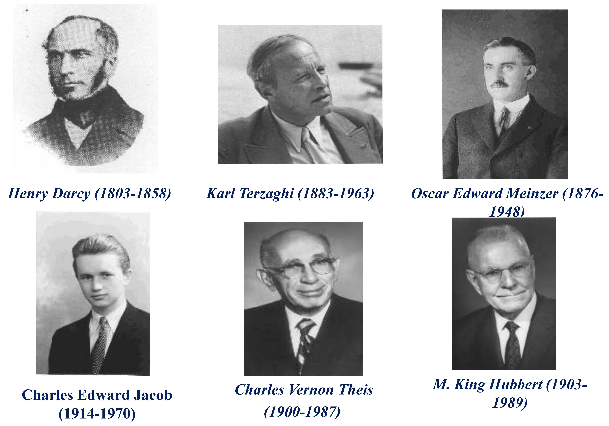

# 绪论

<yanggy1010@126.com>

[TOC]

## 1. 研究对象

**地下水动力学** (groundwater dynamics) 是研究地下水在岩石中运动的科学，研究对象为重力水。渗流力学是研究地下水运动的理论基础。

**目的**：从数量和质量（水化学成分）两方面对地下水进行定量分析，合理开发利用地下水，兴利除害。

**方法**：以**质量守恒**、**能量转化**的物理定律为基础，分析含水层中地下水在静态、动态条件下的自然属性与力学性质、地下水在含水层中运动的影响因素，特别是它们的量化表示。数学、物理、流体力学等。

因此研究分析地下水的运动规律需要同时从**流体（水）**、**介质（含水层）** 两方面开展工作。

## 2. 课程内容

(1) 地下水运动的基本概念与基本定律；

(2) 地下水运动方程及定解条件；

(3) 一维地下水运动问题；

(4) 理想条件下的完整井稳定流模型；

(5) 理想条件下的完整井非稳定流模型；

(6) 根据抽水试验确定含水层参数；

(7) 复杂水文地质条件下的解析法；

## 3. 学习建议

**鼓励团队协作**

+ 自由组成学习小组；
+ 组内民主测评，贡献大的成员获得较高的平时成绩（5 分制）；
+ 考评内容包括考勤、作业、实验报告、其它项目；
+ 小组设组长，负责汇总学习问题，及时向老师反馈同学们的意见。

**学习建议**

+ 找出专业课程之间的内在联系；
+ 同时学习一本英文教材；
+ 看一些课外阅读材料；
+ 有问题及时求助老师、同学；
+ 学会运用网络资源；
+ 尝试编程解决问题；
+ 积极思考，理论联系实践；
+ 了解本学科的学术研究现状。

## 4. 发展历程

按研究者对地下水运动规律的认识过程以研究手段，划分如下

+ 稳定流建立和发展阶段（1856 - 1935）
  
  > 1856 年,法国水力学家 H. Darcy (1803 - 1858) 提出了多孔介质线性渗透定律—达西定律（Darcy's Law），成为地下水运动的理论基础；
  > 
  > 1863 年，J. Dupuit 研究了一维稳定运动和向水井的二维稳定运动，提出了著名的Dupuit假设及Dupuit公式；
  > 
  > 1901 年，P. Forchheimer 等研究了更复杂的渗流问题，奠定了地下水稳定流的理论基础；
  > 
  > 1906 年，提出了Thiem公式；
  > 
  > 1928 年，O.E. Meinzer (1876 - 1948) 研究了地下水运动的不稳定性和承压含水层的贮水性质。

+ 非稳定流建立和发展阶段（1935 - 1969）
  
  > 1935 年，美国C.V. Theis (1900 - 1987) 提出了地下水流向承压水井的非稳定流公式 — Theis 公式，开创了现代地下水运动理论的新纪元；
  > 
  > 1954 年 M.S Hantush，1955 年 C.E.Jacob (1914 - 1970) 提出了越流理论；
  > 
  > 1954 年、1963 年 N.S. Boulton，197 2年 S.P.Neuman 研究了潜水含水层中水井的非稳定流理论。

+ 实验—电网络模拟技术阶段（1950-1980）
  
  > 1950 - 1965 年，研究了大范围含水层系统的电网络模拟技术，到 20 世纪 80 年代在我国还被较广泛应用.

+ 计算机数值模拟技术阶段（1965 - 至今）
  
  > 1965 年以来，计算机数值模拟技术得到广泛应用，并形成为商业化软件。

**知名科学家**

## 5. 研究方向

+ 地下水在裂隙介质、岩溶介质中运动机制与基本运动规律；
+ 非饱和带水、盐分的运动理论；
+ 水中溶质运动机制和运移理论；
+ 热量在地下水中的传导；
+ 地下水最优管理问题；
+ 介质非均质性；
+ 各种实际渗流问题的数值模拟方法；
+ 随机理论在水流和溶质运移研究中的应用；
+ 含多组分溶质水流的Darcy定律形式.

## 6. 应用领域

+ 城市、工矿企业和农业供水：
  确定水文地质参数，论证开采方案和预计开采量，预报开采动态，正确评价地下水资源，科学管理和保护地下水资源.

+ 矿山开采、建筑基坑和沼泽化、盐渍化区的疏干：
  设计疏干量、疏干水平，预测疏干范围、疏干过程，合理选择疏干设备.

+ 水工建筑：
  解决库周、坝（堤）基及坝（堤）体的渗漏量、回水浸没范围等，为正确选择坝址、坝体结构提供依据.

+ 农业工程：
  农田灌溉中确定灌排沟渠的合理间距、排灌水量、时间及地下水动态预报.

+ 环境地质：
  水质污染及净化趋势的预报、地面沉降、岩溶塌陷、边坡稳定、海水入侵、地下水储能以及人工补给.

## 7. 教材及参考书

**教材**

+ 薛禹群.地下水动力学[M].北京：地质出版社.

**参考书**

+ 陈祟希.地下水动力学 [M]. 北京：地质出版社；
+ 李义昌.地下水动力学 [M]. 徐州：中国矿业大学出版社；
+ 周志芳，王锦国.地下水动力学 [M]. 北京：科学出版社；
+ 迟宝明.地下水动力学习题集 [M]. 北京：科学出版社；
+ Bear，J.，Hydraulics of Groundwater，McGraw Hill，1979.

## 8. 轻松一下

**数学要点（高数第七版）**

**1）微分在近似计算中的应用**：（上册 P116）；

**2）Taylor公式**：一元（上册 P138）、二元（下册 P 122）；

**3）多元复合函数求导**：（下册 P78）；

**4）方向导数与梯度**：（下册 P101）；

**5）最小二乘法**：（下册 P127）。

### 1) 微分与近似计算

**微分**：设函数 $y=f(x)$ 在某区间内有定义，区间内的点 $x_0$ 及 $x_0+\Delta x$，如果函数值增量

$$
\Delta y = f(x_0 + \Delta x ) - f( x_0 )
$$

可表示为

$$
\Delta y = A\Delta x + o(\Delta x)
$$

其中 $A$ 为不依赖于 $\Delta x$ 的常数，称 $y=f(x)$ 在 $x_0$ 点可微，$A\Delta x$ 为函数在 $x_0$ 点的微分， 记为

$$
\mathrm{d} y=A\Delta x
$$

式中， $A=f'(x_0)$ .

**近似计算**：

$$
f(x_0+\Delta x) \approx f(x_0)+f'(x_0)\Delta x
$$

**问题**：如何估算误差？

### 2）Taylor公式

- 一元

设函数 $f(x)$ 在含有 $x_0$ 的某开区间 $(a,b)$ 内存在 $(n+1)$ 阶导数，则对任一 $x\in(a,b)$ 有

$$
\begin{split}
f(x)=&f(x_0)+f'(x_0)(x-x_0)+\frac{f''(x_0)}{2!}(x-x_0)^2+ \cdots \\
&+ \frac{f^{(n)}(x_0)}{n!}(x-x_0)^n+R_n(x)\\
\end{split}
$$

式中，

$$
R_n(x)=\frac{f^{(n+1)}(\xi)}{(n+1)!}(x-x_0)^{n+1}
$$

$\xi$ 为 $x_0$ 与 $x$ 间的某个值。$n=1$ 时，

$$
f(x) \approx f(x_0)+f'(x_0)(x-x_0)
$$

误差 $\frac{f''(\xi)}{2!}(x-x_0)^2$.

- 二元

设函数 $z=f(x,y)$ 在含有 $(x_0,y_0)$ 的某邻域内连续且有直到 $(n+1)$ 阶连续偏导数， $(x_0+h,y_0+k)$ 为邻域内任一点，则

$$
\begin{array}{rl}
f(x_0+h,y_0+k) =&f(x_0,y_0) + \left(h\frac{\partial}{\partial x}
+k\frac{\partial}{\partial y}\right) f(x_0,y_0)\\
&+\frac{1}{2!}\left(h\frac{\partial}{\partial x}+k\frac{\partial}{\partial y}\right)^2 f(x_0,y_0)+ \cdots \\
&+ \frac{1}{n!}\left(h\frac{\partial}{\partial x}+k\frac{\partial}{\partial y}\right)^n f(x_0,y_0)\\
&+\frac{1}{(n+1)!}\left(h\frac{\partial}{\partial x}+k\frac{\partial}{\partial y}\right)^{n+1} f(x_0+\theta h,y_0+\theta k)
\end{array}
$$

式中， $0\lt \theta \lt 1$.

如果 $h$ 或 $k$ 有一个为 0，则公式与一元公式相似。

### 3）多元复合函数求导

设 $u=\varphi (x,y)$ 及  $v=\psi (x,y)$  在点 $(x,y)$ 有对 $x$ 及对 $y$ 的偏导数，函数 $z=f(u,v)$ 在对应点 $(u,v)$ 有连续偏导数，则复合函数 $z=f(\varphi,\psi)$ 在点 $(x,y)$ 的两个偏导数都存在，且

$$
\begin{align*}
\frac{\partial z}{\partial x}=\frac{\partial z}{\partial u}\frac{\partial u}{\partial x} +\frac{\partial z}{\partial v}\frac{\partial v}{\partial x} \\
\frac{\partial z}{\partial y}=\frac{\partial z}{\partial u}\frac{\partial u}{\partial y} +\frac{\partial z}{\partial v}\frac{\partial v}{\partial y}
\end{align*}
$$

**例**：将 $\frac{\partial^2u}{\partial x^2}+\frac{\partial^2u}{\partial y^2}$ 转换成极坐标系中的形式。

极坐标

$$
\rho =\sqrt{x^2+y^2},\theta=\arctan \frac{y}{x}
$$

有

$$
\begin{align*}
\frac{\partial u}{\partial x}=\frac{\partial u}{\partial \rho}\frac{\partial \rho}{\partial x}+\frac{\partial u}{\partial \theta}\frac{\partial \theta}{\partial x}\\
\frac{\partial u}{\partial y}=\frac{\partial u}{\partial \rho}\frac{\partial \rho}{\partial y}+\frac{\partial u}{\partial \theta}\frac{\partial \theta}{\partial y}
\end{align*}
$$

$$
\begin{align*}
\frac{\partial^2u}{\partial x^2}=\frac{\partial}{\partial \rho}\left(\frac{\partial u}{\partial x}\right)\frac{\partial \rho}{\partial x}+\frac{\partial}{\partial \theta}\left(\frac{\partial u}{\partial x}\right)\frac{\partial \theta}{\partial x}\\
\frac{\partial^2u}{\partial y^2}=\frac{\partial}{\partial \rho}\left(\frac{\partial u}{\partial y}\right)\frac{\partial \rho}{\partial y}+\frac{\partial}{\partial \theta}\left(\frac{\partial u}{\partial y}\right)\frac{\partial \theta}{\partial y}\\
\end{align*}
$$

计算后整理得

$$
\small\frac{\partial^2u}{\partial x^2}+\frac{\partial^2u}{\partial y^2} =\frac{\partial^2u}{\partial \rho^2}+\frac{1}{\rho}\frac{\partial u}{\partial \rho}+\frac{1}{\rho^2}\frac{\partial^2 u}{\partial \theta^2} = \frac{1}{\rho^2}\left[\rho\frac{\partial}{\partial \rho}\left(\rho\frac{\partial u}{\partial\rho}\right)+\frac{\partial^2u}{\partial \theta^2}\right]
$$

### 4）方向导数与梯度

**方向导数**：

设 $f(x,y)$ 在 $(x_0,y_0)$ 处可微，则沿 $\mathbf{\vec{L}}$ 的方向导数存在，且

$$
\left.\frac{\partial f}{\partial l}\right|_{(x_0,y_0)}=f_x(x_0,y_0)\cos\alpha+f_y(x_0,y_0)\cos\beta
$$

式中， $\cos \alpha$ 与 $\cos \beta$ 为 $\mathbf{\vec{L}}$ 的方向余弦。

**梯度**：

$$
\mathbf{grad} f(x_0,y_0)=\nabla f(x_0,y_0)=f_x(x_0,y_0)\mathbf{\vec{i}}+f_y(x_0,y_0) \mathbf{\vec{j}}
$$

梯度与方向导数的关系：

设 $\mathbf{\vec{n}}$ 为 等值线 $f(x,y)=c$ 上 $P_0(x_0,y_0)$ 点的单位法向量，则

$$
\nabla f(x_0,y_0)=\frac{\partial f}{\partial n}\mathbf{\vec{n}}
$$

### 5）最小二乘法

假设一组试验数据 $(x_i,y_i)$ 符合经验公式 $y=ax+b$ ， $\hat{y_i}$ 为 对应于 $x_i$ 的经验值，则误差为 $\hat{y}_i-y_i$。

求误差平方和最小时的系数 $a$ 和 $b$ :

$$
\min \limits _i M(a,b)=\sum\limits_i (y_i-\hat{y}_i)^2=\sum\limits_i \left[y_i-(ax_i+b)\right]^2
$$

也可以看作优化问题的求解。

若通过数据转换，经验公式可以写成 $y=ax+b$ 的形式，可直接套用公式计算，如 $y=a{\rm e}^{bx}$。

多个变量，如 $(x_{1i},x_{2i},\cdots,x_{ki},y_i)$ 有经验公式 $y=a_1x_1+a_2x_2+\cdots+a_kx_k$，也可使用最小二乘法，所得公式与多元线性回归方法相同。
