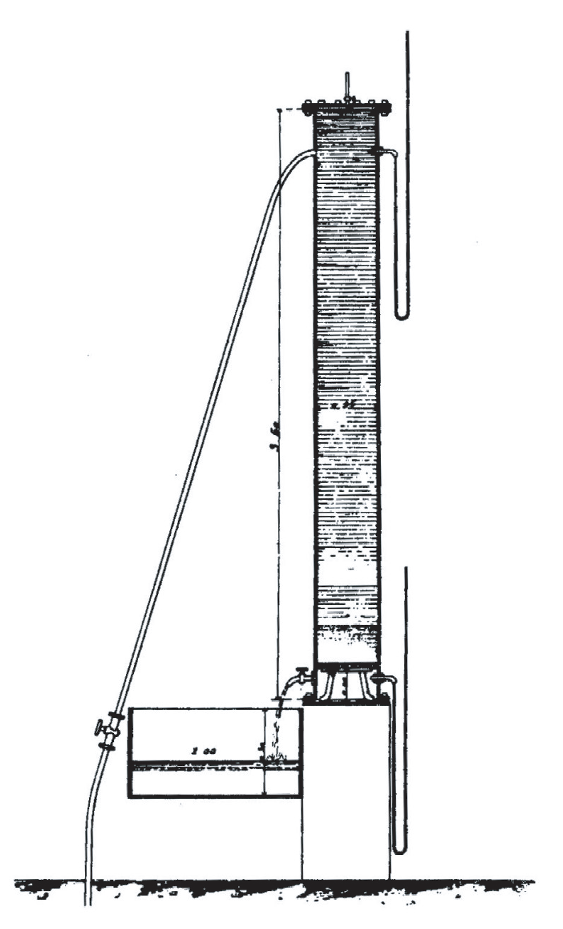
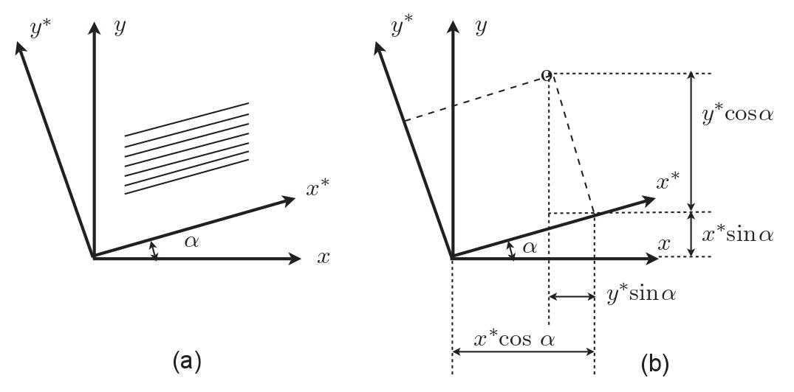
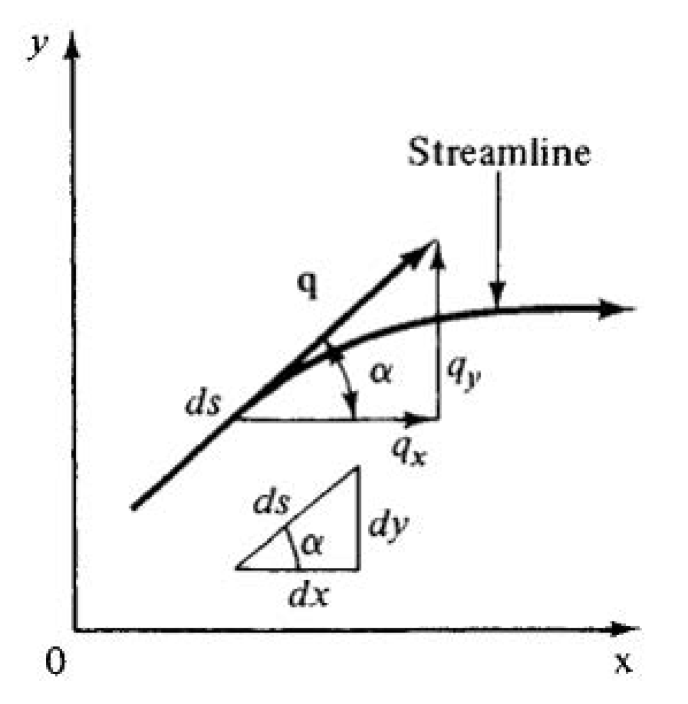
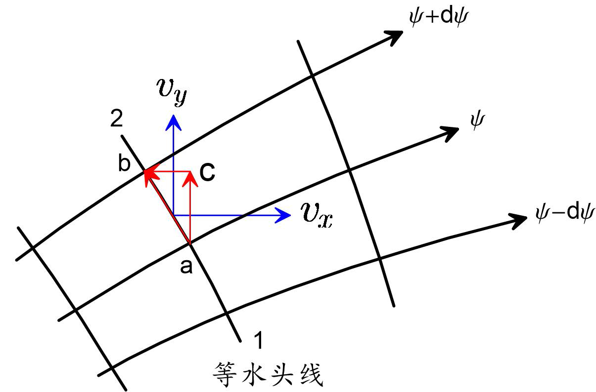
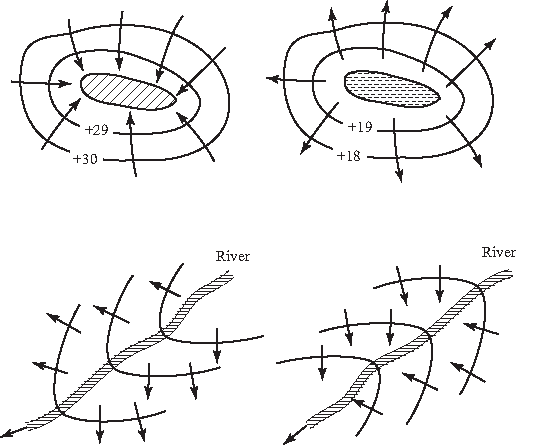
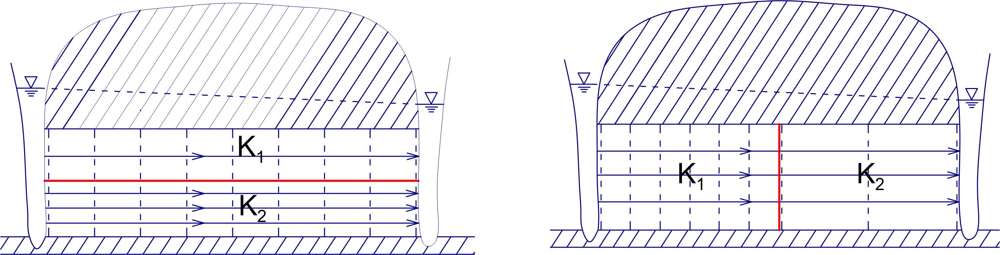
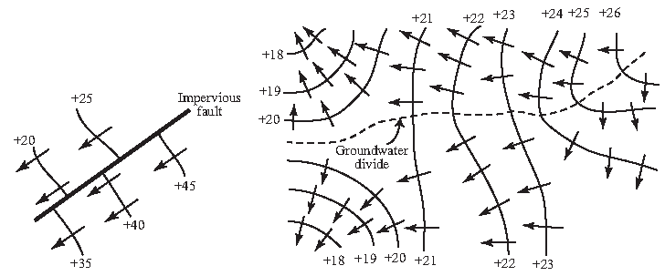

# 1 地下水运动的基本概念与基本定律

<yanggy1010@126.com>

[TOC]

## 1.1  基本概念

### 1.1.1  岩层中地下水运动的研究方法

地下水的物理性质、含水层结构都会影响地下水的运动。一般地，对于流体（水）在多孔介质（含水层）中的运动，需要从流体与多孔介质两方面进行研究！

本课程以多孔介质的渗流力学方法研究地下水流的动力学问题。

**多孔介质**：在地下水动力学中，将具有孔隙的岩石称为多孔介质。在我们的生产、生活中，很多东西都可认为是多孔介质。水文地质中将含水层当成多空介质，如

- 孔隙介质：砂层、疏松砂岩等
- 裂隙介质：裂隙发育的石英岩、花岗岩等
- 岩溶(Karst)介质：岩溶不十分发育的石灰岩与白云岩等

多孔介质中可能存在固、液、气等多种成分，因此具有多相性

- 固相：骨架
- 液相：吸附水、薄膜水、毛管水、重力水等
- 气相：空气等 (非饱和带中)  

### 1.1.2 流体性质

流体的性质主要指如下的几项，其它如温度等在研究水流的热传导性时才在考虑。

- 密度、容重：$\rho$ ( $\mathrm{ML^{-3}}$ )，$\gamma=\rho g$
- 粘滞性：运动粘滞系数 $\nu$ ( $\mathrm{L^2T^{-1}}$ )，动力粘滞系数 $\mu=\rho\nu$
- 表面张力：表面张力系数 $\sigma$
- 可压缩性

根据胡克定律，有压缩系数描述流体的可压缩性。

- 胡克定律:

$$
\mathrm{d}p=-E \frac{\mathrm{d}V}{V}
$$

式中，$E$ — 体积弹性系数或弹性模量 (Elastic(ity) modulus)

**流体的压缩系数 $\beta$：**

等温条件下, 对体积 $V$ 的水施加 $dp$ 压强, 体积压缩量为 $dV$, 压缩系数定义为:

$$
\beta= - \frac{1}{V}\frac{\mathrm{d}V}{\mathrm{d}p}=\frac{1}{E}
$$

量纲 ( $\mathrm{M^{-1}LT^{2}}$ )

**地下水状态方程：** 地下水体积和密度随压力变化的方程.

设初始压强 $p_0$, 水的密度 $\rho$, 体积 $V_0$, 压强变化 $\mathrm{d}p$ 时体积变化 $\mathrm{d}V$, 对

$$
\frac{\mathrm{d}V}{V}=-\beta\mathrm{d}p
$$

两边积分, 得

$$
V =V_0e^{-\beta(p-p_0)},\quad \rho =\rho_0e^{\beta(p-p_0)}
$$

Taylor 级数展开，忽略高阶无穷小：

> 体积状态方程

$$
V=V_0\left[1-\beta(p-p_0)\right]
$$

> 密度状态方程

$$
\rho=\rho_0\left[1+\beta(p-p_0)\right]
$$

> 密度—压强关系

$$
\mathrm{d}\rho=-\rho\frac{\mathrm{d}V}{V}=\rho\beta\mathrm{d}p
$$

### 1.1.3 多孔介质性质

多孔介质指以下的几何性质与力学性质：

- 孔隙性
- 连通性
- 可压缩性

孔隙的多少决定了多孔介质中可容纳的水量大小，根据孔隙对地下水运动的影响有分为有效孔隙与死端孔隙。

- 有效孔隙: 互相连通、不为结合水所占据的孔隙
- 死端孔隙: 一端与其它孔隙连通，另一端是封闭的孔隙，其中地下水是相对停滞的

孔隙性以孔隙度 ( $n$ ) 为指标度量。

- 孔隙度 ($n$)：为孔隙体积与多孔介质总体积之比；
- 有效孔隙度 ( $n_e$ )：为有效孔隙体积与多孔介质总体积之比；

**不同类型的孔隙对供水、工程排水的意义：**

> 供水：取有效孔隙度 ( $n_e$ )
> 
> 排水：取总孔隙度 ( $n$ )，死端孔隙对工程疏干排水有意义！

多孔介质由骨架与孔隙组成，多孔介质物理量一般认为是某个尺度上的物理量。

**多孔介质物理量的测量，以孔隙度为例：**

- 典型单元体(REV): $V_{min}$ 与 $V_{max}$ 范围内的体积 $V_0$, 中心 $P$ 点的物理量定义为典型体内部物理量的平均值.

多孔介质的体积变化使其中所含水量也发生变化。因此也可以定义多孔介质的压缩系数。

天然条件下, 一定深度的含水层承受上覆岩层荷重, 荷重增加引起含水层压缩。设作用于介质表面的压强增加量为 $\mathrm{d}\delta$。记 $V_b$ 为多孔介质体积，有

- 多孔介质压缩系数

$$
\alpha=-\frac{1}{V_b}\frac{\mathrm{d}V_b}{\mathrm{d}\delta}
$$

记 $V_s=(1-n)V_b$ 为骨架体积，$V_v=n V_b$ 为孔隙体积, 定义骨架、孔隙的压缩系数为

- 骨架压缩系数

$$
\alpha_s=-\frac{1}{V_s}\frac{\mathrm{d}V_s}{\mathrm{d}\delta}
$$

- 孔隙压缩系数

$$
\alpha_p=-\frac{1}{V_v}\frac{\mathrm{d}V_v}{\mathrm{d}\delta}
$$

> 压缩系数间的关系：$\alpha=(1-n)\alpha_s+n\alpha_p$ 

因为骨架压缩性比孔隙压缩性小的多, 有 $\alpha \approx n \alpha_p$

### 1.1.4 弹性释水与重力排水

不同含水层的释水现象：

- 弹性释水: 由于水头降低导致含水层压缩释水的现象
- 重力排水: 潜水面降低地下水在重力作用下从含水层排出的现象

用 **<u>太沙基有效应力原理 ( K.Terzaghi, 1943 )</u>** 可以计算出含水层的弹性释水量。

在含水层中取单位面积的横切面, 作用在该横切面的上覆荷重由颗粒 (骨架) 和水共同承担:

$$
\sigma=\lambda \sigma_s+(1-\lambda)p
$$

式中: $\lambda$ — 颗粒接触面积；$\sigma$ — 上覆荷重产生的总应力；$\sigma_s$ — 粒间应力；$p$ — 水压强；$\sigma'=\lambda\sigma_s$ — 有效应力.

假设 $\lambda$ 很小, 有

$$
\sigma={\sigma'}+p
$$

抽水会引起水头变化 $\mathrm{d}H$, 水浮力变化 $\mathrm{d}p=\rho g\mathrm{d}H$, 若上覆荷重不变 ( $\mathrm{d}\sigma=0$ ), 有

$$
\mathrm{d}\sigma'=-\mathrm{d}p
$$

即天然状态下含水层上覆荷重与颗粒反作用力及水的压力平衡。作用于骨架上的力增加引起含水层压缩, 水浮力减小导致水的膨胀, 从而使从含水层释放水量.

**问题：承压含水层由于水头降低释放的水量有多少？**

**水头改变时含水层弹性释放水量的计算：**

- 含水层体积变化量

$$
\mathrm{d}V_b=-\alpha V_b\mathrm{d}\sigma'= \alpha V_b\mathrm{d}p =\alpha V_b\rho g\mathrm{d}H
$$

- 含水层压缩释放的地下水体积

$$
\mathrm{d}V_1=-\mathrm{d}V_b=-\alpha V_b\rho g\mathrm{d}H
$$

- 水压强减小引起的地下水膨胀体积

$$
\mathrm{d}V_2=-\beta V_2\mathrm{d}p=-\beta n\,V_b\rho g \mathrm{d}H
$$

- 含水层释放的地下水总体积

$$
\mathrm{d}V=\mathrm{d}V_1+\mathrm{d}V_2=-(\alpha+n\beta)\rho g V_b\mathrm{d}H
$$

所有的饱水岩层都有弹性释水现象。

**描述弹性释水的水文地质参数：**

- 贮水率: 面积为 1 单位厚度为 1 单位的含水层, 当水头改变一个单位时弹性释放或贮存的水量, $S_s=(\alpha+n\beta)\,\rho g$, 量纲 $L^{-1}$。
- 贮水系数: 面积为 1 单位面积厚度为含水层厚度 ($M$) 的含水层柱体, 当水头改变一个单位时弹性释放或贮存的水量, $S=S_sM$。

**描述（潜水）含水层重力排水的水文地质参数：**

- 给水度 ( $\mu$ ): 水头下降 1 单位, 从潜水含水层底板延伸到地表的单位水平面积岩石柱体在重力作用下释出水的体积, 数值上等于容水度 ( $\theta$ ) 减去持水度 ( $\theta_r$ ), 一般为 0.05～0.25.

> 含水层的贮水系数 $S$ 一般为 $10^{-3}$～$10^{-5}$。给水度 $\mu$ 要比 $S$ 大几个数量级, 研究潜水运动经常忽略潜水含水层的弹性释水。

**弹性释水与重力排水现象的差异:**

> 承压含水层: 减压造成弹性释水, 假设弹性释放瞬时完成, 贮水系数不随时间变化;
> 
> 潜水含水层: 重力作用下排水, 有滞后疏干现象, 给水度为时间的函数；排水时间越长, 给水度越大, 并逐渐趋近于一个固定值。

### 1.1.5 地下水运动的渗流模型

**含水层中的地下水运动特点:**

- 只在孔隙空间存在, 在整个多孔介质中不连续;
- 沿着由形状、大小各异、由连通空隙构成的通道流动;
- 微观水平研究个别孔隙或裂隙中地下水运动非常困难;
- 单个水质点的运动特征复杂, 研究质点特征无意义.

**研究思路：** 从宏观角度来研究地下水运动规律, 以假想水流替代岩层中的实际水流. 

**渗流（定义）:** 一种假想水流, 满足以下假设:

- 假想水流的性质 ( 密度、粘滞性等 ) 和真实地下水相同;
- 假想水流充满整个含水层空间;
- 假想水流运动时, 在任意岩层体积内所受阻力等于真实水流所受的阻力;
- 通过任意断面的流量及任一点的压力或水头均和实际水流相同.

**渗流假设的等效性:**

- 质量等效: 渗流通过某断面的流量应等于通过该断面孔隙的实际流量;
- 能量等效: 渗流通过某岩层所受到的阻力与实际水流相等.

研究渗流问题用到了连续介质假设，

**连续介质假设：** 将流体或固体所占空间近似看作连续、无空隙充满 "质点" 的空间，每一点、每一时刻都有确定的物理量，并且是空间坐标和时间的连续函数。

**渗流模型的优点:**

- 不连续的水流变成连续的渗流;
- 渗流场为连续介质.
- 可用连续函数描述空间中某个点的物理量 (孔隙度、压力、水头与速度等)。

我们知道，研究流体运动的方法有拉格朗日（Lagrange）法和欧拉（Euler）法。拉格朗日法属于研究质点运动的方法，欧拉法研究质点通过空间各点时的运动特性，属于研究场的方法。显然，欧拉法适合于研究渗流问题。

**渗流场（定义）:**  假想水流所占据的空间.

**渗流模型的基本参数：**

- 过水断面: 垂直于渗流方向的一个岩石截面, $A$
- 渗流量(流量): 单位时间通过过水断面的水量, $Q$
- 渗流(透)速度: 单位时间垂直通过单位面积过水断面的流量, $v=\frac{Q}{A}$

**渗流速度 $v$ 与平均流速 ${\bar u}$ 的关系：**

$$
{\bar u}=\frac{v}{n}
$$

实际上，渗流速度不仅体现质量的变化，还具有能量上的意义。

用水头分布表示渗流场的能量状态，水头的概念与水力学相同。

> 测压 (管) 高度

测点 $A$ 至测压管水面的垂直距离, $h_n$

$$
h_n=\frac{p}{\rho g}
$$

式中, $p$ — 相对压强或渗流压强

> 位置水头

测点 $A$ 至基准面的垂直距离, $z$

> 测压管水头

以 $0-0$ 为基准面, 测压管水面至基准面的垂直距离, $H_n$

$$
H_n=z+h_n=z+\frac{p}{\rho g}
$$

> 流速水头

$$
h_u=\frac{u^2}{2g}
$$

> 总水头

$H_n$ 与流速水头 $h_u$ 之和：

$$
H =H_n+h_u=z+\frac{p}{\rho g}+\frac{u^2}{2g}
$$

> 地下水实际流速很小, 计算中通常以测压管水头代替总水头

$$
H \approx z+\frac{p}{\rho g}
$$

其它与水头有关的常用概念

> 水位

以海平面为基准面的测压管水头

> 等水头面

渗流场内水头值相同的点所连成的曲面

> 等水头线

等水头面与某一平面的交线

在地下水动力学中，用水力坡度表示水头的变化，定义如下

> 水力坡度

大小等于梯度值, 方向沿着等水头面的法线指向水头降低方向的矢量

$$
\mathbf{J}=-\frac{\mathrm{d}H}{\mathrm{d}n}\mathbf{n}
$$

> $\mathbf{J}$ 在空间中的分量

$$
J_x=-\frac{\partial H}{\partial x};\;J_y =-\frac{\partial H}{\partial y};\;J_z =-\frac{\partial H}{\partial z}
$$

从以上介绍可以看出，$Q$ 是标量，与过水断面面积相关，$H$ 也是标量；$v$、$\mathbf{J}$ 都有方向性，是矢量，通过投影可以得到正交坐标系各坐标轴方向上的分量。

### 1.1.6  地下水运动特征分类

**运动要素:** 表征渗流运动特征的物理量, 如渗流量 ($Q$)、渗流速度 ($v$)、压强 ($p$)、水头 ($H$) 等.

运动要素与时间关系:

- 稳定流: 运动要素不随时间变化;
- 非稳定流: 运动要素随时间变化.

渗流速度与空间坐标的关系:

- 一维: 渗透速度只在 1 个坐标方向上有分速度;
- 二维: 渗透速度只在 2 个坐标方向上有分速度;
- 三维: 渗透速度在 3 个坐标方向上的分量均不等于零.

> 对于轴对称问题, 柱坐标可降低维数!

### 1.1.7 地下水流态

- 层流: 水流流束彼此不相混杂、运动迹线呈近似平行的流动;
- 紊流: 水流流束相互混杂、运动迹线呈不规则的流动.

**Reynolds数:**

$$
R_e =\frac{v\cdot d}{\nu}
$$

式中:

- $v$—地下水的渗流速度;
- $d$—含水层颗粒的平均粒径;
- $\nu$—地下水的运动黏滞系数.

**临界Reynolds数 ($Re_c$):** 判别流体状态的参数, $< Re_c$ 为层流; $>Re_c$ 为紊流; ($Re_c$ 一般取值150～300)

**临界水力坡度 ($J_c$) :** 对于裂隙介质可用临界水力坡度判别流动状态.

> 天然孔隙含水层中的水流, $Re$ 远小于 $Re_c$, 裂隙含水层中的水流, $J$ 远小于 $J_c$, 地下水多处于层流状态.

## 1.2 Darcy定律

### 1.2.1 Darcy实验与Darcy定律

**亨利 $\cdot$ 达西 (Henri Darcy)**：法国南部城市第戎的一个水力工程师，研究了喷泉供水问题。

**Darcy实验**：如图的装置：

通过实验得出如下规律：

通过固定断面均匀砂柱的流量 $Q$

- 与砂柱断面 $A$ 成正比
- 与入水口、出水口的水位差成正比
- 与砂柱长度 $L$ 成反比

该结论即为著名的 **Darcy 定律** (1856)

$$
Q = KA\frac{H_1 - H_2}{L}
$$

或

$$
v =\frac{Q}{A}=KJ
$$

式中: $K$—系数; $J$—水力坡度.

改写成如下形式：

$$
H_1= H_2+\frac{L}{K}v
$$

式中：$\frac{L}{K}v$ —水流的水头损失.

> Darcy定律实现了地下水系统能量、质量两方面描述的统一！

**Darcy定律微分形式：**

$$
v = - K\frac{\mathrm{d}H}{\mathrm{d}s}
$$

3维形式：

$$
v_x=-K\frac{\partial H}{\partial x},v_y=-K\frac{\partial H}{\partial y},v_z=-K\frac{\partial H}{\partial z}
$$

$v_x$、$v_y$、$v_z$ 表示 3 个坐标方向的分量.

矢量形式：

$$
\mathbf{v}=v_x\mathbf{i}+v_y\mathbf{j}+v_z\mathbf{k}
$$

式中：$\mathbf{i,j,k}$ 为 3 个方向的单位矢量。

### 1.2.2  渗透系数与渗透率

Darcy注意到，系数 $K$ 与所填充的砂子种类有关。

**$K$ 影响因素：** $K= f$ (介质性质，流体性质)

- 岩层介质性质：粒度、成分、颗粒排列、充填状况、裂隙性质及发育程度等
- 流体性质：容重、粘滞性等，与 $\rho g$ 成正比，与 $\mu$  成反比；与流体温度、压力有关。

**渗透系数 $K$：** 表征岩层透水能力的水文地质参数，数值上为水力坡度等于1 时的渗透速度，量纲 $\mathrm{LT^{-1}}$.

记

$$
K=k\frac{\rho g}{\mu}
$$

式中：$\rho$ — 液体密度，$g$ — 重力加速度，$\mu$—动力黏滞系数

**渗透率 $k$：** 反映介质渗透能力的参数，量纲 $\mathrm{L^2}$.

渗透率 $k$ 与介质的几何性质有关，与液体性质无关，在一定条件下可认为是常数，并且常常具有尺度效应.

**渗透率理论公式：**

> 多孔介质, 概化为平行的毛细管束

$$
\begin{split}
k&=\frac{nd^2}{32}\\
K&=\frac{nd^2}{32}\frac{\rho g}{\mu}
\end{split}
$$

> 裂隙介质，概化为平行、缝宽相同的平行板

$$
\begin{split}
k&=\frac{nB^2}{12}\\
K&=\frac{nB^2}{12}\frac{\rho g}{\mu}
\end{split}
$$

**研究二维运动常用的水文地质参数：**

- 单宽流量($q$)：$q=\frac{Q}{B}=MKJ=TJ$
- 导水系数($T$)：表征含水层透水能力的水文地质参数，等于水力坡度为 1 时通过整个含水层厚度的单宽流量，$T=KM$，量纲 $\mathrm{L^2T^{-1}}$.

> 厚的含水层富水性要好，渗透系数大的含水层过水能力好。

### 1.2.3  Darcy定律适用范围

当渗流速度由低到高变化时，地下水运动状态有 3 种情况：

1. $Re$ 小于 1 到 10 之间的某个值时，粘滞力占优势，为层流
2. 当 $Re$ 在 1 到 100 之间时，由粘滞力占优势过渡到惯性力占优势，由层流变为紊流
3. 高的 $Re$，为紊流

判断参数

1. 用 $Re$ 判断: 当 $Re$ 在 1～10 时，水流为层流，Darcy 定律成立。

2. 起始水力坡度 $J_0$：某些粘性土水力坡度必须大于 $J_0$ 才能发生运动。Darcy定律有如下形式：

$$
v=K(J-J_0)
$$

> **多数地下水运动服从 Darcy 定律**。
> 
> 例: 粗砂粒径 $d=0.5$ mm，水温 $15^{\circ}$C，水的运动粘滞系数 $\nu=0.1m^2/d$；取 $Re=1$，反求渗透速度

$$
v = \frac{\mathrm{Re} \cdot\nu}{d} = \frac{1\times0.1}{0.0005} = 200m/d
$$

> 渗透速度小于 $200m/d$ 时为 Darcy 流。
> 
> 一般地，粗砂 $K=100m/d$，$J<\frac{1}{500}$。取 $J=\frac{1}{500}$ 可求得 $v=0.2m/d$，远小于 $200m/d$，服从 Darcy 定律。

## 1.3  渗透系数张量与岩层渗透特征

岩层的渗透性一般在顺层方向与垂层方向差异明显。从 Darcy 公式可以看出，含水层的渗透性影响着地下水的运动方向，下面探讨不同坐标系下渗透系数的表示方法。

### 1.3.1  渗透系数的张量表示

如图，设含水层主渗透方向 $x^\ast,y^\ast$ 的渗透系数分别为 $K_1,K_2$.  $\mathrm{x^\ast o y^\ast}$ 为 坐标系 $\mathrm{xoy}$ 逆时针方向旋转角度 $\alpha$ 获得。

设 $x^\ast,y^\ast$ 方向的渗透速度

$$
v_x^\ast=-K_1\frac{\partial H}{\partial x^\ast},\quad
v_y^\ast=-K_2\frac{\partial H}{\partial y^\ast} 
$$

根据坐标系转换关系

$$
\begin{align*}
x=x^\ast\cos\alpha-y^\ast\sin\alpha\\
y=x^\ast\sin\alpha+y^\ast\cos\alpha
\end{align*}
$$

得 $x,y$ 方向的渗透速度与 $x^\ast,y^\ast$ 方向的渗透速度关系为

$$
\begin{align*}
v_x=v_x^\ast\cos\alpha-v_y^\ast\sin\alpha\\
v_y=v_x^\ast\sin\alpha+v_y^\ast\cos\alpha
\end{align*}
$$

由复合函数求导法则，有

$$
\begin{align*}
\frac{\partial H}{\partial x^\ast}&=\frac{\partial H}{\partial x}\frac{\partial x}{\partial x^\ast}+\frac{\partial H}{\partial y}\frac{\partial y}{\partial x^\ast}=\frac{\partial H}{\partial x}\cos\alpha+\frac{\partial H}{\partial y}\sin\alpha\\
\frac{\partial H}{\partial y^\ast}&=\frac{\partial H}{\partial x}\frac{\partial x}{\partial y^\ast}+\frac{\partial H}{\partial y}\frac{\partial y}{\partial y^\ast}=-\frac{\partial H}{\partial x}\sin\alpha+\frac{\partial H}{\partial y}\cos\alpha
\end{align*}
$$

得

$$
\begin{align*}
v_x=-K_{xx}\frac{\partial H}{\partial x}-K_{xy}\frac{\partial H}{\partial y}\\
v_y=-K_{yx}\frac{\partial H}{\partial x}-K_{yy}\frac{\partial H}{\partial y}
\end{align*}
$$

式中

$$
\begin{split}
K_{xx}&=K_1\cos^2\alpha+K_2\sin^2\alpha\\
K_{xy}&=(K_1-K_2)\sin\alpha\cos\alpha\\
K_{yx}&=K_{xy}\\
K_{yy}&=K_1\sin^2\alpha+K_2\cos^2\alpha
\end{split}
$$

进一步，求出 $K_1,K_2,\alpha$：

$$
\begin{array}{rl}
\begin{array}{c}
K_1 \\ K_2
\end{array}
&=
\frac{K_{xx}+K_{yy}}{2}\pm\left[\left(\frac{ K_{xx}-K_{yy}}{2}\right)^2+K_{xy}^2\right]^{1/2}\\
& \\
\alpha &=\frac{1}{2}\arctan\frac{2K_{xy}}{K_{xx}-K_{yy}}
\end{array}
$$

写成矩阵形式

$$
\begin{pmatrix}
v_x\\
v_y
\end{pmatrix}
=-\begin{pmatrix}
K_{xx} & K_{xy} \\
K_{yx} & K_{yy}
\end{pmatrix}
\begin{pmatrix}
\frac{\partial H}{\partial x}\\
\frac{\partial H}{\partial y}
\end{pmatrix}
$$

3 维的形式：

$$
\begin{pmatrix}
v_x\\
v_y\\
v_z
\end{pmatrix}
=-\begin{pmatrix}
K_{xx} & K_{xy} & K_{xz} \\
K_{yx} & K_{yy} & K_{yz} \\
K_{zx} & K_{zy} & K_{zz} \\
\end{pmatrix}
\begin{pmatrix}
\frac{\partial H}{\partial x}\\
\frac{\partial H}{\partial y}\\
\frac{\partial H}{\partial z}
\end{pmatrix}
$$

其中，$K_{xy}=K_{yx},\,K_{xz}=K_{zx},\,K_{yz}=K_{zy}$

**向量形式**

$$
\mathbf{v}=\mathbf{K}\cdot\mathbf{J}
$$

**张量 (tensor)**: 表示向量、张量和其他张量关系的多线性函数。

$\mathbf{K}$ 是对称张量，与选定的坐标系有关，三个主渗透方向是正交的，主方向渗透系数称为主渗透系数.

从以上推导可以看出，渗透主方向与坐标方向一致时，$\mathbf{K}$ 的表示可以简化为主对角阵

$$
K= \left( \begin{array}{ccc} K_{xx} & 0 & 0 \\ 0 & K_{yy} & 0 \\ 0 & 0 & K_{zz} \end{array} \right)
$$

渗透速度：

$$
v_x=-K_{xx}\frac{\partial H}{\partial x},v_y=-K_{yy}\frac{\partial H}{\partial y},v_z=-K_{zz}\frac{\partial H}{\partial z}
$$

### 1.3.2  透水特征分类

均质性：

- 均质性：渗流场中所有点都具有相同的渗透系数
- 非均质性：渗流场中不同点具有不同的渗透系数

异向性：

- 各向同性：渗流场中某一点各个方向上具有相同的渗透系数
- 各向异性：渗流场中某一点各个方向上具有不同的渗透系数

透水性差异性：

- 非均质岩层透水性是渐变的，如山前洪积扇
- 非均质岩层透水性是突变的，如砂层夹粘土透镜体
- 扁平状细粒沉积物水平方向渗透系数较垂直方向大
- 构造断裂沿裂隙方向渗透系数大

设主渗透方向与 $x,y$ 方向一致，与 $x$ 轴夹角 $\theta$ 方向上的渗透系数为 $K_\theta$。

$$
\left\{
\begin{array}{ll}
x&=r\cos\theta\\y&=r\sin\theta
\end{array}\right.
\implies
\left\{
\begin{array}{l}
\frac{\mathrm{d}x}{\mathrm{d}r}&=\cos\theta\\
\frac{\mathrm{d}y}{\mathrm{d}r}&=\sin\theta
\end{array}
\right.
$$

$$
\left\{
\begin{array}{ll}
v_x&=-K_{xx}\frac{\partial H}{\partial x}=v_\theta\cos\theta\\
v_y&=-K_{yy}\frac{\partial H}{\partial y}=v_\theta\sin \theta\\
v_\theta&=-K_\theta\frac{\partial H}{\partial r}
\end{array}\right. \implies
\left\{\begin{array}{ll}
\frac{\partial H}{\partial x}&=-\frac{\cos\theta}{K_{xx}}v_\theta\\
\frac{\partial H}{\partial y}&=-\frac{\sin\theta}{K_{yy}}v_\theta\\
\frac{\partial H}{\partial r}&=-\frac{1}{K\theta}v_\theta
\end{array}\right.
$$

因为

$$
\frac{\partial H}{\partial r}=\frac{\partial H}{\partial x}\cos\theta+\frac{\partial H}{\partial y}\sin\theta
$$

由

$$
\frac{1}{K_\theta}=\frac{\cos^2\theta }{K_{xx}}+\frac{\sin^2\theta }{K_{yy}}
$$

得

$$
\frac{r^2}{K_\theta}=\frac{x^2}{K_{xx}}+\frac{y^2}{K_{yy}}
$$

这是一个以 $\sqrt{K_{xx}}$ 和 $\sqrt{K_{yy}}$ 为长短轴的椭圆方程，称为**渗透系数椭圆**。

**渗透系数椭圆**: 以圆表示各向同性, 椭圆表示各向异性, 半径表示渗透系数大小, 椭圆长短轴表示主渗透方向。
三维流问题：

$$
\frac{r^2}{K_\theta}=\frac{x^2}{K_{xx}}+\frac{y^2}{K_{yy}}+\frac{z^2}{K_{zz}}
$$

- 各向同性介质中，$K$ 是标量，$\mathbf{J} 和 \mathbf{v}$ 共线；

- 各向异性介质中，$\mathbf{K}$ 是张量，$\mathbf{J}$ 和 $\mathbf{v}$ 一般不共线。

## 1.4 等效渗透系数

对于特定的非均质含水层，将复合结构的含水层转化为等效的单一结构的含水层，可简化水文地质计算。

### 1.4.1 水流折射定律

水流折射：水流通过渗透系数突变界面，流线改变方向的现象。

界面上 A 点满足

**水流连续**（质量）：

$$
v_{1n}=v_{2n}
$$

**水头连续**（能量）：

$$
H_1=H_2,\frac{\partial H_1}{\partial x} = \frac{\partial H_2}{\partial x}
$$

水平方向：

$$
v_{1\tau}=- K_1 \frac{\partial H_1}{\partial x},\quad\,
v_{2\tau}=- K_2 \frac{\partial H_2}{\partial x}
$$

垂直方向：

$$
v_{1n}=v_{2n}
$$

有

$$
\tan\theta_1 = \frac{v_{1\tau}}{v_{1n}},\quad \tan\theta_2 = \frac{v_{2\tau}}{v_{2n}}
$$

渗流折射定律：

$$
\frac{\tan\theta_1}{\tan\theta_2} =\frac{K_1}{K_2}
$$

讨论：

- 均质岩层中不发生折射;
- 水流垂直通过界面时不发生折射;
- 水流平行于界面时不发生折射;
- 发生折射时，$K$ 愈大，$\theta$ 也愈大，流线也愈靠近界面;
- 水流折射并不改变地下水流总方向;
- 总体流向仍受边界条件和源汇等控制;

### 1.4.2 等效渗透系数

**水流平行于层面的等效渗透系数**（$K_p$）

- 含水层总的单宽流量等于各分层单宽流量之和；
- 每一分层水力坡度相等.

$$
q= \sum\limits_{i = 1}^n K_i M_i\frac{\Delta H}{l} =K_pM\frac{\Delta H}{l}
$$

等效渗透系数：

$$
K_p = \frac{\sum\limits_{i = 1}^n K_iM_i}{\sum\limits_{i = 1}^n M_i}
$$

**水流垂直于层面的等效渗透系数**（$K_v$）

- 垂直通过各块段的流量相同;
- 总水头差等于各块段水头差之和.

$$
\begin{array}{ll} q=K_ib\frac{\Delta H_i}{M_i},& q= K_vb\frac{\Delta H}{M}\\
\sum\limits_{i = 1}^n \Delta H_i =\sum\limits_{i = 1}^n \frac{M_iq}{K_ib},&\Delta H = \frac{Mq}{K_vb}\end{array}
$$

等效渗透系数：

$$
K_v = \frac{\sum\limits_{i = 1}^n M_i}{\sum\limits_{i = 1}^n \frac{M_i}{K_i}}
$$

讨论：

- 水流垂直于层面的等效渗透系数取决于渗透系数最小的分层；

把 $M_i,\,K_i$ 看成没有水文地质意义的纯粹变量，则

$$
K_p>K_v
$$

可用柯西不等式证明。

**柯西不等式(Cauchy-Schwarz)：**

$$
\left(\sum\limits_{i=1}^{n}a_ib_i\right)^2\leq\sum\limits_{i=1}^{n}a_i^2\sum\limits_{i=1}^{n}b_i^2
$$

证明：

$$
\begin{align*}
\because \qquad & \sum\limits_{i=1}^{n}(a_i\lambda+b_i)^2 =\lambda^2\sum\limits_{i=1}^{n}a_i^2+2\lambda\sum\limits_{i=1}^{n}a_ib_i+\sum\limits_{i=1}^{n}b_i^2\geq 0\\
\therefore \qquad &\Delta=4\left(\sum\limits_{i=1}^{n}a_ib_i\right)^2-4\sum\limits_{i=1}^{n}a_i^2\sum\limits_{i=1}^{n}b_i^2\leq0\end{align*}
$$

即柯西不等式成立。

## 1.5 渗流场的研究方法—流网

### 1.5.1 流函数

**迹线**：水分子运动轨迹。

**流线**：某一时刻渗流场中处处和渗流速度矢量相切的曲线。

**流线方程**：

|  |  |
| ----------------------------------------------------------------------------------- |:-----------------------------------------------------------------------------------:|

$$
\frac{\mathrm{d}x}{v_x} = \frac{\mathrm{d}y}{v_y}\quad or \quad v_x\mathrm{d}y-v_y\mathrm{d}x=0
$$

**流函数**：满足条件

$$
\frac{\partial\psi}{\partial x} = - v_y,\quad\frac{\partial\psi}{\partial y} =v_x
$$

的函数 $\psi$ 称为流函数，量纲 $\mathrm{L^2T^{-1}}$.

流函数的全微分：

$$
\mathrm{d} \psi= \frac{\partial\psi}{\partial x}\mathrm{d}x + \frac{\partial\psi}{\partial y}\mathrm{d}y = v_x\mathrm{d}y - v_y\mathrm{d}x = 0
$$

沿同一流线，流函数 $\psi$ =常数。

计算两条流线间的单宽流量：

在等水头线上取与流线交点 $a(x,y),b(x+\mathrm{d} x,y+\mathrm{d}y)$，计算 $\psi$ 与 $\psi +\mathrm{d}\psi$ 间的单宽流量：$\mathrm{d}q=v_x\mathrm{d}y-v_y\mathrm{d}x=\mathrm{d} \psi$，积分：

$$
q= \int_{\psi_1}^{\psi_2}\mathrm{d}\psi=\psi_2-\psi_1
$$

**流函数特性**：

- 对于给定流线，流函数是常数；不同流线有不同的常数值；
- 对平面问题，两流线流函数的差等于两流线间的流量；
- 均质各向同性介质中的水流，流函数满足 Laplace 方程；其他情况下均不满足 Laplace 方程；
- 非稳定流的流线不断变化。因此，只有对不可压缩液体的稳定流动，流线才有实际意义。

### 1.5.2 流网及其性质

**流网**：

在渗流场中，取一组相邻流线流函数之差相等的流线，一组相邻等水头线水头差相等的等水头线，由这样一组流线和等水头线组成的网格，称为流网。

可以看出，流线越密，单宽流量越大；等水头线越密，水力坡度越大。因此，流网可以表示渗流场的质量与能量状态。

**流网的性质**：

- 在各向同性介质中，流速与水力坡度方向一致，流线与等水头线处处垂直，流网为正交网格；
  各向异性介质中，流速与水力坡度方向不一致，流线与等水头线一般不正交。
- 在均质各向同性介质中，流网每一网格的边长比为常数。
- 流网中各相邻流线流函数差相等且每个网格水头差相等时，通过每个网格的流量相等。
- 不同透水性介质相邻时，在一介质中为曲边正方形的网格，越过界面进入另一介质网格变成曲边矩形。
  水流由$K$值小的介质进入$K$值大的介质，流网成为扁平网格；水流由$K$值大的介质进入$K$值小的介质，则正好相反。

### 1.5.3 流网的应用

含水层渗透性对流网形状影响。

**应用流网分析水文地质条件**：

- 河流与地下水的补、排关系；
- 分析含水层的透水（导水）能力；
- 解释水文地质现象；
- 分析地下水的补给、排泄、径流特征；

**应用流网进行水文地质计算**：

- 确定水头与渗透压强：任一点的水头 $H$ 可以由等水头线用内插法读取，$p=\rho g(H-z)$
- 计算水力坡度和渗流速度：在两条等水头线之间画出流线，可以计算水力坡度与渗透速度：

$$
J=\Delta H/ \Delta s,v =KJ
$$

- 计算流量：通过计算各流线形成的流带的流量之和，可以求取渗流区某断面的流量。

$$
Q=MK \Delta H\sum_{i=1}^n{\frac{\Delta l_i}{\Delta s_i}}
$$

**流网绘制方法**：

- 数学方法：求出空间上的水头分布，可以绘出等水头线；求出流函数，可以绘出流线。
- 物理模型模拟：水电比拟。
- 现场测定：测定水头，绘制等水头线，再据正交原则绘制流线。
- 信手流网：据流场边界性质和介质特性，半定量地绘制流网。

**信手流网**：

- 分析水文地质条件，弄清补给区、排泄区、或源汇项分布、边界条件等。
- 先绘制肯定的流线和等水头线：
  - 隔水边界是流线；
  - 无入渗、无蒸发条件下潜水面是流线；
  - 湖泊、河流边界可看成等水头线，
- 有两个以上排泄点时应确定分水线、面、点。

### 1.5.4 典型的流网

