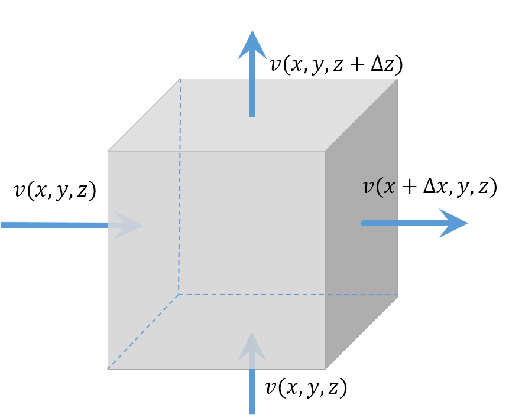
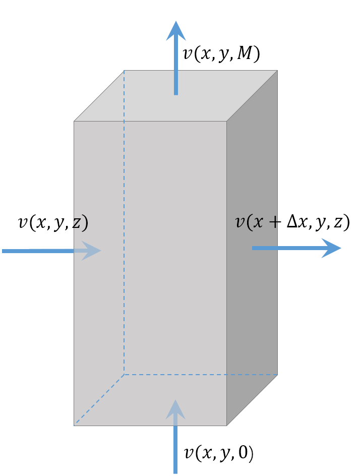
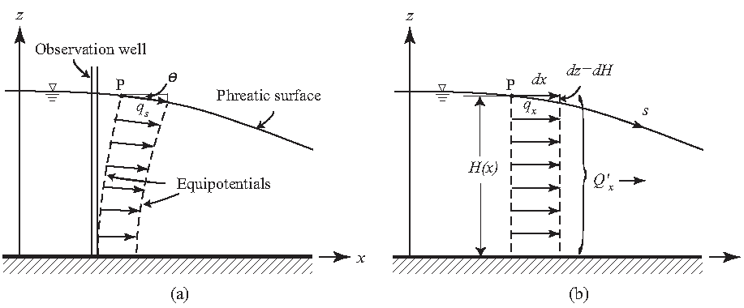
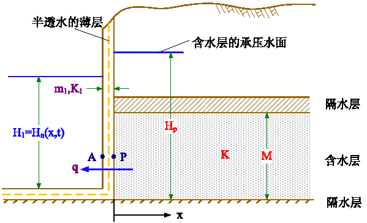
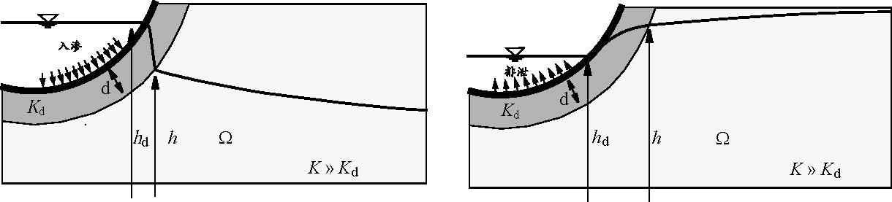

# 2 地下水运动的数学模型及定解条件

<yanggy1010@126.com>

[TOC]

## 2.1 渗流连续性方程

某研究对象的水均衡方程

$$
\Delta^{in}-\Delta^{out}=\Delta V_p \tag{2-1}
$$

水均衡方程作用

- 大区域的水均衡计算常用于区域水资源评价；
- 微分单元体的水均衡用于推导渗流连续性方程.

**连续性方程**：又称为质量守恒方程或水均衡方程，是应用质量守恒定律研究地下水运动的方法.

连续性方程是分析地下水的补、径、排关系的重要依据。

设液体密度为 $\rho$，渗流速度为 $v_x,v_y$,$v_z$，取无限小的单元体 $\Delta x\Delta y \Delta z$, 研究 $\Delta t$ 时间内各方向流入—流出单元体的质量变化：

$x$ 方向

$$
\Delta_x^{in}-\Delta_x^{out}=
\overbrace{\left[\rho v(x,y,z)-\rho v(x+\Delta x,y,z)\right]}^{\Delta v}
\cdot
\overbrace{\Delta y \Delta z}^A\cdot\Delta t
$$

写成微分形式

$$
\Delta_x^{in}-\Delta_x^{out} =-\frac{\partial(\rho v_x)}{\partial x}\Delta x\cdot\Delta y\Delta z\Delta t
$$

$x,y,z$ 三个方向的总质量差

$$
\Delta^{in}-\Delta^{out}=-\left[\frac{\partial(\rho v_x)}{\partial x} +
\frac{\partial(\rho v_y)}{\partial y} + \frac{\partial(\rho v_z)}{\partial z} \right]
\Delta x\Delta y\Delta z\Delta t 
$$

将单元体内地下水的变化量也用微分形式表示

$$
\Delta V_p=\frac{\partial}{\partial t}\big(\rho n\Delta x\Delta y\Delta z\big)\Delta t
$$

由水均衡方程得

$$
-\left[\frac{\partial(\rho v_x)}{\partial x} + \frac{\partial(\rho v_y)}{\partial y} + \frac{\partial(\rho v_z)}{\partial z} \right]\Delta x\Delta y\Delta z
= \frac{\partial}{\partial t}\big(\rho n\Delta x\Delta y\Delta z\big) 
\tag{2-2}
$$

式 (2-2) 即为渗流连续性方程.

记 $V_b=\Delta x\Delta y \Delta z$ ，我们尝试消除 $\Delta x\Delta y\Delta z$ 获得一般意义上的微分方程。根据 §1.1 介绍的压缩系数定义，有 

$$
\mathrm{d}V_b = \alpha V_b\mathrm{d}p,\quad \mathrm{d}\rho=\rho\beta\mathrm{d}p
$$

假设 $V_b$ 中的颗粒体积不变，即 $\mathrm{d}[(1-n)V_b]=0$ ，有 $\mathrm{d}n=(1-n)\mathrm{d}V_b/V_b$，应用有效应力原理，有 $\mathrm{d}n=(1-n)\alpha\mathrm{d}p$。

计算 (2-2) 的右端项

$$
\begin{split}
\frac{\partial(\rho nV_b)}{\partial t}&=
\frac{\mathrm{d}}{\mathrm{d}p}\big(\rho nV_b\big)\frac{\partial p}{\partial t}\\
&=\left(nV_b\frac{\mathrm{d}\rho}{\mathrm{d}p}+\rho V_b\frac{\mathrm{d}n}{\mathrm{d}p}
+\rho n\frac{\mathrm{d}V_b}{\mathrm{d}p}
\right)\frac{\partial p}{\partial t}\\
&=\big[nV_b\rho\beta+\rho V_b(1-n)\alpha + \rho n \alpha V_b\big]\frac{\partial p}{\partial t}\\
&=\rho(n\beta+ \alpha)V_b\frac{\partial p}{\partial t}
\end{split}
$$

若仅垂向有压缩，有 $\mathrm{d}(\Delta z)/\Delta z=\mathrm{d}(V_b)/V_b=\alpha\mathrm{d}p$，有 

$$
\begin{split}
\frac{\partial(\rho nV_b)}{\partial t}&=\Delta x\Delta y
\frac{\mathrm{d}}{\mathrm{d}p}\big(\rho n\Delta z\big)\frac{\partial p}{\partial t}\\
&=\Delta x\Delta y\left(n\Delta z\frac{\mathrm{d}\rho}{\mathrm{d}p}+\rho \Delta z\frac{\mathrm{d}n}{\mathrm{d}p}
+\rho n\frac{\mathrm{d}\Delta z}{\mathrm{d}p}
\right)\frac{\partial p}{\partial t}\\
&=\Delta x\Delta y\big[n\Delta z\rho\beta+\rho \Delta z(1-n)\alpha + \rho n \alpha\Delta z\big]\frac{\partial p}{\partial t}\\
&=\rho(n\beta+ \alpha)V_b\frac{\partial p}{\partial t}
\end{split}
$$

可以看出，仅垂向有压缩与一般情形是相同。

练习：

1. 写出骨架与地下水都不可压缩时的渗流连续性方程，问此时地下水运动是稳定的还是非稳定的？

2. 用 $\frac{\partial H}{\partial t}$ 表示 $\frac{\partial p}{\partial t}$ 。

## 2.2 承压水运动方程

### 2.2.1 承压水运动方程的一般形式

考虑承压含水层，假设：

- 水流服从 Darcy 定律;
- $K$、$S_s$ 不受 $\rho$、$n$ 变化影响;
- 含水层侧向无压缩 ($\Delta x,\Delta y$为常量)，只有垂向 $\Delta z$ 的压缩;
- 忽略水的压缩。

设水的密度为 $\rho$，渗流速度为 $v_x,v_y,v_z$，取无限小的单元体 $\Delta x\Delta y \Delta z$，$\Delta t$ 时间内单元体内地下水的变化量为

$$
\Delta_t=\frac{\partial}{\partial t}\big(\rho n\Delta x\Delta y\Delta z\big)\Delta t
$$

该值可以根据贮水率的定义直接给出

> 练习：写出 $\Delta t$ 时间内水头变化 $\Delta H$ 时单元体内地下水的质量改变量.

根据贮水率的定义，$\Delta_t=\rho(S_s\Delta H)\Delta x\Delta y\Delta z$. 写成微分形式

$$
\Delta_t=\rho\left(S_s\frac{\partial H}{\partial t}\Delta t\right)\Delta x\Delta y \Delta z
$$

代入连续性方程，有

$$
-\rho\left[\frac{\partial(v_x)}{\partial x} + \frac{\partial(v_y)}{\partial y} + \frac{\partial(v_z)}{\partial z}\right]\Delta x\Delta y\Delta z\Delta t
=\rho\left(S_s\frac{\partial H}{\partial t}\Delta t\right)\Delta x\Delta y \Delta z
\tag{2-3}
$$

> 问题：方程左边因变量为 $v$，右边为 $H$ ，如何统一？

由 Darcy 定律

$$
\left(
\begin{array}{l}
v_x \\
v_y \\
v_z
\end{array}
\right)
=- 
\left(
\begin{array}{ccc} K_{xx} & K_{xy} & K_{xz} \\ K_{yx} & K_{yy} & K_{yz} \\ K_{zx} & K_{zy} & K_{zz}
\end{array} 
\right) 
\left( 
\begin{array}{l}
\frac{\partial H}{\partial x} \\ \frac{\partial H}{\partial y} \\ \frac{\partial H}{\partial z}
\end{array}
\right)
$$

代入 (2-2) 式并消去 $\rho\Delta x\Delta y\Delta z\Delta t$ 得到承压水运动方程的一般形式

$$
-\left(\frac{\partial v_x}{\partial x} + \frac{\partial v_y}{\partial y}+ \frac{\partial v_z}{\partial z} \right)=S_s\frac{\partial H}{\partial t}
\tag{2-4}
$$

式中，

$$
\begin{split}v_x & =-\left( K_{xx}\frac{\partial H}{\partial x}+K_{xy}\frac{\partial H}{\partial y}+K_{xz}\frac{\partial H}{\partial z}\right)\\
v_y & =-\left( K_{yx}\frac{\partial H}{\partial x}+K_{yy}\frac{\partial H}{\partial y}+K_{yz}\frac{\partial H}{\partial z}\right)\\
v_z & =-\left( K_{zx}\frac{\partial H}{\partial x}+K_{zy}\frac{\partial H}{\partial y}+K_{zz}\frac{\partial H}{\partial z}\right)
\end{split}
$$

### 2.2.2 3 维承压水运动方程

根据渗透系数张量的概念，特殊的坐标系可以简化渗透速度的表示。

假设异向性用渗透系数下标区分；均质性用渗透系数是否为常数区分；各向同性时 $K$ 为标量。实际应用时，用参数分区方法使每一个分区都相对是均质的，从而简化计算。

由此可在 (2-4) 的基础上得到承压水运动方程的不同形式。

取坐标方向与主渗透方向一致，则可以写出方程的各种形式：

+ 非均质各向异性
+ 非均质各向同性
+ 均质各向同性
+ 稳定流：水头 $H$ 不随时间 $t$ 变化，即方程右端 $\frac{\partial H}{\partial t}=0$.

均质各向同性含水层中，抽水井抽水时，井周围的地下水运动可看作是抽对称的。此时取柱坐标可以简化计算。

由高等数学知识

$$
\frac{\partial^2H}{\partial x^2}+\frac{\partial^2H}{\partial y^2}
=\frac{\partial^2H}{\partial r^2}+\frac{1}{r}\frac{\partial H}{\partial r}+\frac{1}{r^2}\frac{\partial^2 H}{\partial \theta^2}
= \frac{1}{r^2}\left[r\frac{\partial}{\partial r}\left(r\frac{\partial H}{\partial r}\right)+\frac{\partial^2H}{\partial \theta^2}\right]
$$

轴对称问题，$\frac{\partial^2H}{\partial \theta^2}=0$

- 二度各向异性介质（柱坐标，轴对称）
- 二度各向同性介质（柱坐标，轴对称）

### 2.2.3 2 维承压水运动方程

2 维承压水运动方程的获得可以采用两种方法：一是将高维度的方程作降维处理，一是用单位面积含水层厚度柱体作为均衡单元直接推导。

取坐标方向与主渗透方向一致，在 $z$ 向上 $\frac{\partial H}{\partial z}=0$，可以写出方程的各种形式：

+ 非均质各向异性
+ 均质各向同性（等厚，柱坐标、轴对称）
+ 2 维稳定流： $\frac{\partial H}{\partial t}=0$.

$a=T/S$ 称为压力传导系数。

### 2.2.4  含源、汇项的承压水运动方程

源：有水流流入含水层，取正值；

汇：有水流流出含水层，取负值.

取坐标方向与主渗透方向一致，

- 3 维非均质各向同性

$$
frac{\partial}{\partial x}\left(K\frac{\partial H}{\partial x}
 \right) +\frac{\partial}{\partial y}\left(K\frac{\partial H}
 {\partial y} \right) +\frac{\partial}{\partial z}
 \left(K\frac{\partial H}{\partial z} \right)+W=S_s
 \frac{\partial H}{\partial t}
$$

式中: $W$ — 单位时间垂向上单位体积含水层流入、流出的水量，($1/T$)

- 2 维非均质各向同性

$$
\frac{\partial}{\partial x}\left(T\frac{\partial H}{\partial x}
 \right) + \frac{\partial}{\partial y}\left(T\frac{\partial H}
 {\partial y} \right)+W=S\frac{\partial H}{\partial t}
$$

式中: $W$ — 单位时间垂向上单位面积含水层流入、流出的水量，($L/T$)

## 2.3 有越流承压水运动方程

> 越流：
> 
> 当承压含水层与相邻含水层存在水头差时，地下水便会从高水头含水层通过弱透水层流向低水头含水层，这种现象称越流. 

越流含水层 (半承压含水层)：当承压含水层的上、下岩层（或一层）为弱透水层时，承压含水层可通过弱透水层与上、下含水层发生水力联系，该承压含水层为越流含水层. 

假设条件：

- 含水层产状水平, 等厚;
- 水流服从 Darcy 定律; 
- $K$、$S_s$ 不受 $\rho$、$n$ 变化影响; 
- 含水层侧向无压缩，只有垂向 $\Delta z$ 的压缩，忽略水的压缩，忽略弱透水层弹性释水；
- 弱透水层渗透系数 $K_1,K_2$ 比主含水层渗透系数 $K$ 小得多，地下水垂直通过弱透水层，折射 90° 后变为主含水层中的水平流动。

有越流承压水运动方程可以根据单位面积整个含水层厚度柱体的水量均衡方程得出.

> 练习：试根据承压水运动方程推导有越流承压水运动方程.

取坐标原点位于含水层底板，记 $v(x,y,z)$ 为 $x,y,z$ 点的渗透速度. 考虑厚度 $M$ 非均质各向同性含水层中单位面积柱体 $\Delta t$ 时间内的水量均衡

$$
\Delta V_{in}-\Delta V_{out}=\Delta V_t
$$

$x$ 方向通过柱体的地下水体积变化量

$$
\begin{split}
&\{v(x,y,z)-v(x+\Delta x,x,z)\}\overbrace{M\Delta y}^A\Delta t \\
=&-\frac{\partial v}{\partial x}\Delta xM\Delta y\Delta t 
\end{split}
$$

由于含水层各项同性, 由 Darcy 定律, $x$ 方向渗透速度

$$
\frac{\partial v}{\partial x}=-K\frac{\partial H}{\partial x}
$$

由此得 $x$ 方向通过柱体的地下水体积变化量为

$$
\frac{\partial}{\partial x}\Big(\overbrace{MK}^T\frac{\partial H}{\partial x}\Big)
\Delta x\Delta y\Delta t
$$

$x,y$ 方向通过柱体的地下水体积总变化量

$$
\left\{\frac{\partial}{\partial x}\left(T\frac{\partial H}{\partial x}\right)+
\frac{\partial}{\partial y}\left(T\frac{\partial H}{\partial y}\right)\right\}
\Delta x\Delta y\Delta t
$$

$z$ 方向通过柱体的地下水体积变化量

$$
\left[v(x,y,0)-v(x,y,M)\right]\Delta x \Delta y\Delta t
$$

由 Darcy 定律

$$
\begin{split}
v(x,y,M)&=-K_1\frac{H_1-H}{m_1}\\
v(x,y,0)&=-K_2\frac{H-H_2}{m_2}
\end{split}
$$

由此得 $z$ 方向通过柱体的地下水体积变化量为

$$
\left(K_1\frac{H_1-H}{m_1}+K_2\frac{H_2-H}{m_2}\right)\Delta x \Delta y\Delta t
$$

柱体内部的地下水变化量可根据贮水系数给出

$$
\Delta V_p=S\frac{\partial H}{\partial t}\Delta x\Delta y\Delta t
$$

将这些变量代入水均衡方程并消去 $\Delta x\Delta y\Delta t$，得有越流承压水运动方程

$$
\frac{\partial}{\partial x}\left(T\frac{\partial H}{\partial x}\right)+
\frac{\partial}{\partial y}\left(T\frac{\partial H}{\partial y}\right)+
K_1\frac{H_1-H}{m_1}+K_2\frac{H_2-H}{m_2}=S\frac{\partial H}{\partial t}
$$

非均质各向异性介质，坐标方向与主渗透方向一致

$$
\frac{\partial}{\partial x}\left(T_{xx}\frac{\partial H}{\partial x}\right)+
\frac{\partial}{\partial y}\left(T_{yy}\frac{\partial H}{\partial y}\right)+
K_1\frac{H_1-H}{m_1}+K_2\frac{H_2-H}{m_2}=S\frac{\partial H}{\partial t}
$$

均质各向同性介质

$$
\frac{\partial^2H}{\partial x^2}+\frac{\partial^2H}{\partial y^2}+
\frac{H_1-H}{B_1^2}+\frac{H_2-H}{B_2^2}=\frac{S}{T}\frac{\partial H}{\partial t}
$$

定义

+ 越流因素：$B_1,B_2$ 为上、下两个弱透水层的越流因素，$L$. 
  
  $$
  B_1=\sqrt{\frac{Tm_1}{K_1}},B_2=\sqrt{\frac{Tm_2}{K_2}}
  $$

+ 越流系数：当主含水层和供给越流的含水层水头差为一个长度单位时，通过主含水层和弱透水层间单位面积界面上的水流量.
  
  $$
  \sigma'=\frac{K_1}{m_1}
  $$

有源、汇项

- 非均质各向异性，坐标方向与主渗透方向一致
  
  $$
  \frac{\partial}{\partial x}\left(T_{xx}\frac{\partial H}{\partial x}\right)+
\frac{\partial}{\partial y}\left(T_{yy}\frac{\partial H}{\partial y}\right)+
K_1\frac{H_1-H}{m_1}+K_2\frac{H_2-H}{m_2}+W=S\frac{\partial H}{\partial t}
  $$

- 非均质各向同性
  
  $$
  \frac{\partial}{\partial x}\left(T\frac{\partial H}{\partial x}\right)+
\frac{\partial}{\partial y}\left(T\frac{\partial H}{\partial y}\right)+
K_1\frac{H_1-H}{m_1}+K_2\frac{H_2-H}{m_2}+W=S\frac{\partial H}{\partial t}
  $$

- 均质各向同性
  
  $$
  \frac{\partial^2H}{\partial x^2}+\frac{\partial^2H}{\partial y^2}+
\frac{H_1-H}{B_1^2}+\frac{H_2-H}{B_2^2}+W=
\frac{S}{T}\frac{\partial H}{\partial t}
  $$

- 轴对称形式

$$
\frac{\partial^2H}{\partial r^2}+\frac{1}{r}\frac{\partial H}{\partial r}
+
\frac{H_1-H}{B_1^2}+\frac{H_2-H}{B_2^2}+W=
\frac{S}{T}\frac{\partial H}{\partial t}
$$

## 2.4 潜水运动方程

### 2.4.1 Dupuit 假设

潜水流不是水平运动，潜水面、等水头面是弯曲的，大多数潜水面坡角很小。

Dupuit Assumption (1863)：大多数情况下可以假设潜水流近似水平运动。

* 潜水面坡角很小时可以忽略渗透速度的垂直分量；
* 此时等水头面是铅直的；
* 含水层中水压是静水压力。

> 潜水面上任意一点 $p$ 的渗透速度

$$
v_s=-K\frac{\partial H}{\partial s}=-K\sin\theta
$$

当 $\theta$ 很小时，$\sin\theta\approx\tan\theta=\frac{\partial H}{\partial x}$，得

$$
v_s\approx-K\frac{\partial H}{\partial x}=v_x
$$

> 单宽流量：

$$
q_x=-K(H-z)\frac{\partial H}{\partial x}=
-Kh\frac{\partial H}{\partial x}
$$

> Dupuit 假设使问题简化了

* 剖面 2 维流 ($x,z$) 降维为水平 1 维流；
* 3 维问题 ($x,y,z$) 降维为水平 2 维流 ($x,y$)；
* 潜水面边界处理简单化.

> Dupuit 假设局限性

* 当潜水面存在垂向补给、排泄或潜水为非稳定流时，即使潜水面坡度很小，也需要根据条件具体分析。
* 隔水边界在 $x>2h_0$ 时 Dupuit 假设才有效.

### 2.4.2 Boussinesq方程

假定条件

* 潜水流满足裘布依假设；
* 水和骨架不可压缩；
* 潜水面上存在水量交换 $W$:
  $W>0$ 入渗；
  $W<0$ 蒸发.
* 潜水流为 1 维流.

设 $x$ 处的潜水流厚度为 $h(x)$, 研究 $x$ 方向的 1 维流.

取长度为 $\Delta x$ 宽度为 1 个单位的含水层柱体，则 $\Delta t$ 时段内的水均衡方程为

$$
\Delta V_{in}-\Delta V_{out}=\Delta V_t
$$

记 $q_x$ 为 $x$ 方向的单宽流量，$x$ 方向通过柱体的地下水体积变化量为

$$
\Delta V_{in,x}-\Delta V_{out,x}=-\frac{\partial q_x}{\partial x}\Delta x\cdot1\cdot\Delta t
$$

应用 Dupuit 假设，$x$ 方向单宽流量

$$
q_x=-Kh\frac{\partial H}{\partial x}
$$

得 $x$ 方向的水量差

$$
\Delta V_{in,x}-\Delta V_{out,x}=\frac{\partial}{\partial x}\left(Kh\frac{\partial H}{\partial x}\right)\Delta x\cdot1\cdot\Delta t
$$

$z$ 方向入渗或蒸发引起的柱体水量变化为

$$
\Delta V_{in,z}-\Delta V_{out,z}=W\Delta x\cdot1\cdot\Delta t
$$

$\Delta t$ 时段内潜水位变化 $\frac{\partial H}{\partial t}\Delta t$ 柱体内水量变化为

$$
\Delta V_t=\mu\frac{\partial H}{\partial t}\Delta x\cdot1\cdot\Delta t
$$

忽略 $y$ 方向的体积改变量，将各项代入均衡方程，得

$$
\left[\frac{\partial}{\partial x}\left(Kh\frac{\partial H}{\partial x}\right)+W\right]\Delta x\Delta t=\mu\frac{\partial H}{\partial t}\Delta x\Delta t
$$

消去 $\Delta x\Delta t$ 得到 1 维 Boussinesq 方程:

$$
\frac{\partial}{\partial x}\left(Kh\frac{\partial H}{\partial x}\right)+W=\mu\frac{\partial H}{\partial t}
$$

> 2 维流

* 均质各向同性
  
  $$
  \frac{\partial}{\partial x}\left(h\frac{\partial H}{\partial x}\right) + \frac{\partial}{\partial y}\left(h\frac{\partial H}{\partial y}\right) +\frac{W}{K} = \frac{\mu}{K}\frac{\partial H}{\partial t}
  $$

* 非均质各向同性
  
  $$
  \frac{\partial}{\partial x}\left(Kh\frac{\partial H}{\partial x}\right)+\frac{\partial}{\partial y}\left(Kh\frac{\partial H}{\partial y}\right)+W=\mu\frac{\partial H}{\partial t}
  $$

* 以底板为基准面, 底板水平
  
  $$
  \frac{\partial}{\partial x}\left(Kh\frac{\partial h}{\partial x}\right)+\frac{\partial}{\partial y}\left(Kh\frac{\partial h}{\partial y}\right)+W=\mu\frac{\partial h}{\partial t}
  $$

* 3 维流
  与承压水微分方程相同.

## 2.5. 定解条件

### 2.5.1 基本概念

> **举例**

1 维稳定流方程 

$$
\frac{\partial^2H}{\partial x^2}=0
$$

的通解为

$$
H=C_1x+C_2
$$

1 维非稳定流方程

$$
\frac{\partial^2H}{\partial x^2}=\frac{\partial H}{\partial t}
$$

通解为 

$$
H=[C_1\cos(\lambda x)+C_2\sin(\lambda x)]\mathrm{e}^{-\lambda^2t}
$$

> 微分方程刻画地下水流运动规律，不包含渗流区特定水文地质信息，解不是唯一的!

研究地下水运动需要的**水文地质数据**：

- 渗流区范围与形状；
- 微分方程及水文地质参数，如 $T,K,S,S_s,\mu,B$、源汇项 ($W$) 等；
- 边界条件: 渗流区边界处的水头、渗流量等, 为系统与外部的连续关系；
- 初始条件: 用于非稳定流，某一选定的初始时刻 ($t=0$) 渗流区内水头 $H$ 的分布.

> **定解条件**为边界条件和初始条件的合称.

微分方程与定解条件所描述的数学物理问题称为**定解问题**，一组数学方程与其定解条件构成一个描述某实际问题的**数学模型**.

初始条件可以理解为地下水系统的初始质、能状态。

### 2.5.2 初始条件

- 3 维
  
  $$
  \left. H (x,y,z,t) \right|_{t = 0} = H_0(x,y,z), 
\qquad ( x,y,z) \in D
  $$

- 2 维
  
  $$
  \left. H(x,y,t) \right|_{t = 0} = H_0(x,y), \qquad(x,y) \in D
  $$

> **注意**：初始条件不是地下水开采前的状态!

### 2.5.3 边界条件

**边界条件类型**

- 第一类边界条件 (Dirichlet):
  又称给定水头边界, 即边界某一部分水头是已知的.
- 第二类边界条件 (Neumann)：
  又称给定流量边界, 即边界某一部分单位面积流入、流出量是已知.
- 第三类边界条件 (Robbins)：
  又称混合边界条件, 即边界某一部分水头与法向水力坡度的线性组合是已知的.

边界条件可以理解为地下水系统在边界处与外部的质量交换与能量延续状态。由 Darcy 定律知，第一类边界条件与第二类边界条件在一定条件下是等价的。

**边界条件的表示**

> 第一类边界

- 2 维
  
  $$
  \left.H(x,y,t)\right|_{\Gamma_1}=\varphi_1(x,y,t),
\qquad(x,y) \in\Gamma_1
  $$

- 3 维

$$
\left.H(x,y,z,t)\right|_{S_1}=\varphi_2(x,y,z,t),
\qquad(x,y,z) \in S_1
$$

> 第二类边界

- 2 维

$$
\left.KM\frac{\partial H}{\partial n}
\right|_{\Gamma_2}=vM=q(x,y,t),\qquad(x,y) \in\Gamma_2
$$

- 3 维

$$
\left. K\frac{\partial H}{\partial n}
\right|_{S_2}=v(x,y,z,t),\qquad(x,y,z) \in S_2
$$

> 第三类边界

$$
\frac{\partial H}{\partial n} + \alpha H = \beta,
\qquad(x,y) \in\Gamma_3
$$

式中, $n$ — 边界外法线方向, $M$ — 含水层厚度, $v$ — 渗透速度, $q$ — 单宽流量.

### 2.5.4 边界条件概化

> 第一类边界

当含水层被地表水体完全切割，并且与水体有直接水力联系时，可按第一类边界处理.

$$
\left.H(x,y,t)\right|_{\Gamma_1}=H_1(x,y,t),
\quad\quad(x,y) \in\Gamma_1
$$

> 第二类边界

- 隔水边界为典型的第二类边界，即侧向补给流量 $q=0$.

各向同性介质

$$
\left.\frac{\partial H}{\partial n}\right|_{\Gamma_2}=0
$$

各向异性介质

$$
K_{n}\left.
\frac{\partial H}{\partial n}\right|_{\Gamma_2}=0
$$

- 零流量边界类似于隔水边界，侧向补给流量为零.

$$
q=0
$$

- 若已知抽水井的流量，井边界也是第二类边界.

法向梯度表示

$$
2\pi r_w MK\left.\frac{\partial H}
{\partial n}\right|_{\Gamma_w}=-Q
$$

柱坐标表示

$$
2\pi r_w MK \left.\frac{\partial H}{\partial r}\right|_{r_w}=Q
$$

> 第三类边界

- 若边界由弱透水层与其它水体或含水层相连，可按第三类边界处理.

如图写出边界法向渗透速度：

弱透水层：$v=-K_1\frac{\partial H}{\partial x}=-K_1\frac{H-H_1}{m_1}$

含水层：$v=-K\frac{\partial H}{\partial x}=K\frac{\partial H}{\partial n}$

组合成边界条件：$K\frac{\partial H}{\partial n}+\frac{K_1}{m_1}(H-H_1)=0, \quad(x,y,z)\in\Omega$

- 河床底部有弱透水沉积物时也可按第三类边界处理
  
  
  
  如图写出边界法向渗透度：
  
  弱透水层：$v=-K_1\frac{\partial H}{\partial n}=-K_1\frac{H_1-H}{m_1}$
  
  含水层：$v=-K\frac{\partial H}{\partial n}$
  
  组合成边界条件：$K\frac{\partial H}{\partial n}+\frac{K_1}{m_1}
  (H-H_n)=0,\quad(x,y,z)\in\Omega$

> **讨论**

- 边界水头 $H$ 不随 $t$ 变化是给定水头 (第一类边界) 的特例, 需要谨慎使用 (原因？)
- 边界性质及抽水井与边界距距离对计算结果影响大;
- 稳定流问题不能全部用第二类边界条件 (原因？)

> 注意：

- 边界水头 $H$ 不随 $t$ 变化，若渗流区内部水头急剧变化，将使计算的水力坡度也急剧变化，使流量计算误差变大.
- 根据达西定律，第一类、第二类边界在一定条件下是等价的, 但是稳定流问题若全部是第二类边界条件，则不能确定唯一流场！

**潜水流问题**

- 稳定流问题，潜水面上压强等于大气压，任意一点水头等于该点纵坐标, 为第一类边界. 
  
  $$
  \left\{\begin{array}{ll}
\left.H^*\right|_{C_1}=H_0 & (x,y) \in C_1 \\
\left.H^*\right|_{C_2}=z & (x,y) \in C_2 \\
\left.H\right|_{C_3}=z & (x,y) \in C_3 \\
\left.H\right|_{C_4}=h_w & (x,y) \in C_4 \\
\left.\frac{\partial H}{\partial n}\right|_{C_5}=0 & (x,y) \in C_5
\end{array}\right.
  $$

- 非稳定流问题，潜水面可作为第二类边界.

$$
\left.K\frac{\partial H}{\partial n}\right|_{C_2}=q
$$

当浸润曲线下降时，从边界流入单位面积流量为

$$
q = \mu\frac{\partial H^*}{\partial t}\cos\theta
$$

## 2.6 地下水运动的数学模型及其解法

### 2.6.1 水文地质概念模型

水文地质概念模型 (卡斯塔尼) 是从现场和实验所收集到的具体数据的综合，也就是表示有关含水层结构和作用以及含水系统特征方面的数据图，即"概念示意图".

水文地质概念模型是理论和应用之间的一个环节，既是近代水文地质学的一个主要研究目标，又是地下水资源评价和管理的重要基础.

> 含水系统的水文地质概念模型：表示一定时间内与一定空间内的几组数据资料：

- 水文地质建造特征；边界面、厚度、岩性、粒度或裂隙发育程度等；
- 地质边界条件和水动力学边界条件：水位和入流量、出流量；
- 水动力学参数及其在空间上的分布.

> 水文地质概念模型定义中的含水系统有 3 个特征：

- 水动力学特征
- 水化学特征
- 水生生物学特征

含水系统周围环境对水动力学边界条件会产生一些"脉冲"影响，含水系统在接受这些"脉冲"后，便根据含水层结构参数做出各种相应的反应.

### 2.6.2 水文地质数学模型

数学模型类型

- 随机模型；
- 确定性模型；

确定性模型描述地下水运动的必备条件

- 有一个或一组描述地下水运动的偏微分方程；
- 相应的定解条件.

建立数学模型的目的

将天然地质体概化成概念模型，用一组数学关系式反映水文地质条件和地下水运动特征，达到复制或再现地下水系统状态的目的.

步骤：

- 查明地质、水文地质条件；
- 确定研究区的范围和形状；
- 对研究区的水文地质条件进行概化；
- 给出微分方程和定解条件，以及模型中需要的参数；
- 模型识别；
- 模型检验；
- 评价与预测.

数学模型的适定性

- 解的存在性；
- 解的唯一性；
- 解的稳定性：指当参数和定解条件发生微小变化时，解的变化也是微小的.

正问题和逆问题

- 正问题：给定含水层水文地质参数和定解条件，求解水头H，这类问题称为正问题或水头预报问题;
- 逆问题：根据动态观测资料或抽水试验资料反过来确定水文地质参数，这类问题称为逆问题或反求参数问题.

例 1：研究区地质情况如图，$W(x,y,t)$ 代表单位时间、单位面积上的垂向补给量，$P(x,y,t)$ 为计划开采区单位面积上的开采量，试写出它的数学模型.

步骤：

- 查明地质、水文地质条件；
- 确定研究区的范围和形状；
- 对研究区的水文地质条件进行概化；
- 给出微分方程和定解条件；

稳定流与非稳定流模型的主要差别在于取水过程中，含水层弹性释水与重力排水是否起作用。一般地，短时间的抽水肯定是非稳定流；长时间抽水，边界起作用后，地下水系统状态就主要由边界条件决定了。可以认为，稳定流是非稳定的极限状态。工程实践中还应考虑时间因素，应该选择稳定流还是选择非稳定流模型，视工程进行的阶段情况确定。地下水流模型应用效果不够好，基本上都是用稳定模型去解释非稳定现象所致。

水文地质概念模型（略）

潜水流服从 Darcy 定律, 河流为第一类边界. 记 $h=H-z$, 相应的数学模型为

$$
\left\{
\begin{array}{ll}
\frac{\partial}{\partial x}\left(Kh\frac{\partial H}{\partial x}\right)+
\frac{\partial}{\partial y}\left(Kh\frac{\partial H}{\partial y}\right)+
W-P=\mu\frac{\partial h}{\partial t} & (x,y)\in D,t\geqslant0  \\
\mathrm{IC:}H(x,y,0)=H_0(x,y) & (x,y)\in D \\
\mathrm{BC:}H(x,y,t)=f(x,y,t) & (x,y)\in\widehat{AD} \\
\mathrm{BC:}\frac{\partial H}{\partial n}=0 &
(x,y)\in\widehat{AB}\cup\widehat{BC}\cup\widehat{CD}
\end{array}
\right.\tag{I}
$$

式中，开采量以源汇项的形式出现，$P(x,y,t)$ 为一分片函数。

例 2：其它条件同例 1，在河底有一弱透水层，河水与地下水无直接的水力联系，只是通过弱透水层越流补给地下水.

水文地质概念模型（略）

潜水流服从 Darcy 定律, 河流为第三类边界. 记 $h=H-z$, 相应的数学模型为

$$
\left\{
\begin{array}{ll}
\frac{\partial}{\partial x}\left(Kh\frac{\partial H}{\partial x}\right)+
\frac{\partial}{\partial y}\left(Kh\frac{\partial H}{\partial y}\right)+
W-P=\mu\frac{\partial h}{\partial t} & (x,y)\in D,t\geqslant0  \\
\mathrm{IC:}H(x,y,0)=H_0(x,y)  & (x,y)\in D \\
\mathrm{BC:}\left.\frac{\partial H}{\partial n}\right|_{\widehat {AD}}=
\frac{K_z}{d_z}(H_z-H) & (x,y)\in\widehat{AD} \\
\mathrm{BC:}\frac{\partial H}{\partial n}=0 & 
(x,y)\in\widehat{AB}\cup\widehat{BC}\cup\widehat{CD}
\end{array}
\right.\tag{II}
$$

例 3：若知道地下水排向河流的单宽流量，河流可作为第二类边界处理：

水文地质概念模型（略）

潜水流服从 Darcy 定律, 河流为第三类边界. 记 $h=H-z$, 相应的数学模型为

$$
\left\{
\begin{array}{ll}
\frac{\partial}{\partial x}\left(Kh\frac{\partial H}{\partial x}\right)+
\frac{\partial}{\partial y}\left(Kh\frac{\partial H}{\partial y}\right)+
W-P=\mu\frac{\partial h}{\partial t} & (x,y)\in D,t\geqslant0  \\
\mathrm{IC:}H(x,y,0)=H_0(x,y)  & (x,y)\in D \\
\mathrm{BC:}\left.K\frac{\partial H}{\partial n}\right|_{\widehat {AD}}=
q_1 & (x,y)\in\widehat{AD} \\
\mathrm{BC:}\frac{\partial H}{\partial n}=0 & 
(x,y)\in\widehat{AB}\cup\widehat{BC}\cup\widehat{CD}
\end{array}
\right.\tag{III}
$$

例 4：计划用 $n$ 口井开采地下水，开采量为  $Q_i(i=1,2,\cdots,n)$：

设 $h=H-z$, 偏微分方程

$$
\left\{
\begin{array}{ll}
\frac{\partial}{\partial x}\left(Kh\frac{\partial H}{\partial x}\right)+
\frac{\partial}{\partial y}\left(Kh\frac{\partial H}{\partial y}\right)+
W=\mu\frac{\partial h}{\partial t} & (x,y)\in D,t\geqslant0  \\
\mathrm{IC:}H(x,y,0)=H_0(x,y) & (x,y)\in D \\
\mathrm{BC:}\left.\frac{\partial H}{\partial n}\right|_{\widehat {AD}}=
\frac{K_z}{d_z}(H_z-H) & (x,y)\in\widehat{AD} \\
\mathrm{BC:}\frac{\partial H}{\partial n}=0 &
(x,y)\in\widehat{AB}\cup\widehat{BC}\cup\widehat{CD}\\
\mathrm{IC:}\left.Kh\frac{\partial H}{\partial n}\right|_{\Gamma_{r_{wj}}}
=-\frac{Q_j}{2\pi r_{wj}} & j=1,2,\cdots,n
\end{array}\right.\tag{IV}
$$

式中，开采量以内边界法向流量的形式出现。

### 2.6.3 地下水运动数学模型的解法

- 解析法；
- 数值法；
- 模拟法.

### 补充：1 维显式有限差分法

用差分表示导数：

- **前向差分**

$$
\frac{{\partial f}}{{\partial x}} \approx\frac{{f(x + \Delta x) - f(x)}}{{\Delta x}}
$$

- **后向差分**

$$
\frac{{\partial f}}{{\partial x}} \approx\frac{f(x)-f(x-\Delta x) }{\Delta x}
$$

- **中心差分**

$$
\frac{\partial f}{\partial x} \approx\frac{f(x + \Delta x) - f(x-\Delta x)}{2 \Delta x}
$$

- **二阶导数的中心差分**

$$
\frac{{{d^2}f}}{{d{x^2}}} \approx\frac{{f(x + \Delta x) - 2f(x) + f(x - \Delta x)}}{{{{(\Delta x)}^2}}}
$$

**方程**

$$
\left\{
\begin{array}{ll}
a\frac{\partial^2 h}{\partial x^2}=\frac{\partial h}{\partial t} & (0<x<l,t>0)\\
h(x,0)=h_0 & (0\le x\le l)\\
h(0,t)=h_l & (t>0)\\
h(l,t)=h_r & (t>0)
\end{array}
\right.
$$

**剖分**

将 $l$ 等距剖分 $m$ 份，$\Delta x=l\,/m$，节点坐标 $x_i=i\Delta x,\,(i=0,1,\cdots,m)$。时间步长为 $\Delta t$，时间节点为 $t_n=n\Delta t,(n=0,1,\cdots)$。

**差分方程**

对时间 $t_n=n\Delta t$，$h^n,h^{n+1}$ 分别表示当前时间经过 $\Delta t$ 时间后的水位。

在节点 $i$ 上，将方程写成差商形式

$$
a\frac{h_{i-1}^{n}-2h_{i}^{n}+h_{i+1}^{n}}{(\Delta x)^2}=\frac{h_{i}^{n+1}-h_{i}^{n}}{\Delta t}
$$

边界水头已知，不需要列方程，这种差分格式称为显式差分。

记 $a=T\,/S,\, \lambda = \frac{a\Delta t}{(\Delta x)^2}$，有

$$
h_i^{n+1}=h_i^n + \lambda(h_{i-1}^{n}-2h_{i}^{n}+h_{i+1}^{n})
$$

当 $0<\lambda\le\frac{1}{2}$ 时，显式差分收敛。

$\lambda$ 取特殊的值可以简化计算：

- $\lambda=0.25$：$h_i^{n+1}=(h_{i-1}^{n}+2h_{i}^{n}+h_{i+1}^{n})/4$
- $\lambda=0.50$：$h_i^{n+1}=(h_{i-1}^{n}+h_{i+1}^{n})\big/2$

**例：** $T=20.0\,m^2/d,S=2\times10^{-4},\,L=1000\,m,\,\Delta x=100.0\,m$，$h_0=0,\,h_l=10，h_r=10$

**解：**

$m=10，\Delta x=100m,a=T/S= 10^5 m^2/d$，取 $\lambda = 0.5$ ，$\Delta t=\lambda(\Delta x)^2/a =0.05d$，可用表格计算。

我们可以通过缩小 $\Delta x$ 获得更好的结果，也可用 VB、Python 等编程语言完成计算。

如：$m=100,n=1000,\Delta x=10,\Delta t=0.0005,t_{1000}=0.5$，有

