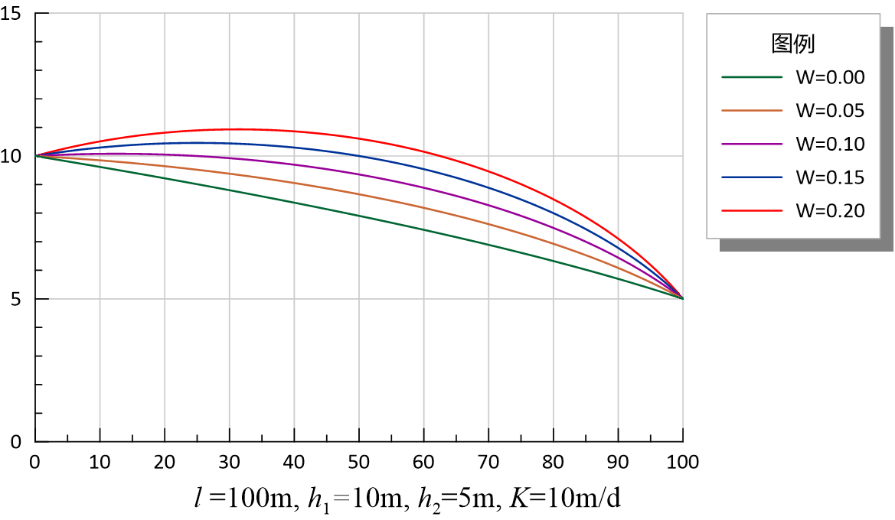
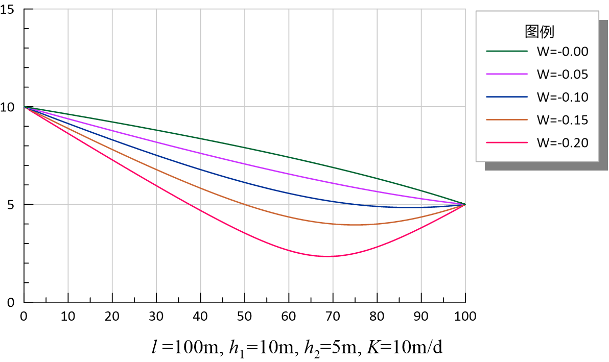
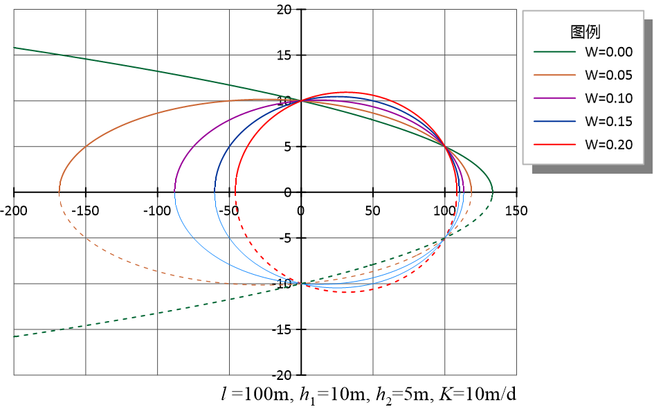
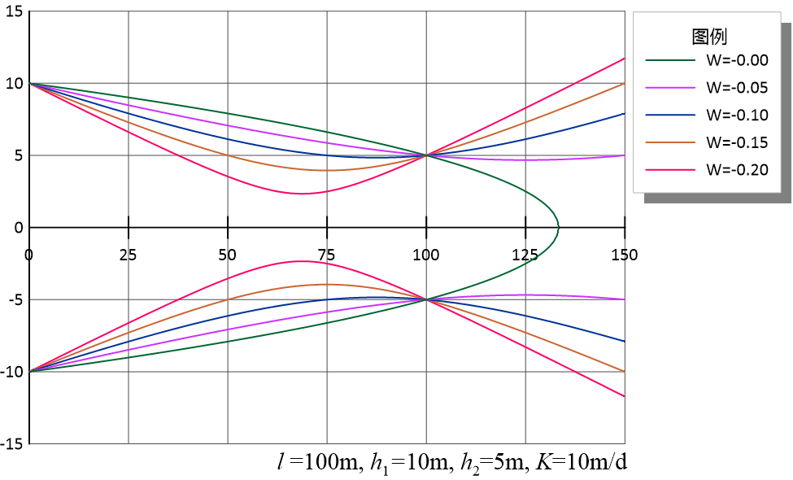
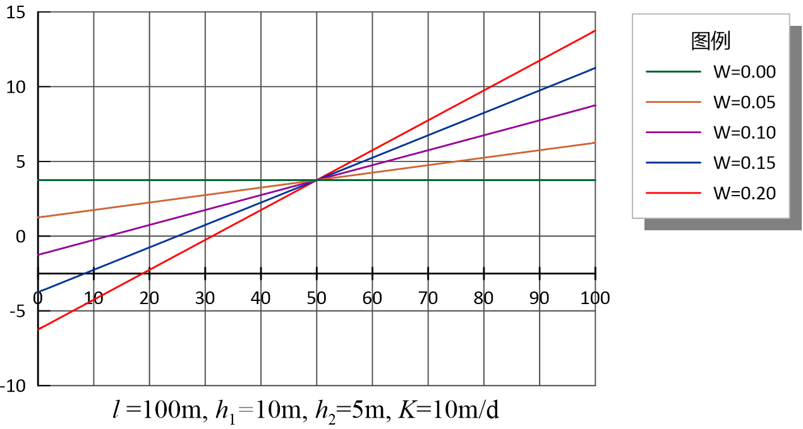
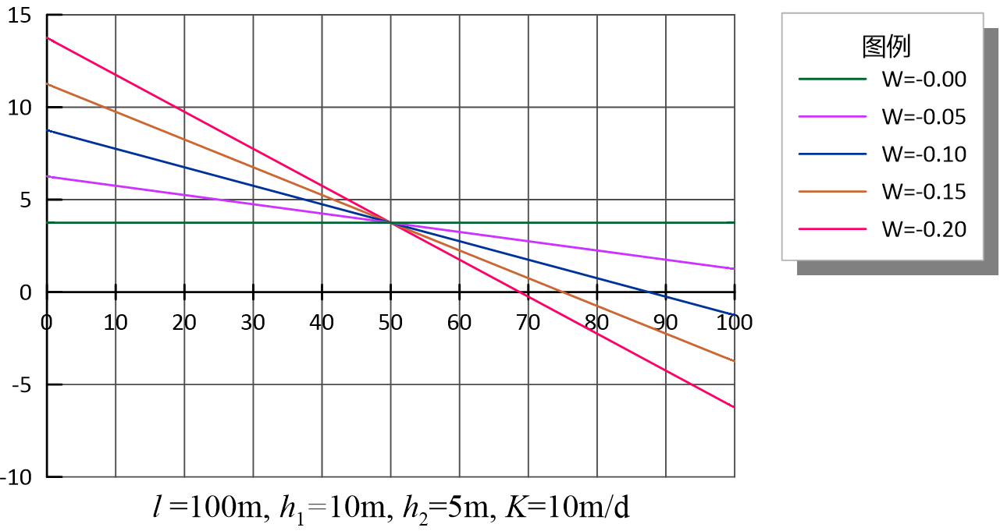
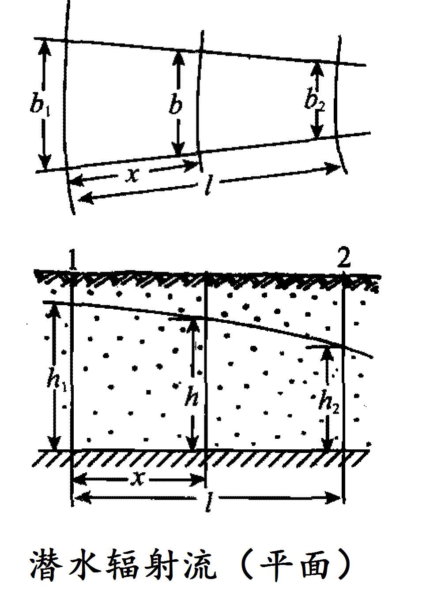
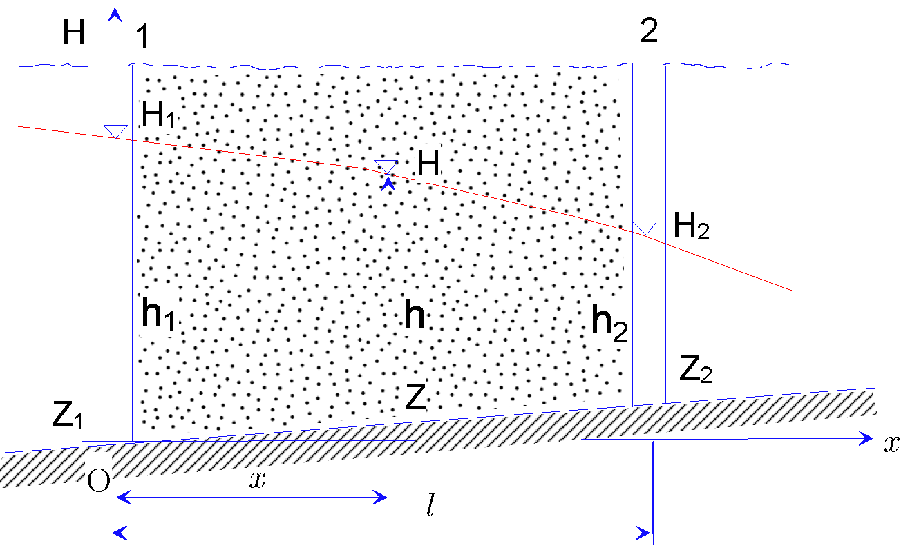
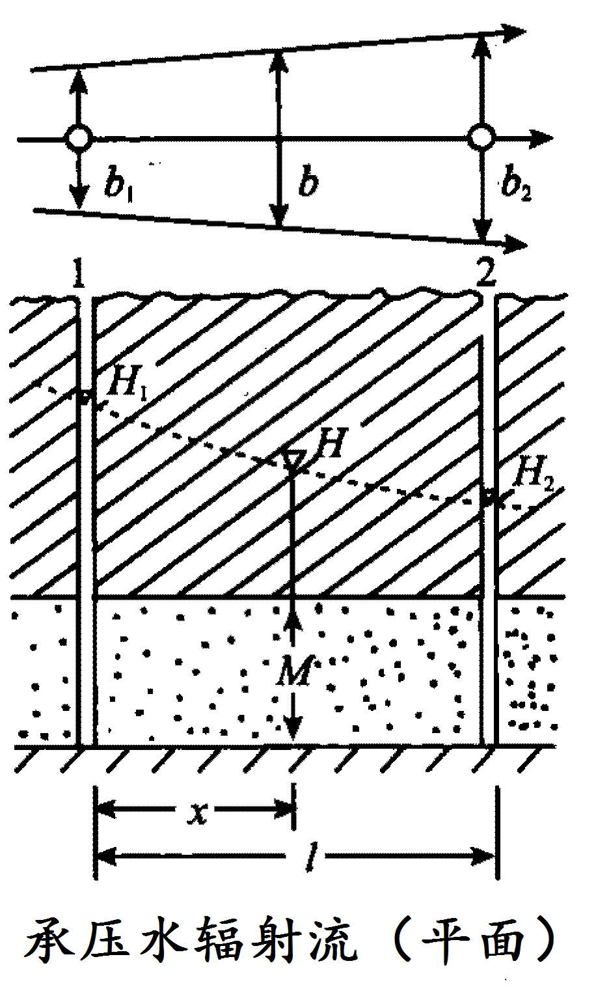
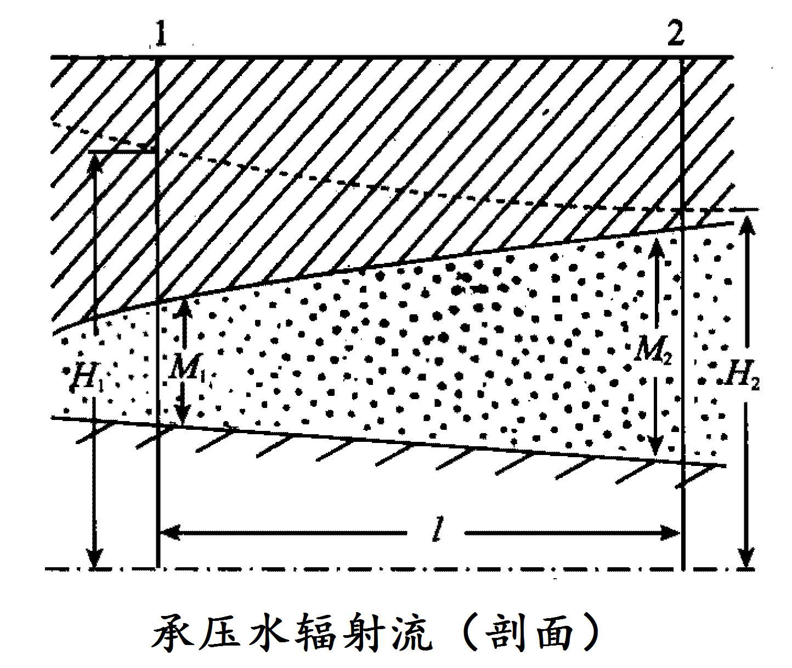

# 3  一维地下水流问题

<yanggy1010@126.com>

[TOC]

## 3.1  河渠间地下水的稳定运动

若河渠等地表水体切割了含水层，地表水与地下水就会发生水力联系，从而产生水量交换。含水层边界受地表水体的水位控制。承压含水层的地下水运动问题相对简单，对于潜水含水层不考虑垂向渗透速度分量，将入渗量作为源汇处理。这样就可将河渠间承压含水层与潜水含水层中的地下水运动简化为一维运动。进一步，通过适当假设，边界条件可以按第一类边界处理。

### 3.1.1 潜水稳定流模型

假设

- 含水层均质各向同性，隔水底板水平；
- 两条平行河流间的潜水流为一维流（Dupuit假设）；
- 上部有均匀入渗，入渗强度W；
- 潜水流是渐变流并趋于稳定.

数学模型

假设 $v_z=0$，取适当坐标系，建立数学模型

$$
\left\{
\begin{array}{l}
\frac{d}{dx}\left(h\frac{dh}{dx}\right)+\frac{W}{K}=0\\
\mathrm{BC:}h|_{x=0}=h_1\\
\mathrm{BC:}h|_{x=l}=h_2
\end{array}
\right.\tag{I}
$$

式中，$h_1,h_2,h_x$ 为  $x=0,x=l,x$ 断面的潜水流厚度；$K$ 为 渗透系数；$W$ 为入渗强度，即单位时间、单位面积上的入渗补给量.

> **一般解法**

将方程左端第一项写为 $\frac{\mathrm{d}^2}{\mathrm{d}x^2}(\frac{h^2}{2})$，微分方程的通解

$$
h^2=-\frac{W}{K}x^2+C_1x+C_2
$$

由边界条件确定常数，得

$$
h^2=h_1^2+\frac{h_2^2-h_1^2}{l}x+\frac{W}{K}\left(lx-x^2\right)
$$

> **单宽流量解法**

由于 1 维问题比较简单，可以沿 1 维水流方向直接由 Dupuit 假设的单宽流量公式计算。

设 $0$ 与 $x$ 断面的单宽流量分别为 $q_1,q_x$，

$$
q_x=-Kh\frac{dh}{dx}
$$

由质量守恒

$$
q_x-q_1=-Kh\frac{dh}{dx}-q_1=Wx
$$

分离变量

$$
-Kh\mathrm{d}h=(q_1+Wx)\mathrm{d}x
$$

对应不同积分限求定积分：

$$
\begin{array}{lll}
-K\int_{h_1}^h hdh=\int_0^x(q_1+Wx)dx & \implies &
K\frac{h_1^2-h^2}{2}=q_1x+\frac{1}{2}Wx^2 \\
-K\int_{h_1}^l hdh=\int_0^l (q_1+Wx)dx & \implies & 
K\frac{h_1^2-h_2^2}{2}=q_1l+\frac{1}{2}Wl^2
\end{array}
$$

消去 $q_1$ 并整理

$$
h^2=h_1^2+\frac{h_2^2-h_1^2}{l}x+\frac{W}{K}\left(lx-x^2\right)
$$

该式称为浸润曲线方程。

> **浸润曲线形状**：由 $W$ 的正负控制。





- $W>0$ 为椭园的上半枝，$h_{max}$ 为分水岭 ;
- $W=0$ 为抛物线;
- $W<0$ 为双曲线的上半枝，$h_{min}$ 为汇水岭.

入渗(或蒸发)使浸润曲线在抛物线基础上抬升(或下降), 幅度由 $W,K$ 控制，浸润曲线是二次曲线的一部分.





> **$x$ 处断面单宽流量**：分水岭两侧渗透速度方向相反。

$$
q_x=-Kh\frac{\partial h}{\partial x}=K\frac{h_1^2-h_2^2}{2l}-\frac{1}{2}Wl+Wx
$$





> **无入渗（$W=0$）** 为抛物线

水头方程

$$
h^2=h_1^2+\frac{h_2^2-h_1^2}{l}x
$$

单宽流量

$$
q=K\frac{h_1^2-h_2^2}{2l}
$$

该式称为 Dupuit 公式.

浸润曲线为抛物线，所有断面单宽流量相等.

> **Dupuit 假设的局限性：**

- 由于 Dupuit 假设，在分水岭、河床壁面附近、隔水边界处计算的水头不准确；
- 离边界、分水岭水平距离 $l>1.5\text{～}2.0M$ 处等水头面才可视为垂直面；
- 恰尔奈 (1951) 证明：Dupuit 公式计算的单宽流量是准确的.

### 3.1.2 承压水稳定流模型

假设

承压含水层均质各向同性，产状水平、等厚；上下游断面的水头为 $H_1,H_2$.

数学模型

$$
\left\{
\begin{array}{l}
\frac{d^2 H}{dx^2}=0\\
\mathrm{BC:}H|_{x=0}=H_1\\
\mathrm{BC:}H|_{x=L}=H_2
\end{array}
\right.\tag{II}
$$

水头方程

$$
H=H_1-\frac{H_1-H_2}{l}x
$$

断面处单宽流量

$$
q=KM\frac{H_1-H_2}{l}
$$

降落曲线 $H$ 为一条直线，与渗透系数 $K$ 无关.

## 3.2 河渠间地下水的非稳定运动

河渠水位变化将导致岸边地下水水位变化，是影响两岸地下水动态的重要因素。

- **回水：** 如果地表水和两岸地下水存在水力联系，河水位（或库水位）的抬高，会引起地下水水位相应的抬高，这种现象通常称为回水。
- **引渗回灌：** 利用河渠地表水的侧渗作用来补充浅层地下水，以达到灌溉农田的目的。

这类问题中，承压水模型相对简单，先探讨齐次边界条件的解，再通过变量代换从齐次边界条件导出非齐次边界条件的解，最后再通过变量代换推导出潜水模型的解。

### 3.2.1 河水位迅速上升为定值的承压水非稳定流模型

**（1）边界水头为零的非稳定流模型（齐次边界条件）**

**假设**

- 含水层均质各向同性、等厚，隔水底板水平;
- 初始水头为 $u(x,0)=\varphi(x)$;
- 两侧河渠水位瞬时降为 $0$.

**数学模型**

$$
\left\{\begin{array}{rl}\mathrm{Eq:}&a\frac{\partial^2u}{\partial x^2}=\frac{\partial u}{\partial t}\\\mathrm{IC:}&u(x,0)= \varphi(x)\\\mathrm{BC:}&u(0,t)=0 \\&u(l,t)=0\end{array}\right.
\tag{III}
$$

式中，$a=T/S$，$u(x,t)$ 为河间含水层中地下水的水头。

方程的通解

$$
u(x,t)=[A_1\cos(\lambda x)+A_2\sin(\lambda x)]\mathrm{e}^{-a\lambda^2t}
$$

其中 $A_1,\,A_2,\,\lambda$ 为未知常数，可由 IC、BC 确定，分离变量法是解决该类问题的常用方法。

**分离变量法**

设 $u(x,t)=X(x)T(t)$，代入微分方程（III），有

$$
a X''(x)T(t)=X(x)T'(t)
$$

$x$ 与 $t$ 为两个独立的自由变量，有

$$
\frac{X''}{X}=\frac{T'}{aT}=-\lambda^2
$$

式中，$\lambda$ 为待定常数。

得到两个常微分方程：

$$
\begin{array}{l}
X''(x)+\lambda^2 X(x)=0\\
T'(t)+\lambda^2 a T(t)=0
\end{array}
$$

结合边界条件可得到 $X(x)$ 的边值问题：

$$
\left\{
\begin{array}{l}
X''(x)+\lambda^2X(x)=0  \\
X(0)=X(l)=0
\end{array}
\right.
$$

通解为

$$
X(x)=A_1\cos(\lambda x)+A_2\sin(\lambda x)
$$

令 $x=0$，得 $X(0)=A_1=0$；令 $x=l$，得 $X(l)=A_2\sin(\lambda l)=0$。

为了求得非零解，必须 $A_2\ne0$ 且 $\sin(\lambda l)=0$，因此 $\lambda$ 必须取下列值：

$$
\lambda_n=\frac{n\pi}{l},n=1,2,\cdots
$$

$T(t)$ 满足方程

$$
T'(t)+\lambda^2 a T(t)=0
$$

通解为 $T(t)=B\mathrm{e}^{-\lambda^2at}$（$B$ 为任意常数）。

因此，定解问题（III）的解为

$$
u(x,t)= \sum_{n=1}^\infty c_n \sin(\lambda_nx)\mathrm{e}^{-\lambda_n^2 a t}
$$

式中，$c_n(n=1,2,\cdots)$ 为未知常数，$\lambda_n=\frac{n\pi}{l},n=1,2,\cdots$。

令 $t=0$，由初始条件得

$$
\varphi(x)= \sum_{n=1}^\infty c_n \sin(\lambda_nx)
$$

两边同乘以 $\sin(\frac{m\pi}{l}x)$ 并从 0 到 $l$ 积分

$$
\int_0^l \varphi(x)\sin\left(\frac{m\pi}{l}x\right)\mathrm{d}x=
\sum_{n=1}^\infty \int_0^l c_n\sin\left(\frac{m\pi}{l}x\right)\sin\left(\frac{n\pi}{l}x\right)\mathrm{d}x
$$

由于

$$
\int_{0}^{l}\sin\left(\frac{m\pi}{l}x\right)\sin\left(\frac{n\pi}{l}x\right)\mathrm{d}x =
\left\{
\begin{array}{ll}
   0 & m \neq n  \\
   \frac{l}{2} & m=n
\end{array}\right.
$$

得

$$
c_n=\frac{2}{l}\int_0^l\varphi(x)\sin\left(\frac{n\pi}{l}x\right)\mathrm{d}x=\frac{2}{l}\int_0^l\varphi(x)\sin(\lambda_n x)\mathrm{d}x
$$

综上所述，齐次边界条件定解问题的解为由上，方程的解为

$$
u(x,t)= \sum_{n=1}^\infty c_n \sin(\lambda_nx)\mathrm{e}^{-\lambda_n^2 a t}
$$

式中，$c_n=\frac{2}{l}\int_0^l\varphi(x)\sin\frac{n\pi x}{l}\mathrm{d}x$，
$\lambda_n=\frac{n\pi}{l},\,n=1,2,\cdots$。

**（2）边界水头不为零的非稳定流模型（非齐次边界条件）**

**假设**

- 含水层均质各向同性、等厚，隔水底板水平;
- 初始水头为 $H(x,0)=h_0$;
- 两侧河渠水位同时上升并保持为给定值，即左河水位升至 $h_1$，右河升至 $h_2$.

**数学模型**

$$
\left\{
\begin{array}{rl}
  \mathrm{Eq:}&a\frac{\partial^2H}{\partial x^2}=\frac{\partial H}{\partial t}\\
  \mathrm{IC:}&H(x,0)=h_0\\
  \mathrm{BC:}&H(0,t)=h_1 \\
  &H(l,t)=h_2
\end{array}\right.
\tag{IV}
$$

式中，$a=T/S$.

记 $\Delta{h_1}=h_1-h_0$，$\Delta{h_2}=h_2-h_0$。 设 

$$
u(x,t)=H(x,t)-h_0-(1-\frac{x}{l})\Delta h_1-\frac{x}{l}\Delta h_2
$$

则 $u(x,t)$ 满足定解问题（$\mathrm{II}$），$\varphi(x)=-(1-\frac{x}{l})\Delta h_1-\frac{x}{l}\Delta h_2$。

现在关键问题是计算系数 $c_n$：

$$
\left\{\begin{array}{l}
\varphi(x)=-(1-\frac{x}{l})\Delta h_1-\frac{x}{l}\Delta h_2\\
c_n=\frac{2}{l}\int_0^l\varphi(x)\sin(\lambda_nx)\mathrm{d}x,\,(n=1,2,\cdots)
\end{array}\right.
$$

- 第一项

$$
\begin{align*}
a_n&=-\frac{2\Delta h_1}{l}\int_0^l\left(1-\frac{x}{l}\right)\sin(\lambda_n x)\mathrm{d}x \\
&=\frac{2\Delta h_1}{l}\frac{1}{\lambda_n}\int_0^l\left(1-\frac{x}{l}\right)\mathrm{d}\cos(\lambda_nx)\\
&=\frac{2\Delta h_1}{n\pi}\left.\left[\left(1-\frac{x}{l}\right)\cos(\lambda_nx)\right]\right|_0^l-
\frac{2\Delta h_1}{n\pi}\int_0^l\cos(\lambda_nx)(-\frac{1}{l})\mathrm{d}x\\
&=-\frac{2\Delta h_1}{n\pi}
\end{align*}
$$

- 第二项

$$
\begin{align*}
b_n&=-\frac{2\Delta h_2}{l}\int_0^l\frac{x}{l}\sin(\lambda_nx)\mathrm{d}x\\
&=\frac{2\Delta h_2}{l}\frac{1}{\lambda_n}\int_0^l\frac{x}{l}\mathrm{d}\cos(\lambda_nx)\\
&=\frac{2\Delta h_2}{n\pi}\left.\left[\frac{x}{l}\cos(\lambda_nx)\right]\right|_0^l-\frac{2\Delta h_2}{n\pi}\int_0^l\cos(\lambda_nx)\frac{1}{l}\mathrm{d}x \\
&=\frac{2\Delta h_2}{n\pi}(-1)^n=-\frac{2\Delta h_2}{n\pi}(-1)^{n+1}
\end{align*}
$$

因此

$$
c_n=-\frac{2}{n\pi}\left[{\Delta h_1+(-1)^{n+1}\Delta h_2}\right]
$$

由此可得得**定解问题**（$\mathrm{IV}$）的解

$$
H(x,t)=h_0+(1-\frac{x}{l})\Delta h_1+\frac{x}{l}\Delta h_2-\frac{2}{\pi}
\sum_{n=1}^\infty \frac{\Delta h_1+(-1)^{n+1}\Delta h_2}{n}\sin(\lambda_nx)\mathrm{e}^{-\lambda_n^2 a t}
$$

式中，$\lambda_n=\frac{n\pi}{l}(n=1,2,\cdots)$。记 $\bar{x}=\frac{x}{l},\bar{t}=\frac{at}{l^2}$，则

$$
\begin{array}{rl}
H(x,t)-h_0&=\Delta h_1\left[ 1-\bar{x}-
  \frac{2}{\pi}\sum\limits_{n=1}^\infty \frac{1}{n} \sin(
  n\pi \bar{x})\mathrm{e}^{-(n\pi)^2\bar{t}}\right]\\
  &+\Delta h_2\left[ \bar{x}-\frac{2}{\pi}\sum\limits_{n=1}^\infty \frac{(-1)^{n+1}}{n} \sin(
  n\pi \bar{x})\mathrm{e}^{-(n\pi)^2\bar{t}}\right]
\end{array}
$$

记

$$
\begin{array}{rl}
F(\bar{x},\bar{t})&=1-\bar{x}-
  \frac{2}{\pi}\sum\limits_{n=1}^\infty \frac{1}{n} \sin(
  n\pi \bar{x})\mathrm{e}^{-(n\pi)^2\bar{t}} \\
F'(\bar{x},\bar{t}) &=\bar{x}-\frac{2}{\pi}\sum\limits_{n=1}^\infty \frac{(-1)^{n+1}}{n} \sin(
  n\pi \bar{x})\mathrm{e}^{-(n\pi)^2\bar{t}}
\end{array}
$$

有

$$
H(x,t)-h_0=\Delta h_1F(\bar{x},\bar{t})+\Delta h_2F'(\bar{x},\bar{t})
$$

式中，$F(\bar{x},\bar{t})$ 为河渠水位函数，$F'(\bar{x},\bar{t})$ 为河渠水位余函数，且

$$
F'(\bar{x},\bar{t})=F(1-\bar{x},\bar{t})
$$

**求 $F(\bar{x},\bar{t})$ 的 VBA 程序**

```python
Function FF(x, t, nmax)
  If t <= 0 Then
    FF = 0#
  Else
    Pi = 3.141592654
    FF = 1 - x
    For n = 1 To nmax
      alpha = n * Pi
      term = -2 * Sin(alpha * x) * Exp(-t * alpha ^ 2) / alpha
      FF = FF + term
    Next n
  End If
End Function
```

**求 $F(\bar{x},\bar{t})$ 的 Python 程序**

```python
# 河渠水位函数
def river_head(t, x, nmax):
    if t <=0:
        f = 0.0
    else:
        f = 1.0 - x
        for n in range(1, nmax + 1):
            alpha = n * np.pi
            term = -2.0 * np.sin(alpha*x) * np.exp(-t*alpha**2) / alpha
            f = f + term
    return f

river_head = np.vectorize(river_head)river_head)
```

**$x$ 断面处的单宽流量**

$$
\begin{split}
q_{x,t}&=-T\frac{dH}{dx}=-T\frac{dH}{d\bar{x}}\frac{d\bar{x}}{dx}\\
& =\frac{T}{l}[\Delta h_1G(\bar{x},\bar{t})-\Delta h_2G'(\bar{x},\bar{t})]
\end{split}
$$

式中,

$$
\begin{split}
G(\bar{x},\bar{t})&=-\frac{dF}{d\bar{x}}
=1+2\sum_{n=1}^{\infty}\cos(n\pi\bar{x})e^{-n^2\pi^2\bar{t}}\\
G'(\bar{x},\bar{t})&=\frac{dF'}{d\bar{x}}
=1+2\sum_{n=1}^{\infty}(-1)^n\cos(n\pi\bar{x})e^{-n^2\pi^2\bar{t}}
\end{split}
$$

$G(\bar{x},\bar{t})$ 为河渠流量函数; $G'(\bar{x},\bar{t})$ 为河渠流量余函数, $G'(\bar{x},\bar{t})=G(1-\bar{x},\bar{t})$.

**求 $G(\bar{x},\bar{t})$ 的 VBA 程序**

```python
Function GG(x, t, nmax)
  If t <= 0 Then
    GG = 0#
  Else
    Pi = 3.141592654
    GG = 1
    For n = 1 To nmax
      alpha = n * Pi
      term = 2 * Cos(alpha * x) * Exp(-t * alpha ^ 2)
      GG = GG + term
    Next n
  End If
End Function    
```

**求 $G(\bar{x},\bar{t})$ 的 Python 程序**

```python
# 河渠流量函数
def river_flow(t, x, nmax):
    if t <=0:
        g = 0.0
    else:
        g = 1.0
        for n in range(1, nmax + 1):
            alpha = n * np.pi
            term = 2.0 * np.cos(alpha*x) * np.exp(-t*alpha**2) 
            g = g + term
    return g

river_flow = np.vectorize(river_flow)
```

**Python 演示程序**

```python
nmax = 50
t = 0.001
x = np.linspace(0,1,11)
print('水位 :')
print(river_head(t, x, nmax))
nmax = 1000
print('水位 :')
print(river_head(t, x, nmax))  
```

> 思考: 若模型中含有为常数的汇源项 $W$（均匀入渗）时，解是什么形式？

方程：

$$
a\frac{\partial^2H}{\partial x^2}+\frac{W}{S}=\frac{\partial H}{\partial t}
$$

式中 $S$ 为贮水系数。令 $H=u+\frac{Wt}{S}$，$u$ 满足方程

$$
a\frac{\partial^2u}{\partial x^2}=\frac{\partial u}{\partial t}
$$

**河水位连续变化的情况**

将水位概化为阶梯状，每个时段认为是定水位。应用叠加原理，将一个回水问题分解为几个回水问题，相邻时段水位作为回水前后水位.

### 3.2.2 河水位迅速上升为定值的潜水非稳定流模型

**假设**

- 含水层均质，各向同性，隔水底板水平，无入渗；
- 初始状态稳定，初始水位 

$$
\begin{array}{l}
h_{x,0}^2=h_{0,0}^2+\frac{h_{l,0}^2-h_{0,0}^2}{l}x
=(1-\frac{x}{l})h_{0,0}^2+\frac{x}{l}h_{l,0}^2
\end{array}
$$

- 两侧河渠水位同时上升，左河水位自 $h_{0,0}$ 上升至 $h_{0,t}$，右河自 $h_{l,0}$ 上升至 $h_{l,t}$.

**数学模型**

$$
\left\{\begin{array}{l}
\frac{\partial h}{\partial t}
=\frac{K}{\mu}\frac{\partial}{\partial x}\left(h\frac{\partial h}{\partial x}\right)\\
h^2(x,0)=(1-\frac{x}{l})h_{0,0}^2+\frac{x}{l}h_{l,0}^2\\
h(0,t)=h_{0,t} \\
h(l,t)=h_{l,t}
\end{array}\right.
\tag{V}
$$

该模型为非线性的，线性化后可求解。

**Boussinesq 方程的线性化**

- 第一种线性化方法
  如果 $h$ 变化不大，用平均值 $\bar{h}$ 代替 $h$

$$
K\bar{h}\frac{\partial^2h}{\partial x^2}
=\mu\frac{\partial h}{\partial t}
$$

- 第二种线性化方法
  令 $u=\frac{h^2}{2}$, $\frac{\partial h}{\partial t}=\frac{1}{h}\frac{\partial u}{\partial t}$, 有

$$
K\frac{\partial^2u}{\partial x^2}
=\frac{\mu}{h}\frac{\partial u}{\partial t}
$$

  $h$ 取平均值 $\bar{h}$

$$
K\bar{h}\frac{\partial^2u}{\partial x^2}+W\bar{h}=
\mu\frac{\partial u}{\partial t}
$$

采用第二种线性化方法，令

$$
u=\frac{h^2}{2},\,a=\frac{Kh_m}{\mu}
$$

得

$$
\frac{\partial u}{\partial t}=a \frac{\partial^2 u}{\partial x^2}
$$

式中，$h_m$ 为潜水流平均厚度.

**数学模型：**

$$
\left\{
\begin{array}{l}
\frac{\partial u}{\partial t}=a\frac{\partial^2 u}{\partial x^2}\\
u(x,0)=(1-\frac{x}{l})\frac{h_{0,0}^2}{2}+\frac{x}{l}\frac{h_{l,0}^2}{2}=\frac{h_{x,0}^2}{2}\\
u(0,t)=\frac{h_{0,t}^2}{2},\, u(l,t)=\frac{h_{l,t}^2 }{2}
\end{array}\right.
\tag{VI}
$$

记 $\Delta(h_{0,t}^2)=h_{0,t}^2-h_{0,0}^2$, $\Delta(h_{l,t}^2)=h_{l,t}^2-h_{l,0}^2$, 参考承压水模型解法，得

$$
\begin{align*}
u(x,t)=&u(x,0)+(1-\frac{x}{l})\frac{\Delta(h_{0,t}^2)}{2}+\frac{x}{l}\frac{\Delta(h_{l,t}^2)}{2}\\
&-\frac{2}{\pi}
\sum_{n=1}^\infty \frac{\frac{\Delta(h_{0,t}^2)}{2}+(-1)^{n+1}\frac{\Delta(h_{l,t}^2)}{2}}{n}\sin(\lambda_nx)\mathrm{e}^{-\lambda_n^2 a t}
\end{align*}
$$

将  $u(x,t)=\frac{h_{x,t}^2}{2},\,u(x,0)=\frac{h_{x,0}^2}{2}$ 代入并整理得

$$
\begin{split}
& h^2_{x,t}-h_{x,0}^2 \\
&=(1-\frac{x}{l})\Delta(h_{0,t}^2)+\frac{x}{l}\Delta(h_{l,t}^2)-\frac{2}{\pi}
\sum\limits_{n=1}^\infty \frac{\Delta(h_{0,t}^2)+(-1)^{n+1}\Delta(h_{0,t}^2)}{n}\sin(\lambda_nx)\mathrm{e}^{-\lambda_n^2 a t}
\end{split}
$$

记 $\bar{x}=\frac{x}{l},\bar{t}=\frac{at}{l^2}$，整理得

$$
\begin{array}{rl}
h_{x,t}^2-h_{x,0}^2&=\Delta(h_{0,t}^2)\left[1-\bar{x}-\frac{2}{\pi}\sum\limits_{n=1}^\infty \frac{1}{n}\sin(n\pi\bar{x})\mathrm{e}^{-(n\pi)^2 \bar{t}}\right] \\
&+\Delta(h_{l,t}^2)\left[\bar{x}- \frac{2}{\pi}\sum\limits_{n=1}^\infty\frac{(-1)^{n+1}}{n}\sin(n\pi\bar{x})\mathrm{e}^{-(n\pi)^2\bar{t}}\right]
\end{array}
$$

写成河渠水位函数与河渠水位余函数的形式

$$
h^2_{x,t}-h^2_{x,0}=\Delta(h_{0,t}^2)F(\bar{x},\bar{t})
+\Delta(h_{l,t}^2)F'(\bar{x},\bar{t})
$$

**任一断面单宽流量**

$$
\begin{split} q_{x,t}&=-Kh\frac{dh}{dx}\\
&=q_{x,0}+\frac{K}{2l}\left(\Delta h_{0,t}^{2}G(\bar{x},\bar{t})-
\Delta h_{l,t}^{2}G'(\bar{x},\bar{t})\right)
\end{split}
$$

### 3.2.3 有河渠渗漏的半无限空间非稳定流模型（补充）

**（1） 承压水非稳定流的定降深沟模型**

**假设**

- 假定渗流区含水层均质、各向同性、含水层厚度不变、侧向无限延伸；
- 初始水力坡度为零，河渠水位突然下降然后保持不变.

**降深沟的数学模型**

$$
\begin{cases}
a\frac{\partial^2s}{\partial x^2}=
\frac{\partial s}{\partial t} & 0<x<\infty, t>0 \\
s(x,0)=0 & 0<x<\infty  \\
s(\infty,t)=0 & t>0 \\
s(0,t)=s_c & t>0
\end{cases}\tag{VII}
$$

式中，$s$ 为降深.

解为

$$
s(x,t)= s_c\,\mathrm{erfc}(u)
$$

式中，$u=\frac{x}{2\sqrt{at}}$，$\mathrm{erfc}(u)=1-\mathrm{erf}(u)=\frac{2}{\sqrt{\pi}}\int_{u}^{\infty}e^{-y^2}\mathrm{d}y$ 为余误差函数，$\mathrm{erf}(u)= \frac{2}{\sqrt{\pi}}\int_{0}^{u}e^{-y^2}\mathrm{d}y$ 为误差函数.

任意断面的单宽流量

$$
q_x=\frac{s_c T}{\sqrt{at}}\frac{1}{\sqrt{\pi}}{e^{-u^2}}
$$

**（2） 承压水非稳定流的定流量沟模型**

**假设**

- 承压含水层，均质、各向同性、等厚且半无限;
- 一侧为定流量抽水（渗漏、注水）.

**定流量沟的数学模型**

$$
\begin{cases}
a\frac{\partial ^2 s}{\partial x^2}=\frac{\partial s}{\partial t}& 0<x<\infty ,t>0 \\
s(x,0)=0 & 0<x<\infty \\
s(\infty,t)=0 & t>0\\
\frac{\partial s(0,t)}{\partial x}=-\frac{q}{T}& t>0
\end{cases}\tag{VIII}
$$

式中，$s$ 为降深。

解为

$$
s(x,t)=\frac{qx}{T}\left[\frac{e^{-u^2}}{\sqrt{\pi}u}-\mathrm{erfc}(u)\right]
$$

式中，$u=\frac{x}{2\sqrt{at}}$, $\mathrm{erfc}(u)$ 为余误差函数.

**（3）潜水非稳定流的定降深沟模型**

**假设**

- 含水层均质，各向同性，隔水底板水平，无入渗，侧向无限延伸；
- 初始水力坡度为零；
- 左侧河渠水位突然下降（或抬升）至 $h_{0,t}$，然后保持不变.

**数学模型**

记 $u=\frac{h^2}{2},\,a=\frac{Kh_m}{\mu}$，有

$$
\left\{\begin{array}{l}
\frac{\partial u}{\partial t}
=a\frac{\partial^2u}{\partial x^2}\\
u(x,0)=\frac{h_0^2}{2}\\
u(0,t)=\frac{h_{0,t}^2}{2}\\
h(\infty,t)=\frac{h_0^2}{2}
\end{array}\right.\tag{IX}
$$

相当于单侧有河渠渗透的半无限问题 ($l\to\infty$)。记 $\Delta(h_{0,t}^2)=h_{0,t}^2-h_{0}^2$

**断面 $x$ 时刻 $t$ 的潜水位**

$$
h_{x,t}^2=h_{0}^2+\Delta h_{0,t}^2\mathrm{erfc}(u)
$$

式中，$\lambda=\frac{x}{2\sqrt{at}}$ 为河渠水位对地下水位的影响系数，$\mathrm{erfc}(u)$ 为余误差函数。

**断面x时刻t的单宽流量**

$$
q_{x,t}=\frac{K\Delta h_{0,t}^2}{\sqrt{at}}G(\lambda)
$$

式中, $G(\lambda)=\frac{1}{2\sqrt\pi}e^{-\lambda^2}$。

## 3.3  地下水流模型的应用

### 3.3.1 稳定流模型应用

#### 3.3.1.1 根据潜水含水层观测孔水位求含水层水文地质参数 K、W

河渠间 $x_0$ 处有一个观测孔的水位值 $h_0$：

- 已知 $h_0$ 和 $K$，计算 $W$

$$
W=K\left[\frac{h_0^2-h_1^2}{(l-x_0)x_0}-\frac{h_2^2-h_1^2}{(l-x_0)l}\right]
$$

- 若未知 $K$， 可计算 $\frac{W}{K}$

$$
\frac{W}{K}=\frac{h_0^2-h_1^2}{(l-x_0)x_0}-\frac{h_2^2-h_1^2}{(l-x_0)l}
$$

#### 3.3.1.2 根据潜水浸润曲线形状做工程计算

有入渗时浸润曲为椭园的上半枝，水头 $h_{max}$ 处存在分水岭； 有入渗时浸润曲为双曲线的上半枝，水头 $h_{min}$ 处存在汇水岭。 

**（1）分水岭移动规律**

求分水岭位置：

$$
\frac{dh}{dx}=0
$$

得分水岭位置$a$

$$
a=\frac{l}{2}-\frac{K}{W}\frac{h_1^2-h_2^2}{2l}
$$

> - $h_1=h_2$ 时，$a=\frac{l}{2}$，分水岭在河渠中间；
> - $h_1>h_2$ 时，$a<\frac{l}{2}$，分水岭靠左河；
> - $h_1<h_2$ 时，$a>\frac{l}{2}$，分水岭靠右河.

> 思考：分水岭永远处在两河范围内吗？

 **例 1（例 2.1）**

1. 建立坐标系，左河底板为原点，$x$ 水平向右，$z$ 垂直向上;
2. 潜水位标高换算为潜水流厚度;
   $h_1=11.15(m),h_2=10.75(m)$ 
3. 计算入渗强度
   $W=\frac{0.445}{365}\times 0.35=0.00043(m/d)$
4. 按公式计算钻孔处潜水位厚度
   $h_{521}=11.96(m),h_8=12.33(m),h_{10}=12.27(m),h_{12}=11.98(m)$
5. 换算为潜水位标高
   $H_{521}=53.81,H_8=54.18,H_{10}=54.12,H_{12}=53.83,H_{max}=54.18(m)$
6. 按公式计算分水岭位置及分水岭的潜水流厚度
   $a=802(m),h_{max}=12.33(m)$
7. 按公式计算河流单宽流量
   $q_1=-0.35(m^2/d),h_2=0.40(m^2/d)$

**（2）利用分水岭的性质快速计算河渠的补给（排泄）量**

记 $q_1,q_2,q_x$ 分别为左河、右河、断面 $x$ 处的单宽流量。若 $q_1<0$ 左河渗漏；$q_2<0$ 右河渗漏。

- 分水岭在两河之间，$0<a<l$
  
  - $q_1=-Wa$
  - $q_2=W(l-a)$

- 分水岭位于河流断面上
  
  - $a=0$：$q_1= 0,\, q_2=Wl$
  - $a=l$：$q_1= -Wl,\, q_2=0$

- 河渠间不存在分水岭（$a<0$ 或 $a>l$）
  
  $q_2-q_1=Wl$

**例 2 ：** 例  2.1 的第7步可以按比例计算出。

**（3）利用分水岭公式计算排水渠间距**

为避免河渠间地块土壤发生盐渍化或沼泽化，设计排水渠时需要把地下水位控制在一定高度。根据河渠间的最高水位 $h_{max}$ 可以试算出排水渠间距 $l$ 与最高水位的位置 $a$：

$$
\left\{\begin{array}{ll}
a & =\frac{l}{2}-\frac{K}{W}\frac{h_1^2-h_2^2}{2l}\\
h_{\max}^2 & = h_1^2+\frac{h_2^2-h_1^2}{l}a+\frac{W}{K} (la-a^2 )
\end{array}\right.
$$

特别地，若两河水位相等，排水渠间距为

$$
l=2\sqrt{\frac{K}{W}(h_{max}^2-h_w^2)}
$$

**（4）根据分水岭移到规律判断水库渗漏情况**

**河流或水库的渗漏量**

记 $q_1,q_2,q_x$ 分别为左河、右河、断面 $x$ 处的单宽流量.

$$
\begin{align*}
q_1 &=K\frac{h_1^2-h_2^2}{2l}-\frac{1}{2}Wl\\
q_2 &=K\frac{h_1^2-h_2^2}{2l}+\frac{1}{2}Wl\\
q_x &=K\frac{h_1^2-h_2^2}{2l}-\frac{1}{2}Wl+Wx
\end{align*}
$$

若 $q_1<0$ 左河渗漏, $q_2>0$ 右河渗漏.
蓄水过程中，分水岭不断向水库方向（水位高处）移动

- 分水岭在水库、河流之间不发生渗漏；
- 河间分水岭消失将引起水库渗漏：

设当 $a=0$ 时库水位极限高度为 $h_{max}$，有

$$
h_{max} = \sqrt{\frac{W}{K} l^2+h_2^2}
$$

**（5）根据分水岭移到规律指导野外水文调查**

- $K$ 愈大,愈易渗漏：调查库址要避开岩溶发育带、构造破碎带或古河道发育带；
- 河间距离越小越易渗漏：要避免将库址选在分水岭过于狭窄的地带；
- 入渗补给量 $W$ 愈小，愈易渗漏：在干旱地区选址时，要避开存在渗透性差的覆盖层地带；
- 邻河水位愈低，愈易渗漏：选址时应注意选在邻河水位高的地段。

**（6）地下水污染与治理**

- 控制分水岭的位置可确保地下水向河流排泄，防止已被污染的河水进入含水层；
- 控制分水岭的位置可确保地下水向人工沟渠排泄，使被污染的含水层得到恢复。

#### 3.3.1.3 非均质潜水含水层的单宽流量

- 等效渗透系数法（§1.4）
- 块段法

**双层结构含水层（上下块段）：** 下层可视为承压水，层可视为潜水。

**<u>规则</u>**

- 上下游断面各分层水头相同；

- 总单宽流量为各分层单宽流量之和。
  
  承压水

$$
q_1 =K_1M\frac{h_1 - h_2}{l}
$$

  潜水

$$
q_2 = K_2\frac{h_1^2 - h_2^2}{2l}
$$

  总单宽流量

$$
q =K_1M\frac{h_1 - h_2}{l} + K_2\frac{h_1^2 - h_2^2}{2l}
$$

**水流方向渗透性突变含水层（水平块段）**：

<u>**规则**</u>

- 各块段单宽流量相同；

- 总水头损失为各块段水头损失之和。
  
  $K_1$岩层

$$
q = K_1\frac{h_1^2 - h_s^2}{2l_1}
$$

  $K_2$岩层

$$
q = K_2\frac{h_s^2 - h_2^2}{2l_2}
$$

  总单宽流量（消去 $h_s$ ）

$$
q = \frac{h_1^2 - h_2^2}{2\left( \frac{l_1}{K_1} + \frac{l_2}{K_2} \right)}
$$

#### 3.3.1.4 承压转无压水流

在地下水位坡度较大的块段有可能形成承压 — 无压流动。以底板为水平基准面，左断面为原点，承压转无压分界处 $x=l_0$ 有 $H=M$。

用分段法计算

- 承压段

$$
q_1=KM\frac{H_1-M}{l_0}
$$

- 无压段

$$
q_2=K\frac{M^2-H_2^2}{2(l-l_0)}
$$

  由于水流连续，$q_1=q_2$ 得

$$
\begin{align*}
l_0 &= \frac{2lM(H_1-M)}{M(2H_1-M)-H_2^2}\\q &= K\frac{M(2H_1-M)-H_2^2}{2l}
\end{align*}
$$

#### 3.3.1.5 辐射流问题

**辐射流：** 流线在平面(剖面)上的投影互不平行的地下水运动.

- 平面辐射流
  
  - 含水层厚度不变，渗流方向的径流宽度变化;
  
  - 无源汇时断面流量 $Q$ 为常数.

- 剖面辐射流
  
  - 含水层厚度变化，渗流方向的径流宽度不变;
  - 无源汇时单宽流量 $q$ 为常数.

**典型的辐射流：** 向井的地下水运动、河湾处的潜水运动、洪积扇上部的潜水运动、矿区排水的地下水运动、含水层厚度变化的地下水运动等。

**辐射流计算方法**

- 近似方法：平均厚度法或平均宽度法；
- 微积分法：给出厚度或宽度的函数，用微积分法计算.

**例 3  潜水平面辐射流**



设断面宽度线性变化

$$
b(x)=b_1+(b_2-b_1)\frac{x}{l}
$$

只考虑平面运动 ( Dupuit 假设)，断面 $x$ 的流量为

$$
Q=-Kbh\frac{dh}{dx}
$$

代入 $b$ 并分离变量

$$
hdh=-\frac{Ql}{K}\frac{dx}{b_1l+(b_2-b_1)x}
$$

从断面 1 到断面 2 积分

$$
\frac{h_2^2-h_1^2}{2}=-\frac{Ql}{K}\cdot\frac{\ln{b_2}-\ln{b_1}}{b_2-b_1}
$$

得

$$
Q=K\frac{b_2-b_1}{\ln{b_2}-\ln{b_1}}\cdot\frac{h_1^2-h_2^2}{2l}
$$

计算 $x$ 断面的水位

$$
hdh=-\frac{Ql}{K}\frac{dx}{b_1l+(b_2-b_1)x}
$$

从断面 1 到断面 $x$, 断面 1 到断面 2 积分:

$$
\frac{h^2(x)-h_1^2}{2}=-\frac{Ql}{K}\cdot\frac{\ln{b}-\ln{b_1}}{b_2-b_1}
$$

$$
\frac{h_2^2-h_1^2}{2}=-\frac{Ql}{K}\cdot\frac{\ln{b_2}-\ln{b_1}}{b_2-b_1}
$$

消去 $Q$，得

$$
h^2(x)=h_1^2+(h_2^2-h_1^2)\frac{\ln{b}-\ln{b_1}}{\ln{b_2}-\ln{b_1}}
$$

**例 4  潜水剖面辐射流**



如图，$z_1=0$，设底板标高线性变化，底板直线方程为 $z=\frac{z_2}{l}x$

只考虑平面运动（Dupuit假设）

断面 $x$ 的单宽流量

$$
q=-K(H-z)\frac{dH}{dx}
$$

方程不是线性的，可用线性化的方法近似求解.

$$
q=-K(H-z)\frac{dH}{dx}\implies \frac{q}{K}\cdot\frac{1}{H-z}dx=-dH
$$

利用积分中值定理：$\int_0^l{\frac{1}{H-z}}dx=\frac{l}{h_m},h_m=\frac{H_1+H_2-z_2}{2}$，有

$$
\frac{q}{K}\frac{l}{h_m} = H_1-H_2 \implies  q=K h_m \frac{H_1-H_2}{l}
$$

> **思考：承压水平面辐射流、剖面辐射流如何计算？**

|  |  |
|:----------------------------------------------------------------------------------------:|:----------------------------------------------------------------------------------------:|

#### 3.3.1.6  坝基渗流与绕坝渗流

按筑坝材料：有土石坝（土坝、堆石坝、砌石坝）、混凝土坝、钢筋混凝土坝、橡胶坝、钢闸门坝等.

- 土石坝：用土或石头建造的宽坝，因为底部承受水压比顶部大的多，所以底部较顶部宽. 土石坝多是横越大河建成的，用的都是既普通又便宜但具有较好不透水性的材料.由于物料较松散，水慢慢渗入堤坝，会降低堤坝的坚固程度.
- 混凝土坝：多用混凝土建成，通常建筑在深而窄的山谷；主要特点是利用自身的重量来支撑水体压力.

按受力情况：

- 重力坝

- 拱坝

- 支墩坝

**（1）坝基渗流—解析公式**

混凝土坝：坝体长度一般比坝下地基厚度大得多，并且底板越宽，底板以下水流就越接近二维流动。地基中的渗流量与坝底轮廓形状有关，在地质勘探阶段无法知道坝底轮廓，通常只需对渗流量进行大致估算。

- **透水地基无限厚**
  
  **巴甫洛夫斯基公式**

$$
H=\frac{H_0}{\pi}\arccos\frac{x}{l},(-l\le x\le +l,H_0=H_1-H_2=\Delta H)
$$

  通过无限厚($M=y$）地基含水层的单宽流量：

$$
q=KH_0\frac{1}{\pi} \mathrm{arcsinh} \left(\frac{y}{l}\right)
$$

- **透水地基有限厚**
  
  **卡明斯基公式**

$$
q=KM\frac{H_0}{2l+M}
$$

  卡明斯基公式当 $M \le 2l$ 时结果较好。

设渗漏坝段长度为 $L$，则坝基总渗漏量为 $Q=qL$。对于层状组合地基，设平行与垂直层面渗透系数分别为 $K_{max}$、$K_{min}$，渗透系数取$K_{cp}=\sqrt{K_{max}K_{min}}$ 计算。

**（2）绕坝渗流—用流网计算**

绕坝渗流指在水平方向上围绕着闸、墩、刺墙等发生的渗流。水库修建前，地下水自分水岭流向河床；水库修建后，天然地下水流对绕坝渗流以某种压缩作用压向岸边。通过分析绕坝渗流流网可以确定总的渗透情况及绕坝渗流量。

**计算步骤**

- 绘制近似流线；

- 将渗流分成宽度为 $\Delta b$ 的若干条带；

- 计算每个条带的渗流量 $\Delta Q$

无压渗流

$$
\Delta Q= K \Delta b \frac{(H_1+H_2)H_0}{2l}
$$

承压渗流

$$
\Delta Q= K \Delta b M \frac{H_0}{l}
$$

- 计算总绕坝渗流量$Q$

$$
Q=\sum_{i=1}^n\Delta Q
$$

如果上下游岸坡有弱透水性的坡积层覆盖

$$
\Delta Q=\Delta b \frac{H_1^2-H_2^2}{2\left(\frac{l_1}{K_1}+\frac{l_2}{K_2}+\frac{l_3}{K_3}\right)}
$$

### 3.3.2 非稳定流模型应用

**应用 1：** 左渠回水右河渠水位保持不变，$\Delta h_{l,t}^2=0$

- 任一断面潜水位

$$
h_{x,t}^2=h_{x,0}^2+\Delta h_{0,t}^2 F(\bar{x},\bar{t})
$$

- 任一断面单宽流量

$$
q_{x,t}=q_{x,0}+\frac{K}{2l}\Delta h_{0,t}^2G(\bar{x},\bar{t})
$$

> 傍河取水布井一般平行于河流，如果将稳定抽水当作渠道处理，可利用上式计算潜水位及河水对地下水的补给量。

**应用 2：** 确定排灌渠的合理间距

假设两河初始水位相同、水位变幅相等，$\Delta h_{0,t}^2 =\Delta h_{l,t}^2$，以两河中间水位作为控制水位,引渗渠道中间水位最低，排水渠道中间水位最高。当 $\bar{x}=0.5$ 时 $F(\bar{x},\bar{t})=F'(\bar{x},\bar{t})$，得

$$
\frac{h_{x,t}^2-h_{x,0}^2}{\Delta h_{0,t}^2}=2F(\bar{x},\bar{t})
$$

该式左端表示 $x=\frac{l}{2}$ 处，回水前、后潜水位平方差占回水前、后河渠水位平方差的百分比，该数为给定数.

按 $\bar{x}=0.5$ 反算 $\bar{t}$ 值，再由 $\bar{t}=\frac{at}{l^2}$ 及设计排水时间 $t$ 求出 $l$:

$$
l=\sqrt{\frac{at}{\bar{t}}}=\sqrt{\frac{Kh_m}{\mu\bar{t}}}t
$$

> 含水层透水性和平均厚度越小，给水度越大，预计排灌时间越短，则$l$越小；反之，则越大。

**应用 3：** 回水引起的浸没范围预测

潜水位等于或高出地表的区域就是可能的浸没区。取 $A$ 点作为浸没区的边界点，$A$ 点地表标高 $h_A$，设 $h_A=h_{A,t}$，回水前 $A$ 点潜水位 $h_{A,0}$。根据单侧半无限公式

$$
\frac{h_{A,t}^2-h_{A,0}^2}{\Delta h_{0,t}^2}=\mathrm{erfc}(\lambda)
$$

查表反求 $\lambda$，计算时间 $t=\frac{x_A^2}{4a\lambda_A^2}$.

$A$ 点开始浸没的时间与距离的平方成正比，并且与岸区地层岩性有关，渗透系数越大，给水度越小，被浸没的时间来得越快。