# 5 理想条件下的完整井非稳定流模型

<yanggy1010@126.com>

[TOC]

## 5.1 承压水完整井的非稳定流模型

### 5.1.1 Theis 模型

- 含水层均质各向同性、等厚, 侧向无限延伸, 产状水平;
- 抽水前天然状态下水力坡度为零;
- 完整井定流量抽水, 井径无限小;
- 含水层中水流服从 Darcy 定律;
- 水头下降引起的地下水从贮存量中的释放是瞬时完成的.

抽水后会形成以井轴为对称轴的降落漏斗. 如图 4.1 建立坐标系，记 $s= H_0-H$

**数学模型**

$$
\begin{cases}
\frac{\partial^2{s}}{\partial{r^2}}+\frac{1}{r}\frac{\partial{s}}{\partial{r}}=
\frac{S}{T}\frac{\partial{s}}{\partial{t}}&t>0, 0<r<\infty\\
s(r,0)=0&0<r<\infty\\
s(\infty,t)=0,\left. \frac{\partial{s}}{\partial{r}}\right|_{r\to\infty}=0&t>0\\
\lim\limits_{r\to0}\big(r\frac{\partial{s}}{\partial{r}}\big)=-\frac{Q}{2{\pi}T} &
\end{cases}\tag{I}
$$

**求解方法**：可用分离变量法、Laplace 变换、Hankel 变换或 Boltzmann 变换法求解.

$$
s=\frac{Q}{4{\pi}T}\int_u^\infty\frac{e^{-y}}{y}\mathrm{d}y=\frac{Q}{4{\pi}T}W(u)
$$

式中, $u=\frac{r^2S}{4Tt}$.

上式称为 Theis 公式, $W(u)$ 称为 Theis 井函数：

$$
W(u)=\int_u^\infty\frac{\mathrm{e}^{-y}}{y}\mathrm{d}y=\mathrm{E}_1(u)=-\mathrm{E}_i(-u)
$$

式中, $\mathrm{E}_i(u)=\int_{-\infty}^u\frac{\mathrm{e}^y}{y}\mathrm{d}y$、$\mathrm{E}_i$, $\mathrm{E}_1$ 称为指数积分.

> 地下水向抽水井的运动, 用柱坐标表示微分方程时, 推荐使用 Laplace 变换法求解, 可用 Python 编程计算.


- 做 Laplace 变换, 相空间的解包含修正 Bessel 函数. scipy.special 模块中有相应函数;
- 做 Laplace 逆变换, mpmath 模块中有 invertlaplace 函数 (talbot, stehfest, dehoog 三种算法);
- 也可直接编程计算.

### 5.1.2 Theis 公式的近似形式

**$W(u)$ 的级数形式**

$$
W(u)=-0.577216-{\ln}u+u-\sum_{n=2}^{\infty}(-1)^n\frac{u^n}{n\cdot n!}
$$

除前三项外为交错级数; $u$ 很小时, 用 $-0.577216-{\ln}u$ 代替 $W(u)$ 的截断误差不超过 $2u$.

| $u$       | 井函数相对误差     |
|:---------:|:-----------:|
| $\le0.1$  | $\le0.05$   |
| $\le0.05$ | $\le0.02$   |
| $\le0.01$ | $\le0.0025$ |

$u$ 很小时 $W(u)\approx-0.577216-{\ln}u={\ln}\frac{2.25Tt}{r^2S}$, 有

$$
s=\frac{Q}{4{\pi}T}{\ln}\frac{2. 25Tt}{r^2S}=\frac{0.183Q}{T}\lg\frac{2. 25Tt}{r^2S}
$$

上式称为 Jacob 公式.

**$W(u)$ 的多项式逼近**

- $0<u\le1$ 时

$$
W(u)=-{\ln}u+a_0+a_1u+a_2u^2+a_3u^3+a_4u^4+a_5u^5
$$

式中

$$
\begin{array}{lrlr}
a_0 =&-0.57721566 & a_3 =& 0.05519968\\
a_1 =& 0.99999193 & a_4 =&-0.00976004\\
a_2 =&-0.24991055 & a_5 =& 0.00107857
\end{array}
$$

- $1 < u < \infty$ 时

$$
W(u)=\frac{b_0+b_1u+b_2u^2+b_3u^3+u^4}{c_0+c_1u+c_2u^2+c_3u^3+ u^4}\cdot
\frac{e^{-u}}{u}
$$

式中 

$$
\begin{array}{lrlr}
b_0 =&  0.2677737343 & c_0 =&  3.9584969228 \\
b_1 =&  8.6347608925 & c_1 =& 21.0996530827 \\
b_2 =& 18.0590169730 & c_2 =& 25.6329561486 \\
b_3 =&  8.5733287401 & c_3 =&  9.5733223454
\end{array}
$$

**求 $W(u)$ 的VBA程序**

```vbscript
'To compute the exponential integral W(x) for 0<x<infinity. 
Function W(x)
  A0 = -0.57721566
  A1 =  0.99999193
  A2 = -0.24991055
  A3 =  0.05519968
  A4 = -0.00976004
  A5 =  0.00107857
  B0 =  0.2677737343
  B1 =  8.6347608925
  B2 = 18.059016973
  B3 =  8.5733287401
  C0 =  3.9584969228
  C1 = 21.0996530827
  C2 = 25.6329561486
  C3 =  9.5733223454

  If x <= 1 Then
    W = -Log(x) + A0 + x * (A1 + x * (A2 + x * (A3 + x * (A4 + x * A5))))
  Else
    P1 = B0 + x * (B1 + x * (B2 + x * (B3 + x)))
    P2 = C0 + x * (C1 + x * (C2 + x * (C3 + x)))
    W = (P1 / P2) * Exp(-x) / x
  End If
End Function
```

**标准曲线**

$W(u)\sim u$ 曲线


$W(u)\sim\frac{1}{u}$ 曲线 


> $W(u)\sim\frac{1}{u}$ 的单调性与 $s\sim t$ 一 致，因此经常使用的标准曲线为 $W(u)\sim\frac{1}{u}$ 曲线。
> 
> 由 $\frac{T}{S}=\frac{r^2}{4t}\cdot\frac{1}{u}$ 可以看出，对于固定的 $r,\,t$ ，尽管含水层参数不同，但 $\frac{1}{u}$ 有可能相同，因而在标准曲线上对应同一个点。
> 
> 对于固定的 $r,\,t$ ，不同的含水层参数可能对应于标准曲线上的不同点。如取 $r=100m,\,t=10\,min$，$\frac{T}{S}$ 分别取 $3.6\times10^5\,m^2/d$、$3.6\times10^7\,m^2/d$，则 $\frac{1}{u}$ 分别为1、0.001，相差两个对数周期。

### 5.1.3 Theis 公式讨论

标准曲线 $W(u)\sim\frac{1}{u}$ 单调性与 $s\sim t$ 一致, 比较常用.

**（1）降深变化规律**

- 同一时间观测 ($t$ 固定): $r\uparrow\implies s\downarrow$, $r\to\infty\implies s\to0$.
- 同一柱状断面( $r$ 固定): $t\uparrow\implies s\uparrow$, $t=0\Rightarrow s=0$.

**（2）$t\to\infty\implies s\to\infty$ 正确性**

- 数学意义上是正确的！
- 从时间无限性与空间有限性考虑, 是不可能发生的！

**（3）等水头线方程**

当 $u$ 很小时, 

$$
x^2+y^2=\frac{2. 25Tt}{S}e^{-\frac{4{\pi}Ts}{Q}}
$$

给定时刻 $t$, 等水头线是以井为圆心的同心圆.

**（4）水头下降速度**

$u<0.01$ 时, 

$$
\frac{\partial s}{\partial t}\approx\frac{Q}{4{\pi}T}\cdot\frac{1}{t}
$$

- 给定时刻 $t$: 近处水头降速大, 远处降速小.
- 抽水后期: 在一定范围内水位大致等幅下降.

令 $\frac{\partial^2s}{\partial t^2}=0$ 可求出**拐点**：$t_i=\frac{r^2S}{4T}(u_i=1)$。

$r$ 处的观测孔:

- $t<t_i$ 时, 水头下降速度随 $t$ 逐渐增大;
- $t>t_i$ 时, 水头下降速度随 $t$ 逐渐减小; 
- $t=t_i$ 时 $\frac{\partial{s}}{\partial{t}}$ 最大.

**拐点处降深**

$$
s_i=\frac{Q}{4{\pi}T}W(u_i)=\frac{Q}{4{\pi}T}\times 0.2194=0.0175\frac{Q}{T}
$$

**（5）柱面渗透速度**

$$
v=\frac{Q}{2{\pi}rM}e^{-\frac{r^2S}{4Tt}}= v'e^{-\frac{r^2S}{4Tt}}
$$

式中: $v'$ 为稳定流渗透速度. $u<0.01)$ 时距抽水井 $r$ 处的观测孔达到似稳定状态.

**距抽水井 $r$ 处柱状过水断面流量**

$$
Q_r= -2{\pi}rMK\frac{\partial s}{\partial r} = Qe^{-\frac{r^2S}{4Tt}}
$$

- $r\to0$ 时, $Q_r \to Q$;
- $u<0.01$ 时, $e^{-\frac{r^2S}{4Tt}}\approx 1$.

> 离抽水井越近, 柱状过水断面流量大. 抽水时间足够长 ($u<0.01$) 各柱状断面的流量近似相等.

**（6）类似Thiem公式的形式**

长时间抽水 ($u<0.01$) 后 Jacob 公式成立. 对于 $r_1$、$r_2$ 处的观测孔

$$
\begin{align*}
s_1=\frac{Q}{4{\pi}T}{\ln}\frac{2. 25Tt}{r_1^2S} \\
s_2=\frac{Q}{4{\pi}T} {\ln}\frac{2. 25Tt}{r_2^2S}\\
\end{align*}
$$

相减得

$$
s_1-s_2=\frac{Q}{2{\pi}T} {\ln}\frac{r_2}{r_1}
$$

**（7）无限小井径假设**

$u_{r_w}<0.01$ 时 $Q_w\approx Q$ 的误差不超过 $1\%$.

**（8）零天然水力坡度假设**

地下水水力坡度一般都比较小, 水力坡度为零的假设对计算结果影响不大; 特殊情况下还可以应用叠加原理进行处理.

**（9）影响半径**

无限延申的无越流补给承压含水层中的抽水井，抽水时间越长，降落漏斗范围越大。抽水影响范围可借助于 “影响半径” 进行分析。
将 Jacob 公式改写为

$$
s=\frac{Q}{2\pi T}\ln\frac{1.5\sqrt{Tt/S}}{r}
$$

比照 Dupuit 公式，形式上影响半径为 $R=1.5\sqrt{Tt/S}$.  Cheng, A.H.-D $^{[1]}$  以总抽水量 99% 来自含水层的弹性释水为标准，得出影响半径为 $R=3.49\sqrt{Tt/S}$.  

这两个公式尽管有差异，但都可用来评估长时间抽水的影响范围。

1. Cheng, A.H.-D., Multilayered Aquifer Systems-Fundamentals and Applications, Marcel Dekker, New York/Basel, 384 p., 2000.

### 5.1.4 变流量的计算公式

流量变化时的计算公式 将流量曲线概化为阶梯曲线; 每一个阶梯视为定流量, 用叠加原理 (时间叠加) 求出总降深。

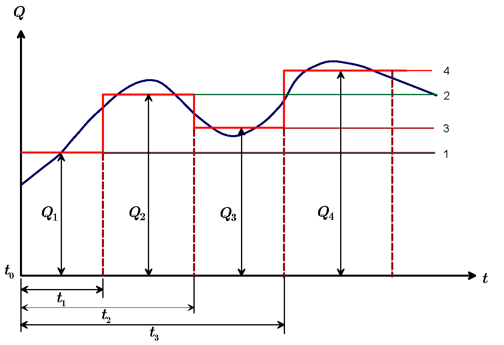

如图, 概化为 4 个阶梯, 分解成 4 个问题: 

1. $t_0\to t$ 以 $Q_1$ 抽水;
2. $t_1\to t$ 以 $Q_2-Q_1$ 抽水;
3. $t_2\to t$ 以 $Q_3-Q_2$ 注水; 
4. $t_3\to t$ 以 $Q_4-Q_3$ 抽水.

各阶梯流量抽水引起的降深:

1. $s_1=\frac{Q_1-Q_0}{4{\pi}T}W\left(\frac{r^2S}{4T(t-t_0)}\right)$
2. $s_2=\frac{Q_2-Q_1}{4{\pi}T}W\left(\frac{r^2S}{4T(t-t_1)}\right)$
3. $s_3=\frac{Q_3-Q_2}{4{\pi}T}W\left(\frac{r^2S}{4T(t-t_2)}\right)$
4. $s_4=\frac{Q_4-Q_3}{4{\pi}T}W\left(\frac{r^2S}{4T(t-t_3)}\right)$

时刻 刻 t 的 降 深:

1. $t_0 < t ≤ t_1,\,s =s_1$
2. $t_1<t\le t_2, s=s_1+s_2$
3. $t_2<t\le t_3, s=s_1+s_2+s_3$
4. $t_3<t\le t_4, s=s_1+s_2+s_3+s_4$

设共有 $n$ 个时段, 且 $t_0 = 0$, $Q_0 = 0$. 当 $t_{n-1}<t<t_n$ 时

$$
s=\frac{1}{4{\pi}T}\sum\limits_{i = 1}^n(Q_i-Q_{i-1})
W\left[\frac{r^2S}{4T(t-t_{i-1})}\right]
$$

如果每个时段抽水延续时间足够长,

$t-t_i\ge25\frac{r^2S}{T}(i=1,2,\cdots, n)$, Jacob 公式成立

$$
s=\frac{0.183}{T}\sum\limits_{i=1}^n(Q_i-Q_{i-1})
\lg\frac{2.25T(t-t_{i-1})}{r^2S}
$$

## 5.2 有越流补给的半承压水完整井非稳定流模型

**越流系统**

包括越流含水层、弱透水层和相邻的含水层的地下水系统.

**越流系统的类型**

- 第一越流系统：忽略弱透水层弹性释放、忽略补给层水位变化;
- 第二越流系统：考虑弱透水层弹性释放、忽略补给层水位变化;
- 第三越流系统：忽略弱透水层弹性释放、考虑补给层水位变化.

### 5.2.1 Hantush-Jacob 模型

**模型假设条件:** 本节主要讨论第一越流系统.

- 每一层都是均质各向同性, 产状水平、等厚, 侧向无限延伸;
- 水流服从 Darcy 定律;
- 抽水过程中相邻含水层水头不变;
- 忽略弱透水层弹性释水, 弱透水层中水流为垂向一维流;
- 抽水含水层天然水力坡度为零, 抽水后形成平面径向流;
- 完整井定流量抽水, 井径无限小.

**数学模型**

$$
\begin{cases}\frac{{\partial}^2s}{{\partial}r^2}+
\frac{1}{r}\frac{{\partial}s}{{\partial}r}-\frac{s}{B^2}=
\frac{S}{T}\frac{{\partial}s}{{\partial}t}&t>0,0<r<\infty\\
\left.s\right|_{t=0}=0&0<r<\infty\\\left.s\right|_{r
\to\infty}=0&t>0\\\lim_{r\to\infty}\left(
r\frac{{\partial}s}{{\partial}r}\right)=-\frac{Q}{2{\pi}T}&t>0
\end{cases}\tag{II}
$$

**模型的解** (Hantush-Jacob,1955)

$$
s=\frac{Q}{4{\pi}T}W\left(u,\frac{r}{B}\right)
$$

式中, $u=\frac{r^2S}{4Tt}$, $B=\sqrt{\frac{TM'}{K'}}$, $W\left(u,\frac{r}{B}\right)$ 为越流井函数。

$$
W\left(u,\frac{r}{B}\right)
=\int_u^\infty\frac{1}{y}e^{-y-\frac{r^2}{4B^2y}}\mathrm{d}y
$$

越流井函数的计算方法见试验材料。

**标准曲线**

对于不同的 $\frac{r}{B}$ 可以绘出 $W(u,\frac{1}{u})$ 标准曲线.


### 5.2.2 Hantush-Jacob 公式讨论

**（1）$s\sim t$ 曲线的变化规律**

$s\sim t$ 曲线分**早、中、晚**三个阶段.

- 早期: 同 Theis 曲线一致, 越流尚未进入主含水层, 抽水量来自主含水层的弹性释水; $r$ 一定时, $B$ 越大, 与 Theis 曲线吻合的时间越长, 越流进入含水层的时间越晚.
- 中期：偏离 Theis 曲线, 越流已经进入抽水含水层, 抽水量来自弹性释水与越流补给两部分. $r$ 一定时, $B$ 越大, 开始偏离的时间越晚.
- 晚期：降深趋于定值. $t\to\infty$ 时 $W\left(u,\frac{r}{B}\right)\approx 2K_0(\frac{r}{B})$，有

$$
s\approx\frac{Q}{2{\pi}T}K_0(\frac{r}{B})
$$

即有越流补给的完整井流，定流量抽水最终能达到稳定流.

**（2）水头下降速度**

$$
\frac{\partial s}{\partial t}=\frac{Q}{4\pi T}\frac{1}{t}
e^{-\left(\frac{r^2S}{4Tt}+\frac{Tt}{SB^2}\right)}
$$

越流含水层水位下降速度比无越流含水层慢.

**（3）稳定流降深的近似公式及各种流量的关系**

**降深的近似公式**

$x>2$ 时 $K_0(x)$ 快速衰减；$x\ll1$ 时，$K_0(x)\approx\ln (\frac{1.123}{x})$。

有

$$
s\approx\frac{Q}{2{\pi}T}\ln\frac{1.123B}{r}
$$

当 $\frac{r}{B}<0.35$ 时，误差小于 5 %；当 $\frac{r}{B}<0.18$ 时，误差小于 1 %。

**抽水量与越流量、轴向侧流量的关系**

径向距离 $r$ 处的轴向侧流量

$$
Q_r=-2{\pi}rT\frac{{\partial}s}{{\partial}r}\approx 
Q\frac{r}{B}K_1(\frac{r}{B})
$$

由此得到抽水量与轴向侧流量关系

$$
\frac{Q_r}{Q}\approx\frac{r}{B}K_1(\frac{r}{B})
$$

在 $r>4B$ 范围，$\frac{Q_r}{Q}<0.05$，可以认为 $r<4B$ 的区域内95%抽水量来自越流量。

## 5.3 有弱透水层弹性释水补给的半承压水完整井非稳定流模型

Hantush-Jacob 模型忽略弱含水层的弹性释水与补给含水层水位变化，为第一越流系统。

事实上，对于多层结构的含水岩组，含水层抽水时会引起弱透水层弹性释水，当弱透水层较厚时，这种补给量是可观的，不能忽略。

M. S. Hantush (1960) 提出了三层结构模型属于第二越流系统。

### 5.3.1 Hantush 模型

Hantush 根据弱透水层弹性释水与相邻含水层关系，给出了三种越流模型：

- 模型 1：与两弱透水层相邻的是定水头含水层；
- 模型 2：与两弱透水层相邻的是隔水层；
- 模型 3：上弱透水层与定水头含水层相邻，下弱透水层与隔水层相邻。

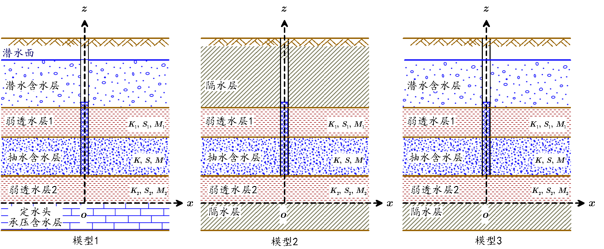

**模型假设条件** 

- 含水层和弱透水层均质、各向同性，产状水平、等厚、无限分布；天然水力坡度为零；
- 单井定流量抽水；
- 弱透水层渗透系数与抽水含水层相比要小的多；
- 含水层抽水时，能得到弱透水层弹性释水补给；弱透水层中水流是垂向流，  抽水含水层中水流为水平径向流，水流服从 Darcy 定律；
- 与弱透水层相邻为定水头含水层或隔水层。

**数学模型**

- 模型 1 

抽水含水层 

$$
\begin{cases} 
T\left(\frac{\partial^2 s}{\partial r^2}
+\frac{1}{r}\frac{\partial s}{\partial r} \right)+K_1
\frac{\partial s_1}{\partial z}-K_2 \frac{\partial s_2}{\partial z}
=S\frac{\partial s}{\partial t} \\ s(r,0)=0 \\
s(\infty,t)=0 \\
\lim\limits_{r\to0}r\frac{\partial s}{\partial r} =-\frac{Q}{2\pi T} 
\end{cases}\tag{III-1}
$$

下弱透水层 

$$
\begin{cases}
K_2 \frac{\partial^2 s_2}{\partial z^2}=S_{s_2}\frac{\partial s_2}{\partial t} \\
s_2(r,z,0)=0 \\
s_2(r,0,t)=0 \\
s_2(r,m_2,t)=s(r,t)
\end{cases}\tag{III-2}
$$

上弱透水层 

$$
\begin{cases}
K_1\frac{\partial^2 s_1}{\partial z^2}=S_{s_1}\frac{\partial s_1}{\partial t} \\
s_1(r,z,0)=0 \\
s_1(r,m_2+M+m_1,t)=0 \\
s_1(r,m_2+M,t)=s(r,t)
\end{cases}\tag{III-3}
$$

- 模型 2 

抽水含水层 

$$
\begin{cases}
T\left(\frac{\partial^2 s}{\partial r^2}
+\frac{1}{r}\frac{\partial s}{\partial r} \right)+K_1
\frac{\partial s_1}{\partial z}-K_2 \frac{\partial s_2}
{\partial z}=S\frac{\partial s}{\partial t} \\ s(r,0)=0 \\
s(\infty,t)=0 \\
\lim\limits_{r\to0}r\frac{\partial s}{\partial r} =-\frac{Q}{2\pi T} 
\end{cases}\tag{IV-1}
$$

下弱透水层

$$
\begin{cases}
K_2 \frac{\partial^2 s_2}{\partial z^2}=S_{s_2}\frac{\partial s_2}{\partial t} \\
s_2(r,z,0)=0 \\
\frac{\partial}{\partial z}s_2(r,0,t)=0 \\
s_2(r,m_2,t)=s(r,t)
\end{cases}\tag{IV-2}
$$

上弱透水层 

$$
\begin{cases}
K_1\frac{\partial^2 s_1}{\partial z^2}=S_{s_1}\frac{\partial s_1}{\partial t} \\
s_1(r,z,0)=0 \\
\frac{\partial}{\partial z}s_1(r,m_2+M+m_1,t)=0 \\
s_1(r,m_2+M,t)=s(r,t)
\end{cases}\tag{IV-3}
$$

- 模型 3 

抽水含水层 

$$
\begin{cases}
T\left(\frac{\partial^2 s}{\partial r^2}
+\frac{1}{r}\frac{\partial s}{\partial r} \right)+K_1
\frac{\partial s_1}{\partial z}-K_2 \frac{\partial s_2}
{\partial z}=S\frac{\partial s}{\partial t} \\ s(r,0)=0 \\
s(\infty,t)=0 \\
\lim\limits_{r\to0}r\frac{\partial s}{\partial r} =-\frac{Q}{2\pi T}
\end{cases}\tag{V-1}
$$

下弱透水层

$$
\begin{cases}  
K_2 \frac{\partial^2 s_2}{\partial z^2}=S_{s_2}\frac{\partial s_2}{\partial t} \\
s_2(r,z,0)=0 \\
\frac{\partial}{\partial z}s_2(r,0,t)=0 \\
s_2(r,m_2,t)=s(r,t)
\end{cases}\tag{V-2}
$$

上弱透水层

$$
\begin{cases} 
K_1\frac{\partial^2 s_1}{\partial z^2}=S_{s_1}\frac{\partial s_1}{\partial t} \\
s_1(r,z,0)=0 \\
s_1(r,m_2+M+m_1,t)=0 \\
s_1(r,m_2+M,t)=s(r,t)
\end{cases}\tag{V-3}
$$

**模型的近似解**

根据 $s\sim t$ 曲线，抽水可分三个阶段。其中，抽水时间足够短及抽水时间足长时 Hantush 模型有近似解.

记 $S_1=m_1S_{s_1}$， $S_2=m_2S_{s_2}$。

- 抽水初期的解
  
  $t<\frac{m_1 S_1}{10K_1}$, $t<\frac{m_2 S_2}{10K_2}$ 时，三种模型具有形式相同的近似解：

$$
s = \frac{Q}{4\pi T}H(u,\beta)=\int\limits_{u}^{\infty}{\frac{e^{-y}}{y}\mathrm{erfc}\left[\frac{\beta\sqrt{u}}{\sqrt{y(y-u)}} \right]}dy
$$

  式中，$u = \frac{r^2S}{4Tt},\,B_1=\sqrt{\frac{Tm_1}{K_1}},\,B_2=\sqrt{\frac{Tm_2}{K_2}},\, \beta= \frac{r}{4B_1}\sqrt{\frac{S_1}{S}} + \frac{r}{4B_2}\sqrt{\frac{S_2}{S}}$

  **标准曲线**

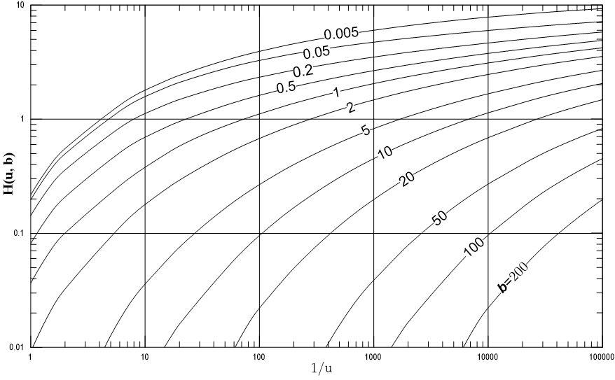

- 抽水时间较长的解
  
  模型 1：$t>5\frac{m_1S_1}{K_1}$ 且 $t>5\frac{m_2S_2}{K_2}$ 时

$$
s = \frac{Q}{4\pi T}W(u_1,\alpha)
$$

  式中

$$
u_1 = \frac{r^2\left(S+\frac{S_1}{3}+\frac{S_2}{3}\right)}{4Tt},\quad \alpha = r\sqrt{\frac{1}{B_1^2} + \frac{1}{B_2^2}}
$$

  $W(u_1,a)$ 为忽略弱透水层弹性释水的越流系统井函数 (Hantush - Jacob)。

  模型 2：$t>10\frac{m_1S_1}{K_1}$ 且 $t>10\frac{m_2S_2}{K_2}$ 时

$$
s = \frac{Q}{4\pi T}W(u_2)
$$

  式中

$$
u_2 = \frac{r^2(S + S_1+S_2)}{4Tt}
$$

  $W(u_2)$ 为无越流含水层井函数 (Theis)。

  模型 3：$t>5\frac{m_1S_1}{K_1}$ 且 $t>10\frac{m_2S_2}{K_2}$ 时

$$
s = \frac{Q}{4\pi T}W(u_3,\frac{r}{B_1})
$$

  式中

$$
u_3 = \frac{r^2\left(S+\frac{S_1}{3}+S_2\right)}{4Tt}
$$

  $W(u_3,\frac{r}{B_1})$ 为忽略弱透水层弹性释水的越流系统井函数 (Hantush-Jacob)。

### 5.3.2 公式讨论

- 当 $B_1,\,B_2 \to\infty$ 或 $S_1=S_2=0$ 时，公式简化为 Theis 公式：

$$
s= \frac{Q}{4\pi T}W(u),\quad u = \frac{r^2S}{4Tt}
$$

- 对模型 1、模型 3（定水头），当 $K_2=0,S_1=S_2=0$ 时，

$$
s=\frac{Q}{4\pi T}W\left( u,\frac{r}{B} \right),\quad u=\frac{r^2S}{4Tt}
$$

  此为忽略弱透水层弹性释水的越流系统井流公式。

- 由 $H(u,\beta)-\frac{1}{u}$ 标准曲线知，$s$ 随 $\beta$ 增大而减小，当 $\beta=0$ 时为 Theis 曲线:
  
  - $S_1$、$S_2$ 增大 ($\beta$ 增大)，$s$ 减小；
  - $r$ 增大 ($\frac{1}{u}$ 减小)，$s$ 减小；
  - $B$ 减小 ($\beta$ 增大)，$s$ 减小。

## 5.4 潜水完整井的非稳定流模型

### 5.4.1 潜水井流特征

- 潜水井流上界面是随时间变化的浸润曲面(自由面)，承压水井流为含水层顶板；
- 潜水井流导水系数 $T=Kh$ 随距离 $r$ 和时间 $t$ 而变化，而承压水井流 $T=KM$ 与$r,t$ 无关；
- 潜水井流降深较大时，垂向分速度不可忽略，井附近为三维流；近水平含水层的承压井流垂向分速度可忽略，可近似地处理为二维流；
- 潜水井抽取的地下水主要来自含水层的重力疏干；重力疏干不能瞬时完成，而是逐渐被排放出来，具有明显地迟后于水位下降的现象，给水度长时间抽水后趋于定值；承压水井抽取的地下水来自含水层贮存量释放，接近于瞬时完成，贮水系数是常数.

潜水井抽水时，观测孔 $s-t$ 曲线有明显的**分阶段变化特征**。

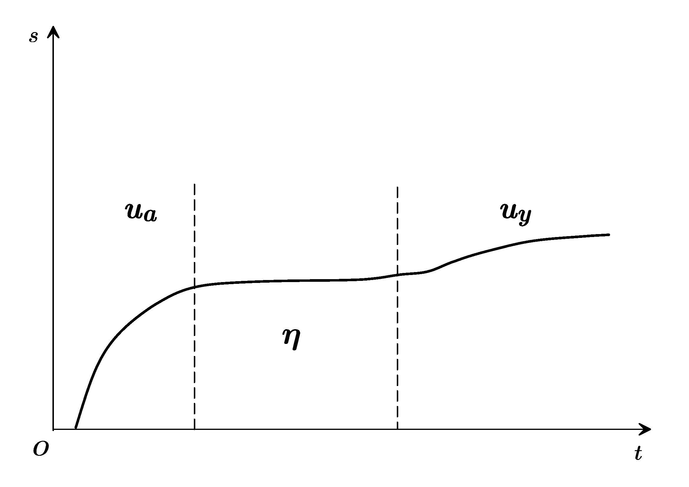

- 早期：抽水开始后的早期阶段，水位刚刚下降，重力排水还未起作用，只有压力降低引起的弹性释水起作用，$s-t$ 曲线与 Theis 曲线一致，时间可能仅几分钟.
   含水层的反应和一个贮水系数小的承压含水层相似；水流主要是水平运动.
- 中期：疏干排水开始起作用，含水层得到补给，水位下降速度明显变缓，$s-t$ 曲线偏离 Theis 曲线，曲线斜率减少，甚至短时间稳定.
   含水层的反应类似于一个有越流补给的承压含水层；降落漏斗仍以缓慢速度扩展着.
- 后期：滞后排水作用达到压力平衡，影响逐渐减小，重力排水与水位下降同步，抽水量来自重力排水，$s-t$   曲线又于 Theis 曲线一致.
   给水度所起的作用相当于承压含水层的贮水系数.

**潜水井流的研究思路**

- 抽水附近按三维流处理；
- 远离抽水井的潜水井流可近似为二维流。

**潜水井流的近似处理**

远离抽水井的潜水井流可近似为二维流。

- 用 $H_m=\frac{1}{2}(H_0+H)$ 近似地代替含水层厚度：长时间抽水后，迟后排水现象已不明显;   在降深不大的情况下（$s\le0.1H_0$，$H_0$ 为抽水前潜水流厚度），可近似用承压井流公式作近似计算

$$
s=\frac{Q}{4\pi H_mK}W(u),u=\frac{r^2\mu}{4KH_mt}
$$

- 采用修正降深值，直接利用 Theis 公式：

$$
s'=s-\frac{s^2}{2H_0}=\frac{Q}{4\pi T}W(u),\quad u=\frac{r^2S}{4Tt}(T=KH_0)
$$

   式中：$s'$ 为修正降深; $s$ 为实测降深; $H_0$ 为潜水流初始厚度.

**潜水完整井流模型分类**

1. 考虑井附近流速垂直分量的第一潜水井流 Boulton 模型；
2. 考虑迟后排水的 Boulton 第二潜水井流模型；
3. 既考虑流速垂直分量又考虑含水层弹性释水的 Neumann 模型.

本课程介绍后两种模型。

### 5.4.2 考虑迟后疏干的的 Boulton 模型

**Boulton 假设**

根据抽水过程中降深---时间曲线特征, Boulton 提出了考虑迟后疏干的计算方法.

假设 $\tau,\tau+\Delta\tau$ 时间段抽水，潜水面下降了 $\Delta s$. 抽出水量由两部分组成：

- 弹性释水放出水量：水位下降 $\Delta s$ 时单位面积含水层弹性释水为$S\cdot\Delta s\cdot1$；

- 迟后疏干排出水量：水位下降$\Delta s$时，迟后疏干排出水量假设为：

$$
\mu\cdot\Delta s\cdot1\cdot\alpha\cdot e^{-\alpha(t-\tau )}
$$

   式中：$\alpha$ — 经验系数.

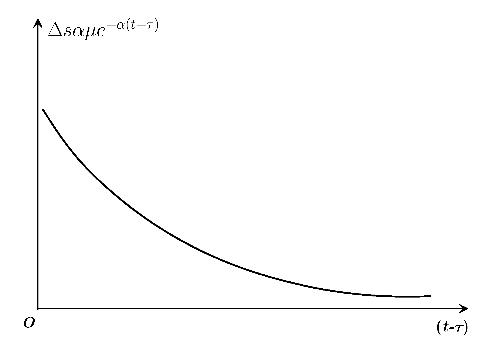

> 用负指数处理迟后现象。

**Boulton 假设合理性**

- 单位面积含水层排水量 $\mu\cdot\Delta s\cdot1\cdot\alpha\cdot e^{-\alpha(t-\tau )}$ 与 $t-\tau$ 关系符合一般经验，时间间隔越长，排出的水量越小.
- $\tau$ 时刻之后，若 $\Delta s=1$，则重力排水的总体积为：

$$
\int\limits_{\tau}^{\infty}{\mu\cdot\alpha\cdot e^{-\alpha(t-\tau)}dt}=\mu
$$

   等于含水层的给水度，满足水量均衡条件，符合实际情况；

- $\tau,t$ 时间段的迟后排水总量为：

$$
\int\limits_{\tau}^t{\mu\cdot\Delta s\cdot\alpha\cdot e^{-\alpha(t-\tau)}dt}=\mu\cdot\Delta s\cdot[1-e^{-\alpha(t-\tau)}]
$$

> 当 $t>\tau$ 时，有迟后效应; 若 $\alpha$ 大，则排出水量大，迟后性小; $1/\alpha$ 称为延迟指数.

**迟后疏干出水量的表示**

在抽水过程中从 0 至 $t$ 时刻，水位下降了 $s$. 单位面积含水层的疏干水量 $q$ 可表示为 $n$ 个$\Delta\tau=\tau_i-\tau_{i-1}$ 对应降深为 $\Delta s_i=s_i-s_{i-1}$ 水量的叠加.

当 $n\to\infty$ 时

$$
\begin{split}
q &=\underset{n\to\infty}{\mathop{\lim}}\sum\limits_{i=1}^n{\mu\Delta s_i\alpha e^{-\alpha(t-\tau_i)}}\\
 &=\underset{n\to\infty}{\mathop{\lim}}\sum\limits_{i=1}^{n}{\mu\frac{\Delta
s_i}{\Delta\tau_i}\alpha e^{-\alpha(t-\tau_i)}\Delta\tau_i}\\
 & =\int\limits_{0}^t{\mu\frac{\partial s}{\partial\tau}\alpha e^{-\alpha(t-\tau)}}d\tau
\end{split}
$$

**Boulton 模型假设**

- 均质各向同性，隔水底板水平侧向无限延伸的含水层；
- 初始水面水平；
- 完整井，井径无限小，定流量抽水，降深 $s\ll H_0$；
- 水流服从 Darcy 定律；
- 抽水时，含水层中的水不能瞬时排出，存在着迟后现象.

**Boulton 模型的数学表示**

$$
\begin{cases}
T\left(\frac{\partial^2s}{\partial r^2}+
\frac{1}{r}\frac{\partial s}{\partial r}\right) =
S\frac{\partial s}{\partial t}+ \alpha\mu\int_0^t\frac{\partial s}{\partial t}e^{- \alpha( t - \tau)}\mathrm{d}\tau & \\
s(r,0)=0 & \\
s(\infty,t)=0 & t > 0 \\ 
\lim_{r \to 0}\left(
r\frac{\partial s}{\partial r}\right) = -\frac{Q}{2\pi T} & t > 0
\end{cases}\tag{VI}
$$

**Boulton 模型的解**

$$
s=\frac{Q}{4\pi T}\int\limits_{0}^{\infty}\frac{2}{x}\left\{1-e^{-u_1}\left[\cosh(u_2)+\frac{\alpha\eta(1-x^2)t}{2u_2}\sinh(u_2)\right]\right\}J_0\left(\frac{r}{\nu D}x\right)dx
$$

式中, 

$$
\begin{array}{lll}
 u_1=\frac{\alpha t\eta (1+x^2)}{2},  & \quad & u_2=\frac{\alpha t\sqrt{\eta^2(1+x^2)^2-4\eta x^2}}{2}\\
\eta =\frac{S+\mu }{S}, && \nu =\sqrt{\frac{\eta-1}{\eta}}=\sqrt{\frac{\mu}{S+\mu}}\\
 D=\sqrt{\frac{T}{\alpha \mu}}&&
\end{array}
$$

$D$ 为疏干因素(量纲为L)，$\sinh(u)=\frac{e^u-e^{-u}}{2},\quad\cosh(u)=\frac{e^u+e^{-u}}{2}$为双曲函数.

**Boulton 模型的简化形式**

当 $\eta\to\infty$ 时，即 $\mu\gg S$ 时，Boulton 解可简化

$$
s =\frac{Q}{4\pi T}\int\limits_0^\infty
\frac{2}{x}
\left\lbrace
1-\frac{1}{1+x^2}e^{-\frac{\alpha tx^2}{1+x^2}}-\frac{x^2}{1+x^2}e^{-\alpha\eta t(1+x^2)}
\right\rbrace J_0\left(\frac{r}{D}x\right)dx 
$$

将Boulton 解进一步简化：

（1）当 $t$ 相当小（抽水初期）：

$$
s = \frac{Q}{4\pi T}\int\limits_{u_a}^\infty\frac{1}{y}\mathrm{e}^{-y-\frac{r^2}{4D^2y}}dy=\frac{Q}{4\pi T}W(u_a,\frac{r}{D})
$$

（2）当 $t$ 很大（抽水延续时间较长）：

$$
s = \frac{Q}{4\pi T}\int\limits_0^\infty
\frac{2}{x}\left\lbrace
1-\frac{1}{1+x^2}e^{-\frac{x^2}{1+x^2}\frac{1}{u_y}\frac{r^2}{4D^2}}
\right\rbrace J_0\left(\frac{r}{D}x\right)dx =\frac{Q}{4\pi T}W(u_y,\frac{r}{D})
$$

式中, $W\left(u_{ay},\frac{r}{D}\right)$ 为潜水含水层中完整井的井函数. 抽水早期，$u_{ay}=u_a=\frac{r^2S}{4Tt}$；抽水后期，$u_{ay}=u_y=\frac{r^2\mu}{4Tt}$.

**Boulton 模型标准曲线**

在双对数纸上绘制标准曲线，$W(u_{ay},\frac{r}{D})$ 为纵坐标，$\frac{1}{u_a}$ 为横坐标作 A 组曲线，$\frac{1}{u_y}$ 为横坐标作 B 组曲线，然后用切线联 A、B 组曲线.


- 井函数曲线组反映了迟后排水的影响. 抽水初期，以弹性释水为主，水位降深同 A 组 Theis 曲线吻合.
- 持续抽水，迟后重力排水发生影响后偏离 Theis 曲线，下降速度变小，并随的 $r/D$ 不同，以不同方式向水平线趋近.
- 抽水后期，迟后重力排水影响减弱，下降速度由小变大，曲线斜率增加. 迟后重力排水影响基本结束时又趋向 B 组 Theis 曲线.

**Boulton 模型按抽水过程的近似解**

- 早期：

$$
s=\frac{Q}{4\pi T}W\left(u_a,\frac{r}{D}\right),\quad u_a =\frac{r^2S}{4Tt}
$$

与忽略弱透水层弹性释水的越流系统井函数相同，疏干因素$D$的作用相当于越流因素 $B$ 的作用. $W(u_a,\frac{r}{D})$ 为潜水含水层 A 组井函数.

- 中期：

$$
s =\frac{Q}{2\pi T}K_0\left(\frac{r}{D}\right)
$$

为忽略弱透水层弹性释水下的越流稳定解.

- 晚期：

$$
s=\frac{Q}{4\pi T}W\left(u_y,\frac{r}{D}\right),\quad u_y = \frac{r^2\mu}{4Tt}
$$

$W(u_y,\frac{r}{D})$ 为潜水含水层 B 组井函数.

**Boulton 模型讨论**

- 早期：当 $t$ 很小时(相当于抽水初期)，与 Hantush-Jacob  公式相同，潜水位下降的过程与越流含水层的过程相同.
- 中期：当 $t$ 很大时(相当于抽水延续时间很长的情况)，与 Theis 公式相同，此时 $\bar{u}=\frac{r^2(S+\mu)}{4Tt}$.
- 晚期：在长时间抽水后，降深可以用 Theis 公式计算.

### 5.4.3  考虑流速垂直分量和弹性释水的 Neumann 模型

**Boulton 延迟疏干模型的缺陷**

- 延迟指数 $\frac{1}{\alpha}$ 缺乏明确的物理含义；
- 对确定的潜水含水层，$\alpha$ 不能保证是常数，$\alpha$ 不是一个物性参数；
- 难于解释潜水含水层的释水机制；
- 二维模型，无法解释抽水井附近三维流特征.

**Neumann 模型的改进**

- 是三维轴对称模型，包含z坐标变化对降深的影响与含水层的各向异性特征；
- 将潜水面作为活动边界，建立了潜水面变动的连续方程；
- 避免了潜水疏干释水所涉及的非饱和带问题；无需物理意义不明的延迟指数 $\alpha$，克服了 Boulton 延迟疏干模型的缺陷.

**Neumann 模型的假设条件**

- 含水层均质各向异性，侧向无限延伸，坐标轴和主渗透方向一致，隔水层水平；
- 初始潜水面水平；
- 水流服从 Darcy 定律；
- 完整井，定流量抽水；
- 抽水期间自由面上没有入渗补给或蒸发；潜水面降深和含水层厚度相比小得多.

**Neumann 模型的数学表示**

$$
\left\{\begin{array}{ll}
K_r\left[\frac{\partial^2s}{\partial{r^2}}+\frac{1}{r}\frac{\partial{s}}{\partial{r}}\right]+K_z\frac{\partial^2s}{\partial{z^2}}=S_s\frac{\partial{s}}{\partial{t}}& t \gt 0,0\lt r\lt\infty,0\lt z\lt H_0 \\ 
s(r,z,0)=0 & 0\lt r\lt \infty \\
s(\infty,z,0)=0 & t\gt 0 \\
K_z\frac{\partial}{\partial{z}}s(r,H_0,t)=-\mu\frac{\partial}{\partial{t}}s(r,H_0,t) & t\gt 0 \\
& 0\lt r\lt  \infty \\
\lim\limits_{r\to0}\int_0^{H_0}r\frac{\partial{s}}{\partial{r}}\mathrm{d}z=-\frac{Q}{2{\pi}K_r} &
\end{array}\right.\tag{VII}
$$

**Neumann 模型的解**

$$
s(r,z,t)=\frac{Q}{4{\pi}T}\int_0^\infty{4y}J_0\left(y\beta^{\frac{1}{2}}\right)\left[\omega_0(y)+\sum\limits_{n=1}^\infty\omega_n(y)\right]\mathrm{d}y
$$

式中 

$$
\begin{split}
{\omega_0(y)}&=\frac{\{1-\exp[-t_s\beta(y^2-\gamma_0^2)]\}\cosh(\gamma_0z_d)}{\{y^2+(1+\sigma)\gamma_0^2-[(y^2-\gamma_0^2)^2/\sigma]\}\cosh(\gamma_0)}\\
{\omega_n(y)}&=\frac{\{1-\exp[-t_s\beta(y^2+\gamma_n^2)]\}\cosh(\gamma_nz_d)}{\{y^2-(1+\sigma)\gamma_n^2-[(y^2+\gamma_n^2)^2/\sigma]\}\cos(\gamma_n)}
\end{split}
$$

$\gamma_0,\gamma_n$ 分别为下面两方程的根：

$$
\begin{array}{rl}
 \sigma\gamma_0\sinh(\gamma_0)- (y^2-\gamma_0^2)\cosh(\gamma_0)=0, & \gamma_0^2<y^2 \\
 \sigma\gamma_n\sin(\gamma_n)+ (y^2+\gamma_n^2)\cos(\gamma_n)=0, & (2n-1)\frac{\pi}{2}<\gamma_n<n\pi(n\ge1)
\end{array}
$$

Neuman 解有 4 个参数：

$$
t_s=\frac{Tt}{Sr^2}(t_y=\frac{Tt}{\mu r^2}),\quad z_d=\frac{z}{H_0},\quad \sigma=\frac{S}{\mu},\quad {\beta}=\frac{r^2K_z}{H_0^2K_r}
$$

记 $K_d=\frac{K_z}{K_r},\quad h_d=\frac{H_0}{r}$，$\beta=K_d/h_d^2$

> $z_d$ 为三维流的参数.

对完整观测井，降深 $s$ 需用沿 $z$ 的平均降深表示，计算公式不变：

$$
s(r,t)=\frac{1}{H_0}\int\limits_{0}^{H_0}{s(r,z,t)dz =}\frac{Q}{4\pi T}\int\limits_{0}^{\infty}{4yJ_0 (y\beta^{\frac{1}{2}})}\left[\omega_0( y)+\sum\limits_{n=1}^{\infty}{\omega_n( y)}\right]dy
$$

其中 $\omega_,\omega_n$ 为 

$$
\begin{split}
\omega_0(y)& =\frac{\{1-\exp[-t_s\beta(y^2-\gamma_0^2)]\}\tanh(\gamma_0)}{\{y^2+(1+\sigma)\gamma_0^2-[(y^2-\gamma_0^2)^2/\sigma]\}\gamma_0}\\
\omega_n(y)& =\frac{\{1-\exp[-t_s\beta(y^2+\gamma_n^2)]\}\tan(\gamma_n)}{\{y^2-(1+\sigma)\gamma_n^2-[(y^2+\gamma_n^2)^2/\sigma]\}\gamma_n}
\end{split}
$$

解有 3 个参数 ($z$ 方向的降深平均化)：

$$
t_s=\frac{Tt}{Sr^2}(t_y=\frac{Tt}{\mu r^2}),\quad \sigma=\frac{S}{\mu},\quad {\beta}=\frac{r^2K_z}{H_0^2K_r}
$$

**Neuman标准曲线**

（1）式中包含 3 个独立的无量纲变量，为了便于作图，假设 $S$ 远小于 $\mu$，即 $\sigma=0$。从而可以绘出两组标准曲线：

- 以 $\beta$ 为参变量，以 $t_s$ 计算无量纲降深 $s_d$ 作出 A 组曲线 $t_s\sim s_d$，坐标 $t_s$ 标在图的上端； 
- 以 $\beta$ 为参变量，$t_y$ 计算无量纲降深 $s_d$，作出 B 组曲线 $t_y\sim s_d$，坐标 $t_y$ 标在图的下端；
- A 组曲线右边部分和 B 组曲线左边部分都趋近于一组水平的渐近线。当 $\sigma=0$ 时二组标准曲线相距无限远，因此必须采用不同的尺度才能绘在一张图纸上。
- A 组曲线用以分析早期的降深资料；B 组曲线用以分析晚期的降深资料。


**Neuman 解的特点**

没有重力排水 ($\mu=0$，相当于抽水初期)，可以证明 Neuman 解具有 Theis 解的形式：

$$
s(r,t)=\frac{Q}{4\pi T}\int\limits_{u_s}^{\infty}\frac{e^{-y}}{y}dy=\frac{Q}{4\pi T}W(u_s)
$$

式中，$u_s=\frac{r^2S}{4Tt}$. 

长时间抽水 ($t\to\infty$，相当于没有了弹性释水)，Neuman 解也具有 Theis 解的形式：

$$
s(r,t)=\frac{Q}{4\pi T}\int\limits_{u_y}^{\infty}\frac{e^{-y}}{y}dy=\frac{Q}{4\pi T}W(u_y)
$$

式中，$u_y=\frac{r^2\mu}{4Tt}$.

抽水初期，弹性释水起主要作用（$u_s=\frac{r^2S}{4Tt}$）;

抽水后期，重力释水起主要作用（$u_y=\frac{r^2\mu}{4Tt}$）.

**井附近降深分析**

记 $s_d=\frac{4{\pi}T}{Qs}$ 为无量纲降深.

- 含水层各向同性，观测点位于距抽水井 $H_0$ 的含水层底部 ($Z_d=0,h_d=1,K_d=1$)
    $s_d\sim t_{s}$ 曲线：
  
  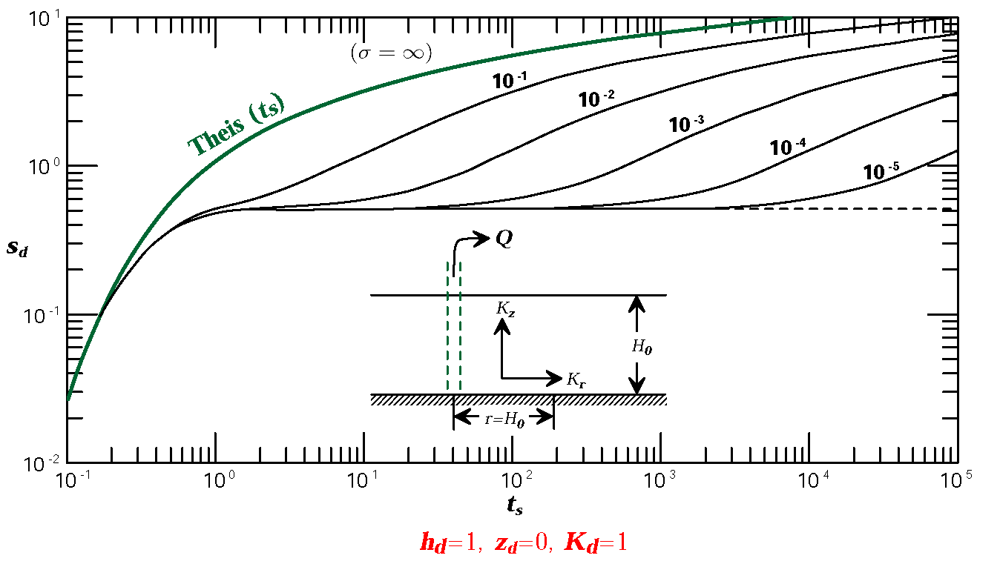
  
    第一阶段（早期）：抽水量来自弹性释水；
  
    第二阶段：重力排水起作用，$\sigma$ 越小，该阶段越长；
  
    第三阶段：弹性释水影响消失，曲线再次与Theis一致.

- 含水层各向同性，观测点位于距抽水井 $H_0$ 的含水层底部 ($Z_d=0,h_d=1,K_d=1$)
    $s_d\sim t_{y}$ 曲线：
  
  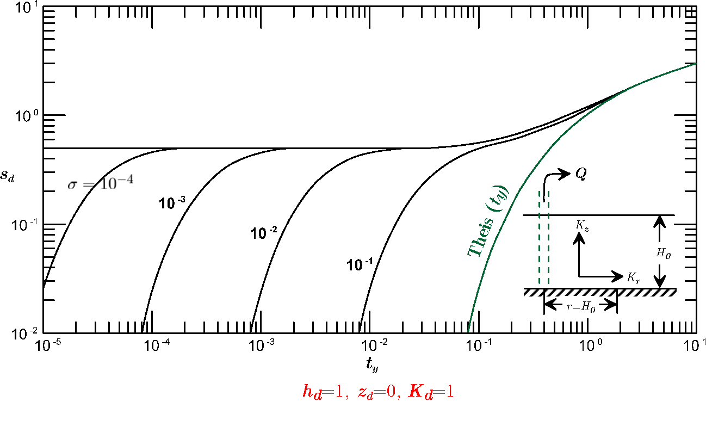
  
    $\sigma$ 越小，第一阶段时间越短. 尽管潜水含水层的 $S_s$ 比 $\mu$ 小得多，弹性释水的影响还不能完全忽略.

- 含水层各向同性，观测点位于距抽水井 $H_0$ 的含水层断面上 ($h_d=1,K_d=1$)
  
    $z_d$ 对降深 $s_d$ 的影响：设 $\sigma=10^{-2}$.
  
  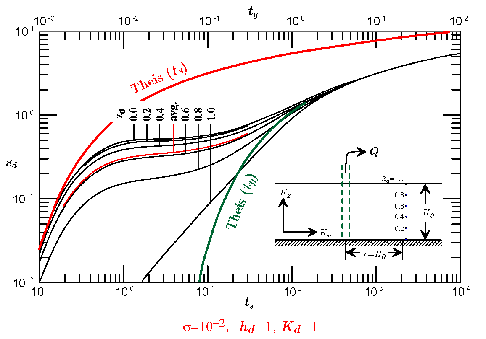
  
    抽水的早、中期，潜水面处的降深小于垂向任意一点的降深，此即迟后排水或潜水面反应滞后的现象.

- 含水层各向同性，观测点位于距抽水井 $H_0$ 的含水层断面上 ($h_d=1,K_d=1$)
    水流状态的变化：设 $\sigma=10^{-2}$.
  
  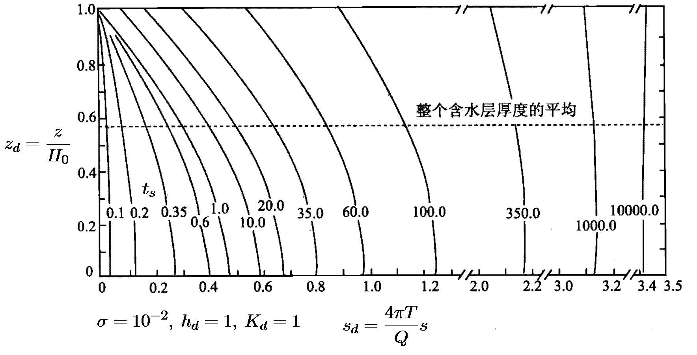
  
    抽水的早、晚期，降深分布曲线基本上是垂直的，与 Dupuit 假设一致.
  
    抽水中期，含水层上部存在明显的渗透速度垂直分量.

- 含水层各向同性，观测点位于含水层底部 ($z_d=0,K_d=1$) 
    $s_d\sim t_{s,y}$ 曲线随 $r$ 的变化: 设 $\sigma=10^{-2}$.
  
  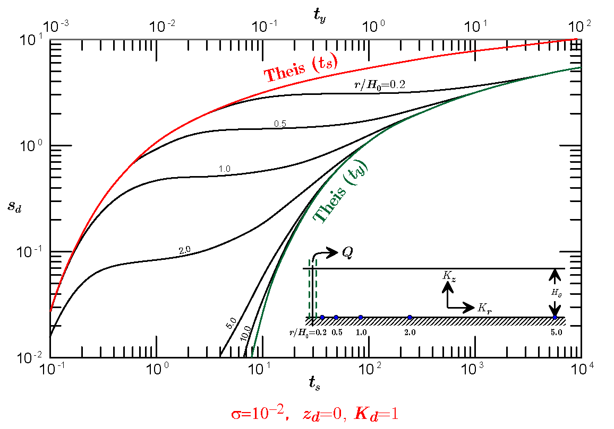
  
    随着 $r$ 增大，弹性释水作用逐渐减弱，$r>10H_0$ 的地段可以完全忽略不计；
  
    潜水面滞后反应随 $r$ 增大而减弱，降深-时间曲线的三个阶段仅在 $r$ 不大的情况下才会显现.

- 含水层各向异性，观测点位于距抽水井 $H_0$ 的含水层底部 ($z_d=0,h_d=1$) 
    各向异性影响: 设 $\sigma=10^{-2}$.
  
  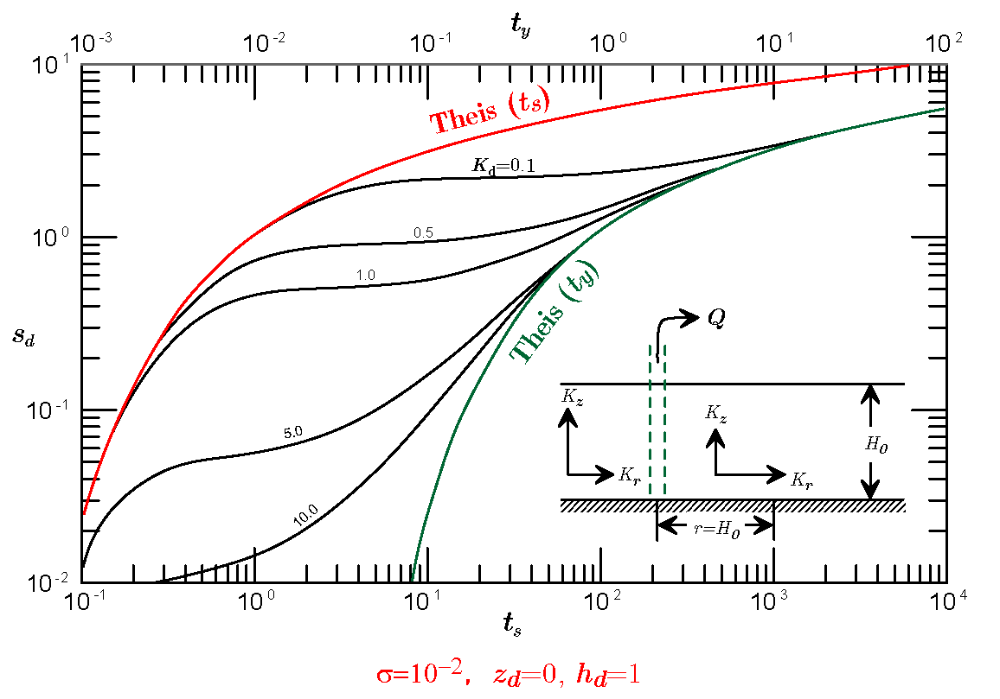
  
    $K_d$ 越小，渗透速度的水平分量越比垂向分量，弹性释水和迟后反应越明显.