# 6 根据抽水试验确定含水层参数

<yanggy1010@126.com>

[TOC]

## 6.1 基本概念

- 正演问题：在各种参数已知的情况下，根据计算公式或描述地下水运动的微分方程及定解条件求渗流区内任意位置及任意时刻的水位或流量；
- 反演问题：根据地下水的天然动态或抽水试验的观测资料确定含水层的某些水文地质参数，又称为含水层参数的识别问题。

反演问题是利用过去一段时期的资料来研究含水层的激发 (如抽水) 和响应 (如地下水位) 关系，并确定模型的参数值，使模型能够描述地下水的动态变化。

**反演问题的分类**

1. 单纯求水文地质参数。包括导水系数、贮水系数等；
2. 确定微分方程中的源汇项，包括蒸发量、入渗量、未知的开采流量等；
3. 确定模型的初始条件；
4. 确定模型的边界条件；
5. 以上几种问题的组合。

**反演问题的适定性**

在数学上，求微分方程的反演问题时，若问题解存在、唯一且稳定，则称该问题是适定的。根据抽水试验资料和天然动态观测资料反求水文地质参数时，也存在含水层参数识别的适定性问题：

1. 根据实际资料反求渗流区水文地质参数时解是否存在？即存在性问题；
2. 参数是否唯一？即唯一性问题；
3. 当实测资料有微小误差时，求得的水文地质参数的误差是否也微小，即水文地质参数是否连续依赖于实测资料？即解的稳定性问题。

在解决实际水文地质问题时，正演问题的数学模型往往都是根据实际的地质、水文地质条件研究得出。转化为反演问题时，解的存在性是无疑的；根据实际水文地质条件对解做一些限制也可以使反演问题获得唯一解；要达到解的稳定性条件，则在计算技术及勘探技术方面需要一些技巧与措施。

**反演问题对水文地质勘探的要求**

1. 对研究地区的水文地质条件，包括边界条件、含水层结构、分布、地下水类型应清楚，避免计算区内未知因素过多，缺乏水文地质条件约束。例如，应查清含水层系统的组成、含水层空间展布情况、均质性、水力性质、含水层间的水力联系、越流补给等，减少参数识别过程中的多解可能性。
2. 计算范围与边界条件同时确定，尽量保持正演模型范围与反演模型范围一致，并保证参数识别所用的资料在空间分布上具有代表性。
3. 根据对研究区水文地质条件的认识，合理设计抽水试验，布置动态观测点，如：
   - 主井位置：主井位置的确定应以抽水试验目的为依据。若是为供水评价或矿山疏水为目的，应尽量结合未来生产井或矿山疏放孔位置选取；若为查清某个地段的水文地质条件，则应将主井位置选择在需了解的地段，使主井附近产生大的降深，充分暴露该地段的水文地质条件。
   - 观测孔：观测孔的个数要与待求参数的个数相适应，位置分布要合理，在参数变化大或水文地质条件变化的地段应有观测孔控制，以提高求参精度。
   - 地下水动态观测对查清边界条件、含水层间的水力联系等水文地质条件至关重要，在各勘探阶段初期就应布置并进行动态观测。

## 6.2 稳定流抽水试验求参

对于缺少抽水降深变化过程数据的单井定流量抽水试验，可用稳定流方法近似估算含水层参数。在现阶段，尽管有针对稳定流抽水试验的各种规范，提倡对稳定流抽水试验过程进行非稳定流观测以获得可以用于非稳定流求参的观测数据，从而提高求参的可靠性。

承压或潜水含水层的完整井抽水，当抽水时间较长时可使抽水井附近的水流达到稳定或近似稳定状态，可依据稳定流的 Dupuit 及 Thiem 公式可以求得含水层的渗透系数 $K$（或导水系数 $T$），计算公式如表所示。

|       | 承压含水层                                                       | 潜水含水层                                                                     |
| ----- | ----------------------------------------------------------- | ------------------------------------------------------------------------- |
| 1个观测孔 | $K = \frac{0.366Q}{M(s_w - s_1)}\lg\frac{r_1}{r_w}$（Dupuit） | $K = \frac{0.732Q}{(2H_0 - s_w -s_1)(s_w-s_1)}\lg\frac{r_1}{r_w}$（Dupuit） |
| 2个观测孔 | $K = \frac{0.366Q}{M (s_1-s_2)}\lg\frac{r_2}{r_1}$（Thiem）   | $K = \frac{0.732Q}{(2H_0-s_1-s_2)(s_1-s_2)}\lg\frac{r_2}{r_1}$（Thiem）     |

式中，$r_w$ 、$s_w$ 为抽水井半径、降深；$r_1$、$r_2$ 为观测井（孔）与抽水井的距离；$s_1$、$s_2$ 为观测井（孔）的降深；$K$ 为渗透系数；$M$、$H_0$ 分别为承压含水层、潜水含水层的厚度。

若没有观测孔数据，也可直接用 Dupuit 公式求参：

|     | 承压含水层                                      | 潜水含水层                                                |
|:---:|:------------------------------------------:|:----------------------------------------------------:|
| 单井  | $K = \frac{0.366Q}{M s_w}\lg\frac{R}{r_w}$ | $K = \frac{0.732Q}{(2H_0 - s_w)s_w}\lg\frac{R}{r_w}$ |

式中，$R$ 为单次抽水试验的影响半径。

对于影响半径 $R$ 的应用多年来一直存在分歧，但在 Dupuit 公式中以对数形式出现，属于不敏感的参数，不追求过高精度的情况下仍可采用。

在有 2 个观测孔降深数据的情况下，可以求出单次抽水的影响半径：

- 承压水

$$
\lg R =\frac{s_1 \lg r_2 - s_2 \lg r_1}{s_1-s_2}
$$

- 潜水

$$
\lg R =\frac{(H_0^2-h_1^2) \lg r_2 - (H_0^2-h_2^2) \lg r_1} {h_2^2-h_1^2}
$$

**排水工程设计经常使用的影响半径经验公式：**

- 吉哈尔特（承压水）

$$
R =10 s_w \sqrt{K}
$$

- 库萨金（潜水）

$$
R =2 s_w \sqrt{KH_0}
$$

式中，$K$ — 渗透系数，$m/d$；$s$ — 设计降深，$m$；$H_0$  — 自底板算起的含水层静止水位（厚度），$m$。

只有抽水井的数据时，可构造迭代公式计算 $K$ 及 $R$：

影响半径R未知时单井抽水试验求参：

- 承压井：

$$
\left\{\begin{split}
K&=\frac{Q}{2\pi Ms_w}\ln\frac{R}{r_w}\\
R&=10s_w\sqrt{K}
\end{split}\right.
$$

- 潜水井：

$$
\left\{\begin{split}
K&=\frac{Q}{\pi (2H_0-s_w)s_w}\ln\frac{R}{r_w}\\
R&=2s_w\sqrt{KH_0}
\end{split}\right.
$$

对于潜水井观测孔应设在 $1.5 \sim 2M$ 以远的位置，但也不应太远，否则观测不到抽水引起的降深。应用 Dupuit 公式估算含水层参数时，若忽略井损值，则所求含水层渗透系数明显偏小。

**Hantush - Jacob 稳态解求参**

有越流补给的含水层长时间抽水后会达到稳定流状态：

$$
s=\frac{Q}{2\pi T}\ln\frac{1.123B}{r}=0.366\frac{Q}{T}\lg\frac{1.123B}{r}
$$

如有抽水试验的2个以上的观测孔数据，也可用该式求参：

$$
T=\frac{0.366Q}{s_1-s_2}\lg\frac{r_2}{r_1},\quad\,B=0.89\,r_1\times10^{\frac{s_1T}{0.366Q}}
$$

> 适当的求参方法可以获取正确的水文地质参数！

**例：** 某承压含水层中的抽水井以 $480m^3/d$ 进行稳定流抽水，抽水井半径 $r_w=0.05m$、降深 $s_w=7.65m$。测得距抽水井 $r_1=50m$、$r_2=100m$、$r_3=120m$ 处的观测井降深分别为 $s_1=2.38m$、$s_2=1.85m$、$s_3=1.70m$。试求取水文地质参数。

Dupuit 公式求参

- 1、2 个观测孔：$T=99.78m^2/d$
- 2、3 个观测孔：$T=92.74m^2/d$
- 1、3 个观测孔：$T=98.23m^2/d$

取平均值：$T=96.92m^2/d$。

验证：

$$
s_1=2.21m,\quad s_2=1.66m,\quad s_3=1.51m
$$

Hantush - Jacob 公式求参

- 1、2 个观测孔：$T=99.78m^2/d$，$B=1000.36m$
- 2、3 个观测孔：$T=92.74m^2/d$，$B=843.25m$
- 1、3 个观测孔：$T=98.23m^2/d$，$B=953.01m$

取平均值：$T=96.92m^2/d$，$B=932.21m$。

验证：

$$
s_1=2.39m,\quad s_2=1.85m,\quad s_3=1.71m
$$

## 6.3 定流量非稳定流抽水试验的配线法求参

配线法是将抽水试验的水文地质条件概化为与某种井流模型相似的条件，将观测孔降深的时间序列曲线在双对数刻度下与相应井流模型标准曲线匹配，通过量取观测曲线的偏移量来计算相应的水文地质参数。该方法将不同的标准曲线当成标尺，分析降深的时间序列与标准曲线的差异性来，从而获取更多的含水层水文地质信息。

### 6.3.1 Theis 模型配线法

Theis 模型配线法根据所使用抽水试验数据的不同，可以分为：

- 降深—时间 ($s\sim t$) 配线法（1 个观测孔的数据）
- 降深—时间距离 ($s\sim t/r^2$) 配线法（多个观测孔的数据）
- 降深—距离 ($s\sim r^2$) 配线法（多个观测孔某时刻的统测数据）

**Theis 模型配线法原理**

以 $s\sim t$ 配线法为例。距抽水井一定距离 $r$ 的观测孔降深 $s$ 是时间 $t$ 的函数 $s=s(r, t)$, 根据 Theis 公式

$$
s=\frac{Q}{4{\pi}T}W(u),\quad t=\frac{r^2S}{4T}\frac{1}{u}
$$

两边取对数并整理, 得 

$$
\begin{array}{l}
\lg s=\lg W(u)+\lg\frac{Q}{4{\pi}T} \\
\lg t=\lg\frac{1}{u}+\lg\frac{r^2S}{4T}
\end{array}
$$

在双对数坐标纸上, 曲线 $s\sim t$ 与 $W(u)\sim\frac{1}{u}$ 形状相同, 位移为 $(\lg\frac{r^2S}{4T}, \lg\frac{Q}{4{\pi}T})$。以观测数据绘制 $s\sim t$ 散点图，根据配线的平移量可以计算出 $T$ 与 $S$。该方法又称为**降深—时间**($s\sim t$) 配线法.

其他配线法原理基本一致。

> **配线法注解**

$W(u)\sim\frac{1}{u}$ 曲线为无量纲标准曲线。不同水文地质条件下，根据观测孔数据绘制的点可能对应于标准曲线的不同部分。

例如，某次抽水试验，观测孔距抽水井 $r=100m$, 抽水后第 $10min$ 进行了一次观测。

$$
a=\frac{T}{S}=\frac{r^2}{4t}\cdot\frac{1}{u}
$$

若 $a$ 为

$$
a= \begin{cases} 3.6\times10^5 m^2/d\\3.6\times10^7 m^2/d\end{cases}
$$

则对应的 $1/u$ 为

$$
\frac{1}{u}=\begin{cases} 1\\ 100 \end{cases}
$$

对应不同的水文地质条件，数据点可以差两个对数周期。设计抽水试验时应该尽可能考虑水文地质条件的差异。

**标准曲线**

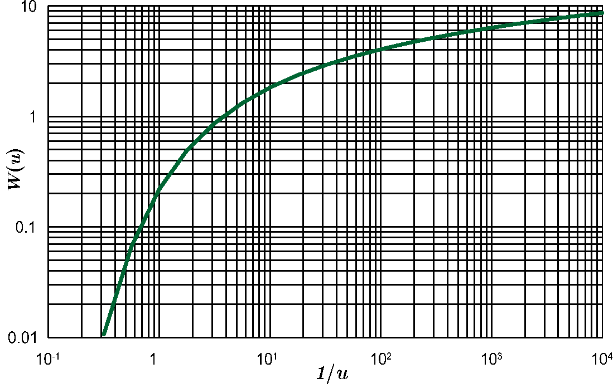

**$s\sim t$ 配线法步骤**

1. 在双对数坐标纸上绘制 $W(u)\sim\frac{1}{u}$ 标准曲线;

2. 在另一张模数相同的透明双对数纸上用实测数据绘制 $s\sim t$ 散点图;

3. 将 $s\sim t$ 散点图置于标准曲线之上, 保持坐标轴平行并平移, 直至点线重合为止;

4. 任取一匹配点 (在曲线上或曲线外均可), 读出匹配点在两张图上的坐标  $([\frac{1}{u}],\,[W(u)])$ 与 $([t],\,[s])$, 代入下式计算参数:

$$
T=\frac{Q}{4\pi[s]}[W(u)],\quad S=\frac{4T}{r^2}\frac{[t]}{[\frac{1}{u}]}
$$

**例：** 承压含水层中完整井某次抽水试验,  $Q=0.032m^3/s$,  观测孔距抽水井 $r=120m$. 观测数据如图所示。试用配线法求取水文地质参数。

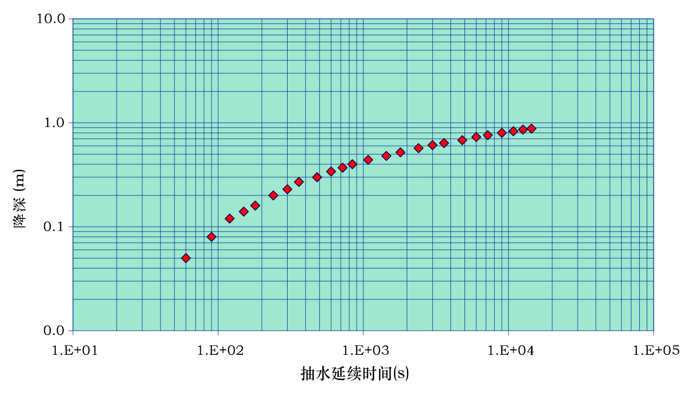

配线

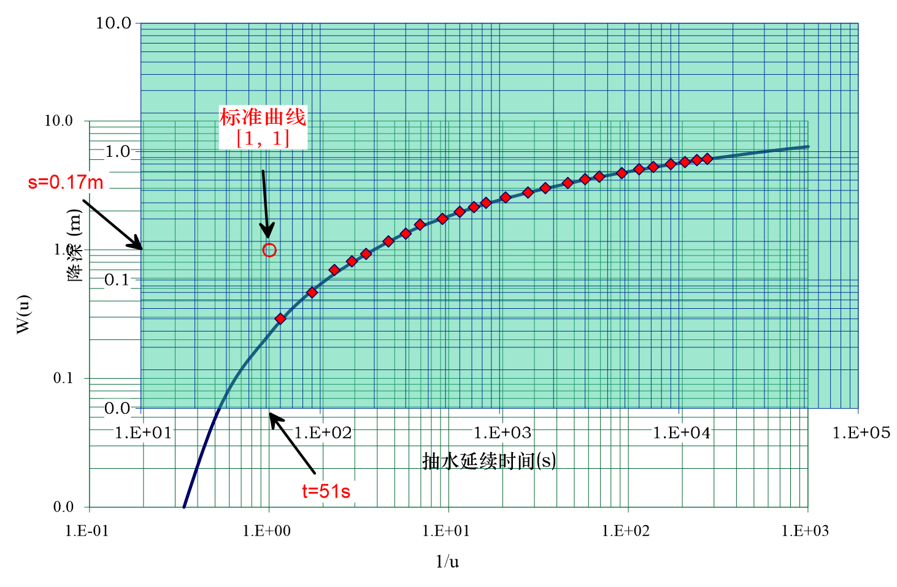

计算参数

$$
\begin{split}
T&=\frac{Q}{4\pi[s]}[W(u)]=\frac{0.032}{4\times3.14\times0.17}\\
&=0.015m^2/s=1300m^2/d\\
S&=\frac{4T}{r^2}\cdot\frac{[t]}{[\frac{1}{u}]}
=\frac{4\times0.015}{120^2}\times51\\
&=2.1\times10^{-4}
\end{split}
$$

**配线法优点**

- 可以充分利用抽水试验的全部观测资料, 即使局部数据有波动或错误也不至于严重影响计算结果.

**配线法缺点**

- 抽水初期数据一般拟和不好, 这是由于泰斯公式的某些假定与实际不符造成的,  因此在配线时主要考虑抽水中后期的数据; 非稳定抽水试验时间不宜过短.
- 当抽水后期曲线比较平缓时, 配线不容易准确.因此在确定抽水延续时间和观测精度时, 应考虑试验数据能够绘出 $s\sim t$ 或 $s\sim \frac{t}{r^2}$ 的弯曲部分, 配线时尽可能用中部弯曲的线段.
- 如果抽水后期偏离标准曲线, 说明外围边界起作用、含水层岩性与外围边界发生变化或有垂直源汇等,  需要把试验数据和具体水文地质条件结合起来分析.

### 6.3.2 Hantush-Jacob 模型配线法

Hantush-Jacob 模型配线法可以使用一个观测孔降深的时间序列计算水文地质参数。

**原理：**

对

$$
s=\frac{Q}{4\pi T}W\left(u,\frac{r}{B}\right),\quad t=\frac{r^2S}{4T}\frac{1}{u}
$$

两边取对数

$$
\lg s=\lg\frac{Q}{4\pi T}+\lg W\left(u,\frac{r}{B}\right),\quad\lg t=\lg\frac{r^2S}{4T}+\lg\frac{1}{u}
$$

$\lg s\sim\lg t$ 曲线与 $\lg W\left(u,\frac{r}{B}\right)\sim\lg \frac{1}{u}$ 的某条曲线形状相同, 位移为 $\left(\lg\frac{r^2S}{4T},\,\lg\frac{Q}{4\pi T}\right)$，以观测数据绘制 $s\sim t$ 散点图，根据所匹配的标准曲线计算 $B$，根据平移量计算 $T$ 与 $S$。

**标准曲线**

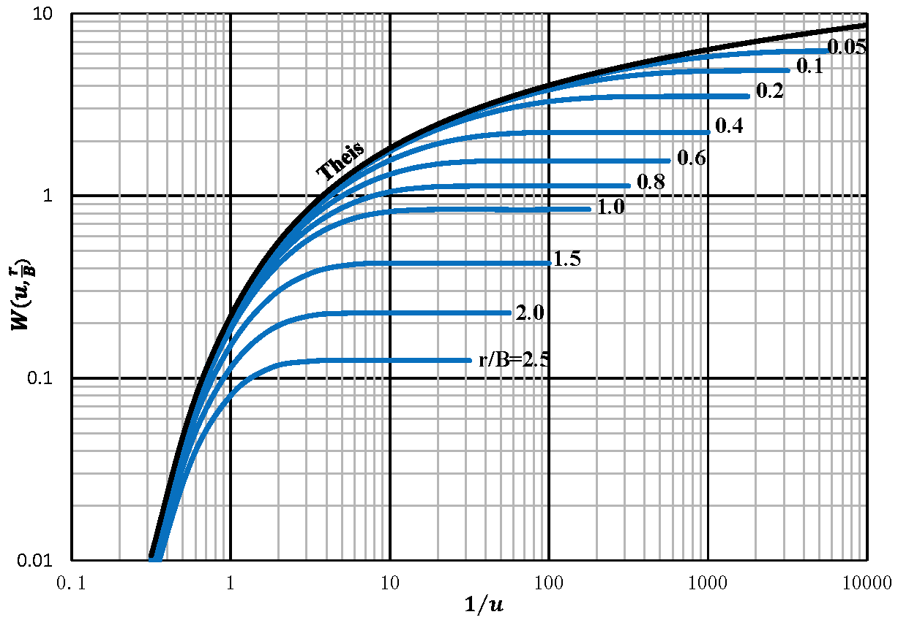

**配线法求参步骤**

1. 在双对数坐标纸上绘制 $W\left(u,\frac{r}{B}\right)\sim\frac{1}{u}$ 标准曲线;

2. 在模数相同的透明双对数纸上, 绘出实测数据 $(s_i,t_i)$ 的散点图;

3. 保持对应坐标轴平行, 相对移动坐标纸, 在标准曲线中找最优重合曲线,  记下 $\left[\frac{r}{B}\right]$ 值;

4. 任选一匹配点,  记下对应的四个坐标值：$\left[W(u,\frac{r}{B})\right],\left[\frac{1}{u}\right],[s],[t]$;
   (特殊的匹配点更便于计算)。

5. 计算参数
   匹配点满足：

$$
[s]=\frac{Q}{4\pi T}\left[W\left(u,\frac{r}{B} \right)\right],
\quad [t]=\frac{r^2S}{4T}\left[\frac{1}{u}\right]
$$

   计算公式：

$$
T=\frac{Q}{4\pi[s]}\left[W\left(u,\frac{r}{B}\right)\right],\quad\,S=\frac{4T[t]}{r^2\left[\frac{1}{u}\right]},\quad\,B=\frac{r}{\left[\frac{r}{B}\right]}
$$

**例：** 某河阶地上部为潜水层, 下部为厚 2 m 的亚砂土与厚 1.5 m 的中、粗砂层(承压含水层). 以 T32 号孔抽取承压水做非稳定抽水试验,$Q$=69.1m$^3$/h; 距 T32 号孔 197 m 处 T31 孔降深观测数据如图所示. 试求取水文地质参数.

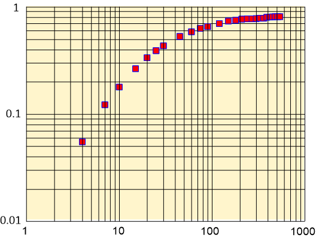

配线

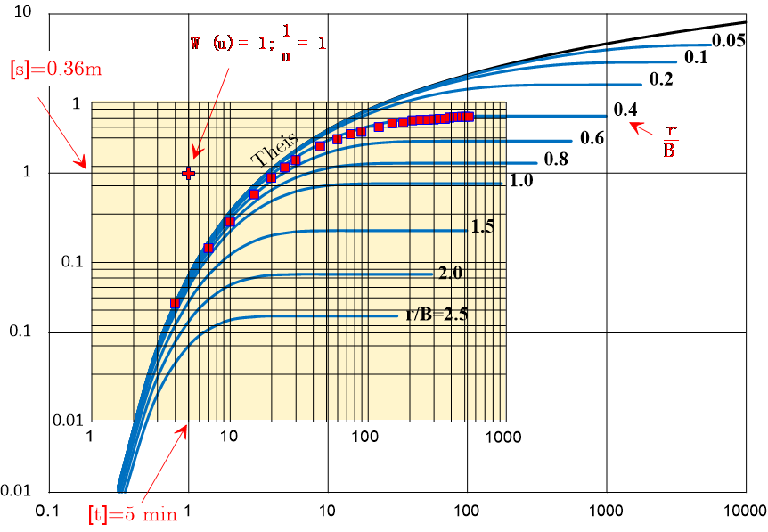

计算参数

$$
\begin{split}
T & =\frac{Q}{4\pi[s]}\left[W\left(u,\frac{r}{B}\right)\right]=\frac{1.15}{4\times\pi\times0.36}=0.254 m^2/min =365.76m^2/d\\
S & =\frac{4T[t]}{r^2\left[\frac{1}{u}\right]}=\frac{4\times 0.254 \times 5}{197^2\times 1}=1.31\times 10^{-4}\\
B & =\frac{r}{\left[\frac{r}{B}\right]}=492.5m
\end{split}
$$

**稳定状态的配线法**：长时间抽水后，Hantush-Jacob 模型有稳态解 $s\approx\frac{Q}{2{\pi}T}K_0(\frac{r}{B})$。如果有多个观测孔的降深，也可采用配线法求参。

对

$$
s=\frac{Q}{2\pi T}K_0\left(\frac{r}{B}\right),\quad\,r=B\frac{r}{B}
$$

两边取对数

$$
\lg s=\lg\frac{Q}{2\pi T}+\lg K_0\left(\frac{r}{B}\right),\quad\lg r=\lg{B}+\lg\frac{r}{B}
$$

将 $\lg\,s\sim \lg\,r$ 曲线与标准曲线 $\lg K_0\left(\frac{r}{B}\right)\sim\lg\frac{r}{B}$ 匹配，读取坐标偏移量求取 $T$、$B$。

**标准曲线:**

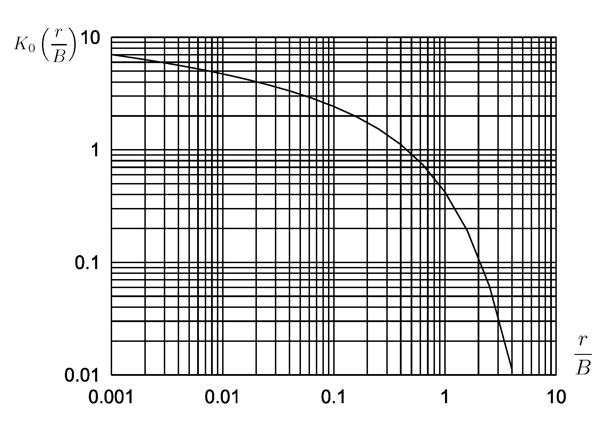

### 6.3.3 有越流补给和弱透水层弹性释水的 Hantush 模型配线法

根据抽水初期与长时间抽水后 Hantush 模型的近似解，可以根据观测孔降深的时间序列计算水文地质参数。

**（1）抽水初期**

Hantush 解为

$$
s = \frac{Q}{4\pi T}H(u,\beta),\quad\,t = \frac{r^2S}{4T}\frac{1}{u}
$$

两边取对数

$$
\lg s=\lg\frac{Q}{4\pi T}+\lg H(u,\beta),\quad\lg t=\lg\frac{r^2S}{4T}+\lg\frac{1}{u}
$$

$\lg s\sim\lg t$ 曲线与 $\lg H(u,\beta)\sim\lg \frac{1}{u}$ 的某条曲线形状相同, 位移为 $\left(\lg\frac{r^2S}{4T},\,\lg\frac{Q}{4\pi T}\right)$，以观测数据绘制 $s\sim t$ 散点图，根据所匹配的标准曲线计算 $\beta$，根据平移量计算 $T$ 与 $S$：

$$
T=\frac{Q}{4\pi[s]}\left[W\left(u,\frac{r}{B}\right)\right],\quad\,S=\frac{4T[t]}{r^2\left[\frac{1}{u}\right]}
$$

**标准曲线**


**（2）长时间抽水后**

模型 1、3 的近似解同 Hantush-Jacob 公式，模型 2 的近似解同 Theis 公式，可用相应的配线法求参。

### 6.3.4 考虑迟后疏干的 Boulton 模型配线法

根据 Boulton 模型的解利用观测孔降深的时间序列计算水文地质参数。利用抽水试验初期的数据可以求出 $T$ 和 $S$，利用抽水试验后的数据可以求出 $T$ 和 $\mu$，进一步可以计算处 $\frac{1}{\alpha}$。

**标准曲线**

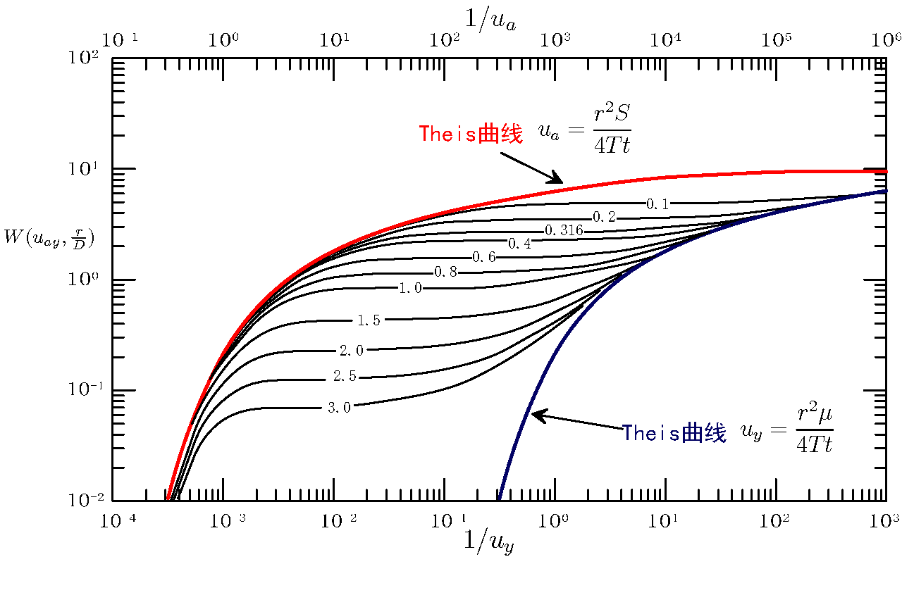

**求参步骤：**

1. 在双对数纸上绘制标准曲线，$W(u_{ay},\frac{r}{D})$ 为纵坐标，$\frac{1}{u_a}$ 为横坐标作 A 组曲线，$\frac{1}{u_y}$ 为横坐标作 B 组曲线，然后用切线联 A、B 组曲线.

2. 根据试验资料，在模数相同的双对数透明纸上绘制 $s-t$ 曲线.

3. 将二曲线叠置在一起，保持对应坐标平行，尽可能地使曲线与 A 组中的某条曲线重合，任选一匹配点，读取坐标   $[W(u_a,\frac{r}{D})]$、$\left[\frac{1}{u_a}\right]$、$[s]$ 和   $[t]$，代入下式求参数 $T$ 和 $S$.

$$
T=\frac{Q}{4\pi\left[ s\right]}\left[W\left( u_a,\frac{r}{D}\right)\right],\quad S =\frac{4T\left[ t\right] }{r^2}\left[\frac{1}{u_a}\right]
$$

4. 在 B 组曲线中找到 A 组中的匹配曲线（$\frac{r}{D}$ 值不变），平移 $s-t$ 曲线使其后半部分尽可能多地与 B 组的该条曲线重合，任选匹配点，取坐标值 $[W(u_y,\frac{r}{D}])$、$\left[\frac{1}{u_y}\right]$、$[s]$ 和 $[t]$，代入下式求参数 $T$ 和 $\mu$.

$$
T =\frac{Q}{4\pi\left[ s\right] }\left[ W\left( u_y,\frac{r}{D}\right)\right],\quad \mu =\frac{4T\left[ t\right]}{r^2\left[\frac{1}{u_y}\right]}
$$

$$
\eta=\frac{S+\mu}{S},\quad\frac{1}{\alpha}=\frac{4T[t]}{\left(\frac{r}{D}\right)^2\left[\frac{1}{u_y}\right]}
$$

5. 上述计算是假设 $s$ 与含水层 $H_0$ 相比时很小时 $T$ 是不变的。 当 $s/H_0$ 较大时，应对 $s$ 进行修正，利用修正后的 $s'$ 作 $s'-t$ 曲线求参.

6. 标准曲线显示，$1/u_y$ 逐渐增加，B 组曲线逐渐靠近 Theis 曲线靠近直至重合，使 B 组曲线变为 Theis 曲线的时间 $t_{w,t}$ 就是迟后排水对降深影响结束时间。根据标准曲线对每个 $r/D$都可确定切入点 $1/u_y$，由

$$
\alpha t_{w,t}=\frac{1}{4}(\frac{r}{D})^2\frac{1}{u_y}
$$

   可以作出 $\alpha t_{w,t}\sim r/D$ 曲线，由该曲线可以确定出 $t_{w,t}$, 根据 $r/D$ 由图读取 $\alpha t_{w,t}$，进一步可求出 $t_{w,t}$.

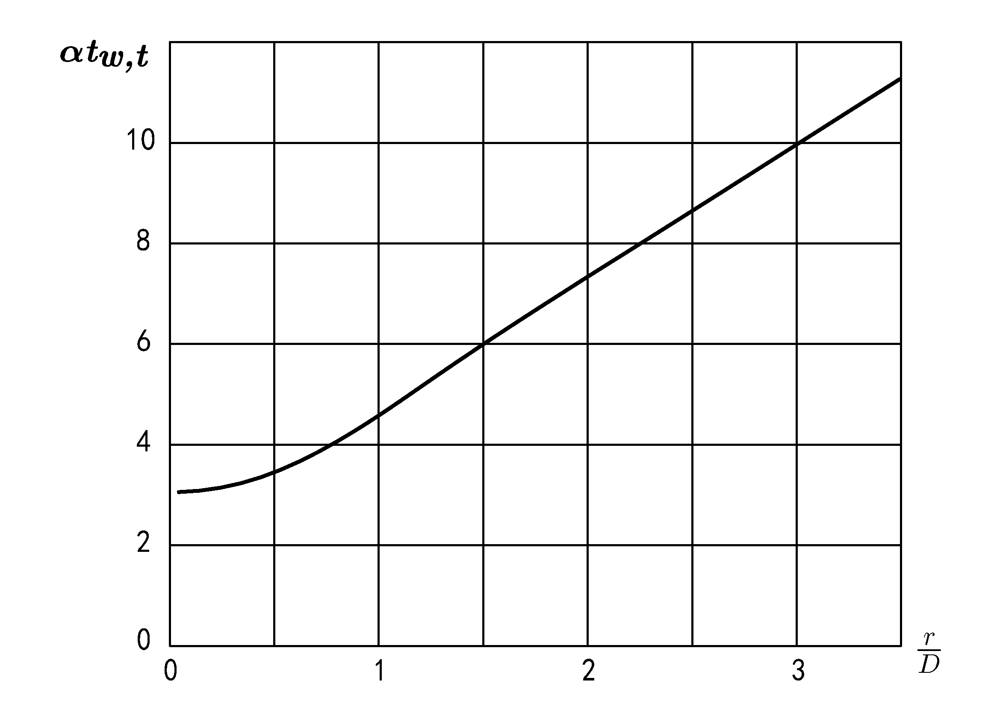

### 6.3.5 Neumann 模型配线法

抽水井与观测孔都是完整井时，无量纲降深 $s_d$ 与 $t_{s,y}$、$\beta=\frac{r^2K_z}{H_0^2K_r}=\frac{K_d}{h_d^2}$ 及 $\sigma =\frac{S}{\mu }$ 有关。当 $S\ll\mu(\sigma=0)$ 时，对不同的 $\beta$ 值可绘制标准曲线。

**标准曲线**

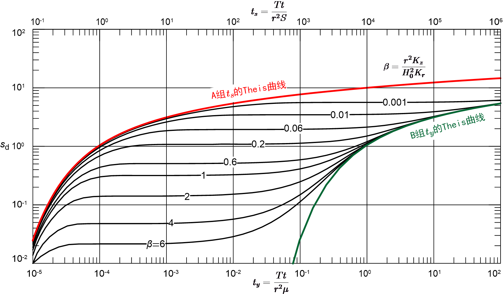

**求参步骤：**

1. 绘制标准曲线：以 $\beta$ 为参变量，分别以 $t_s,t_y$ 计算无量纲降深 $s_d$，作出 A 组和 B 组曲线. A 组曲线坐标 $t_s$ 标在图的上端，B 组曲线坐标 $t_y$ 标在图的下端；A 组曲线右边部分和 B  组曲线左边部分都趋近于一组水平的渐近线. 当 $\sigma=0$ 时，二组标准曲线相距无限远. 因此，必须采用不同的尺度才能绘在一张图纸上.
   A 组曲线用以分析早期的降深资料；B 组曲线用以分析晚期的降深资料.

2. 在模数相同的双对数透明纸上，用完整井抽水观测数据绘出 $s-t$ 曲线；

3. 将曲线后半部分重叠在 B 组曲线上，保持坐标轴平行并移动，使曲线和 B 组曲线中的某一曲线尽量重合，记下对应的 $\beta$ 与匹配点坐标：$[s_d],[t_y],[s],[t]$，计算参数：

$$
T =\frac{Q[s_d]}{4\pi[s]},\quad \mu =\frac{T[t]}{r^2[t_y]}
$$

4. 与 A 组曲线配线，在保持 $\beta$ 相同的条件下，记下匹配点坐标 $[s_d],[t_s],[s],[t]$，计算参数：

$$
T =\frac{Q[s_d]}{4\pi[s]},\quad S =\frac{T[t]}{r^2[t_s]}
$$

   两次计算的 $T$ 应大致相等.

5. 计算其他参数：

$$
K_r=\frac{T}{H_0},\quad\,K_d=\beta\frac{H_0^2}{r^2},\quad\,
K_z=K_rK_d,\quad \sigma =\frac{S}{\mu}
$$

## 6.4 Hantush-Jacob 模型的拐点法求参

根据 Hantush-Jacob 模型解的形式，考虑时间变量 $t$ 的对数刻度，则 $s\sim \lg\,t$ 曲线存在拐点。根据拐点的性质可以求取水文地质参数。

求  $s\sim \lg\,t$曲线拐点的坐标：

$$
\frac{\partial s}{\partial(\lg t)} =\frac{\partial s}{\partial t}\cdot\frac{\partial t}{\partial(\lg t)}=2.3 t\frac{\partial s}{\partial t}=\frac{2.3Q}{4\pi T}e^{-\left(\frac{r^2S}{4Tt}+\frac{Tt}{SB^2}\right)}
$$

$$
\begin{split}
\frac{\partial^2s}{\partial(\lg t)^2}&=\frac{\partial}{\partial t}\big[\frac{\partial s}{\partial(\lg t)}\big]\cdot\frac{\partial t}{\partial(\lg t)} \\
&=\frac{2.3Q}{4\pi T}e^{-\left(\frac{r^2S}{4Tt}+\frac{Tt}{SB^2}\right)}\left(\frac{r^2S}{4Tt^2}-\frac{T}{SB^2}\right)\cdot 2.3t
\end{split}
$$

在拐点 $P$ 处  $\frac{\partial^2s}{\partial(\lg t)^2}=0$ ，有

$$
\frac{r^2S}{4Tt_p^2}-\frac{T}{SB^2}=0
$$

整理得

$$
t_p=\frac{SBr}{2T},\quad\,u_p =\frac{r}{2B}
$$

> $s\sim t$ 曲线拐点与 $s\sim \lg t$ 曲线拐点不是同一点！

拐点 $P$ 处斜率：

$$
i_p=\frac{\partial s}{\partial(\lg t_p)}=\frac{2.3Q}{4\pi T}e^{-\left(\frac{r^2S}{4Tt_p}+\frac{Tt_p}{SB^2}\right)}
$$

将 $t_p=\frac{SBr}{2T}$ 代入得

$$
i_p=\frac{2.3Q}{4\pi T}e^{-\frac{r}{B}}
$$

拐点 $P$ 处降深：

$$
\begin{split}
s_p&=\frac{Q}{4\pi T}\int_{u_p}^{\infty}\frac{1}{y}e^{-y-\frac{r^2}{4B^2y}}dy\\ 
&=\frac{Q}{4\pi T}\int_0^{\infty}\frac{1}{y}e^{-y-\frac{r^2}{4B^2y}}dy-\frac{Q}{4\pi T}\int_{0}^{u_p}\frac{1}{y}e^{-y-\frac{r^2}{4B^2y}}dy
\end{split}
$$

式中第一项为 $t\to\infty$ 的降深 ，也即最大降深 $s_{max}$，由稳定流公式，$s_{max}=\frac{Q}{2\pi T}K_0\left(\frac{r}{B}\right)$。

设 $\xi=\frac{r^2}{4B^2y}$，$\mathrm{d}y=-\frac{r^2}{4B^2\xi^2}\mathrm{d}\xi$，式中第二项

$$
\begin{split}
-\frac{Q}{4\pi T}&\int_{0}^{u_p}\frac{1}{y}e^{-y-\frac{r^2}{4B^2y}}dy\\
&=\frac{Q}{4\pi T}\int_{\infty}^{\frac{r}{2B}}\frac{4B^2\xi}{r^2}
e^{-\frac{r^2}{4B^2\xi}-\xi}\frac{r^2}{4B^2\xi^2}\mathrm{d}\xi\\
& =-\frac{Q}{4\pi T}\int_{\frac{r}{2B}}^\infty\frac{1}{\xi}e^{-\xi-\frac{r^2}{4B^2\xi}}d\xi\\
& =-s_p
\end{split}
$$

代入式中，得

$$
s_p=\frac{1}{2}s_{max}
$$

**拐点 $P$ 的性质**：

- 坐标：

$$
t_p=\frac{SBr}{2T}
$$

- 斜率：

$$
i_p=\frac{2.3Q}{4\pi T}e^{-\frac{r}{B}}
$$

- 降深：

$$
s_p=\frac{Q}{4\pi T}K_0\left(\frac{r}{B}\right)=\frac{1}{2}s_{max}
$$

- $s_p$、$i_p$ 的关系：

$$
2.3\frac{s_p}{i_p}=e^{\frac{r}{B}}K_0\left(\frac{r}{B} \right)
$$

**拐点法求参步骤**

1. 在单对数坐标纸上绘制曲线 $s-\lg t$, 用外推法确定最大降深 $s_{max}$, 计算拐点处的降深 $s_p$；
2. 根据 $s_p$ 确定拐点位置, 并从图上读出拐点出现时间 $t_p$；
3. 在拐点处做曲线 $s-\lg t$ 的切线, 并确定斜率 $i_p$；
4. 根据 $e^{\frac{r}{B}}K_0\left(\frac{r}{B} \right)=2.3\frac{s_p}{i_p}$ 确定 $\frac{r}{B}$ 和 $e^{\frac{r}{B}}$ 的值；
5. 根据 $\frac{r}{B}$ 值求 $B$：$B=\frac{r}{\left[\frac{r}{B} \right]}$；
6. 计算导水系数 $T$ 与贮水系数 $S$：
   $T=\frac{2.3Q}{4\pi i_p}e^{-\frac{r}{B}}$, $S=\frac{2Tt_p}{Br}$；
7. 验证：避免确定 $s_{max}$ 的随意性, 用 Hantush-Jacob 公式进行验证。

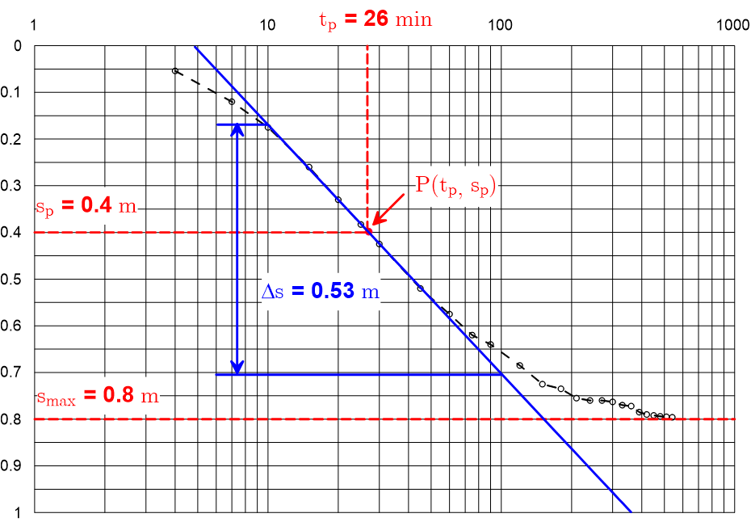

## 6.5 定流量抽水试验的直线图解法求参

直线图解法是将抽水试验的水文地质条件概化为与某种井流模型相似的条件，将观测孔降深的时间序列画在单对数纸上（时间取对数），根据相应井流模型近似解的单对数形式（如 Jacob 公式），这些点应该成直线形式。通过作图求取直线的斜率及横坐标轴的截距，根据相应的公式可进一步求得水文地质参数。

### 6.5.1 Jacob 直线图解法

当 $u<0.01$ 时, 可利用 Jacob 公式近似计算 Theis 井函数

$$
s=\frac{0.183Q}{T}\lg\frac{2.25Tt}{r^2S}
$$

有 1 个观测孔的两个时刻的观测降深，可用 Jacob 公式求参：

$$
\begin{cases}
s_1=&\frac{0.183Q}{T}\lg t_1+\frac{0.183Q}{T}\lg\frac{2.25T}{r^2S} \\
s_2=&\frac{0.183Q}{T}\lg{t_2}+\frac{0.183Q}{T}\lg\frac{2.25T}{r^2S} 
\end{cases}
$$

有 2 个观测孔的同一时刻的观测降深，或 2 个观测孔的不一时刻的观测降深，也可用 Jacob 公式求参：

$$
\begin{cases}
s_1=&-\frac{0.366Q}{T}\lg{r_1}+\frac{0.183Q}{T}\lg\frac{2.25Tt}{S} \\
s_2=&-\frac{0.366Q}{T}\lg{r_2}+\frac{0.183Q}{T}\lg\frac{2.25Tt}{S}
\end{cases}
$$

或

$$
\begin{cases}
s_1=&\frac{0.183Q}{T}\lg\frac{t_1}{r_1^2}+\frac{0.183Q}{T}\lg\frac{2.25T}{S} \\
s_2=&\frac{0.183Q}{T}\lg\frac{t_2}{r_2^2}+\frac{0.183Q}{T}\lg\frac{2.25T}{S}
\end{cases}
$$

如果抽水试验获得多个观测孔、多个时刻的降深，当然可以分别求参数并取平均值。简便的方法是通过作图或最小二乘法求得一组综合得参数。作图法称为直线图解法。

将  Jacob 公式写成如下的形式

$$
\begin{array}{ll}
s=&\frac{0.183Q}{T}\lg t+\frac{0.183Q}{T}\lg\frac{2.25T}{r^2S} \\
s=&\frac{0.183Q}{T}\lg\frac{t}{r^2}+\frac{0.183Q}{T}\lg\frac{2.25T}{S} \\
s=-&\frac{0.366Q}{T}\lg r+\frac{0.183Q}{T}\lg\frac{2.25Tt}{S}
\end{array}
$$

可以看出，观测孔降深与 $\lg t$、 $\lg \frac{t}{r^2}$、 $\lg r$ 成直线关系，根据直线的斜率可求出导水系数，直线在横坐标轴的截距（称为零降深截距）满足 $\frac{2.25Tt}{r^2S}=1$，据此可求出贮水系数。根据所用观测数据的不同，Jacob 直线图解法有以下几种变化形式：

- $s\sim\lg t$ 适应于单孔长时间观测资料求参;
- $s\sim\lg\frac{t}{r^2}$ 适应于多孔长时间观测资料求参;
- $s\sim\lg r$ 适应于具有三个以上观测孔同一观测时间资料求参.

以 $s\sim\lg t$ 直线图解法为例：

**例：** 某承压含水层中完整井某次抽水试验, $Q=0.032m^3/s,\,r=120m$. 观测孔数据 $(t_i,s_i)$ 如图，试求含水层水文地质参数.

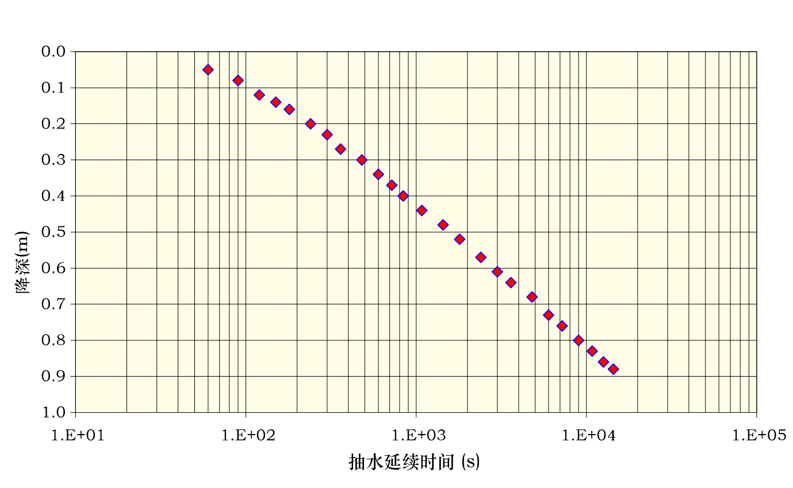

求直线斜率（可取 1 个对数周期的降深变化值）与截距

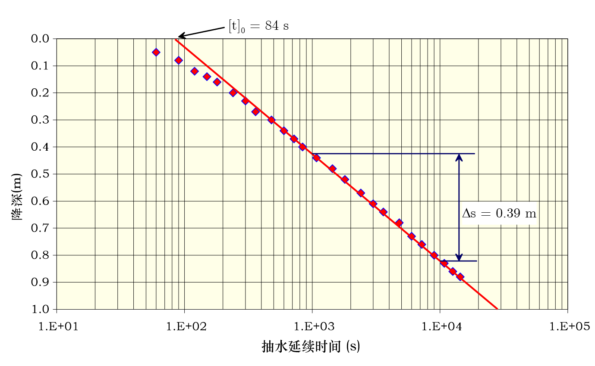

计算参数

$$
T=0.183\frac{Q}{i}=0.183\times\frac{0.032}{0.39}=0.015 m^2/s=1300 m^2/d
$$

$$
S=\frac{2.25T}{r^2}[t]_0=\frac{2.25\times 0.015}{120^2}\times84=1.97\times10^{-4}
$$

> 抽水初期的数据可能不满足 $u<0.01$ 的条件，求出结果后需要对所采用的数据进行验证！

**Jacob 直线图解法步骤**

- 在单对数坐标纸上用实测数据绘制 $s\sim\lg t$、$s\sim\lg\frac{t}{r^2}$ 或 $s\sim\lg r$ 散点图并作出拟合直线;
- 求直线段的斜率, 可直接读取一个对数周期纵坐标的变化值为直线斜率 $i$;
- 计算 $T$

$$
\begin{cases}
s\sim\lg t: & T=0.183\frac{Q}{i} \\
s\sim\lg\frac{t}{r^2}: & T=0.183\frac{Q}{i}  \\
s\sim\lg r: & T=0.366\frac{Q}{\left|i\right|}
\end{cases}
$$

- 求直线在零降深线上的截距

$$
\begin{cases}
s\sim\lg t: & [t]_0 \\
s\sim\lg\frac{t}{r^2}: & \left[\frac{t}{r^2}\right]_0 \\
s\sim\lg r: & [r]_0
\end{cases}
$$

- 计算 $S$

$$
\begin{cases}
s\sim\lg t: & S=2.25T\frac{[t]_0}{r^2} \\
s\sim\lg\frac{t}{r^2}: & S=2.25T\left[\frac{t}{r^2}\right]_0 \\
s\sim\lg r: & S=2.25T\frac{t}{[r]_0^2}
\end{cases}
$$

**Jacob 直线图解法优点**

- 既可以避免配线法的随意性, 又能充分利用抽水后期的所有资料.

**Jacob 直线图解法缺点**

- 必须满足条件 $u\le0.01$ 或 $u\le0.05$, 即只有在 $r$ 较小, $t$较大时才能使用. 否则, 抽水时间短, 直线斜率小, 截距值小, 所得的 $T$ 值偏大, $S$ 值偏小.
- 只有在 $u\le0.01$ 或 $u\le0.05$ 才出现直线段, 因此只能利用部分观测数据.  对于较远的观测孔数据可能会出现直线段很短的情况, 当后期含水层外围非泰斯条件的干扰, 更会使直线模糊不清.

### 6.5.2 Hantush - Jacob 稳态解的直线图解法

有越流补给的含水层长时间抽水后会达到稳定流状态：

$$
s=\frac{Q}{2\pi T}\ln\frac{1.123B}{r}=\frac{2.3Q}{2\pi T}\lg\big(0.89\frac{r}{B}\big)
$$

如有抽水试验的多个观测孔数据，也可用直线图解法求参。

**求参步骤：**

- 将实测的降深取十进制坐标、观测孔与抽水井距离取对数坐标作图，并画出匹配直线

- 求直线斜率：$i=-\frac{2.3Q}{2{\pi}T}$

- 求零降深截距 $r_0$：$0.89\frac{r_0}{B}=1$

- 求导水系数：$T=-\frac{2.3Q}{2{\pi}i}$

- 求越流因素：$B=0.89r_0$

- 越流系数：$\sigma'=\frac{T}{B^2}$

### 6.5.3 Boulton 直线图解法

抽水持续时间足够长以后，迟后的重力排水影响消除，$s\sim\lg t$ 与无越流补给的承压完整井类似，可用直线图解法求参。

$$
s=\frac{0.183Q}{T}\lg t+\frac{0.183Q}{T}\lg\frac{2.25T}{r^2\mu}
$$

求参方法：

$$
T=0.183\frac{Q}{i},\quad\,\mu=\frac{2.25Tt_0}{r^2}
$$

式中，$i$、$t_0$ 分别为直线的斜率、零降深截距。

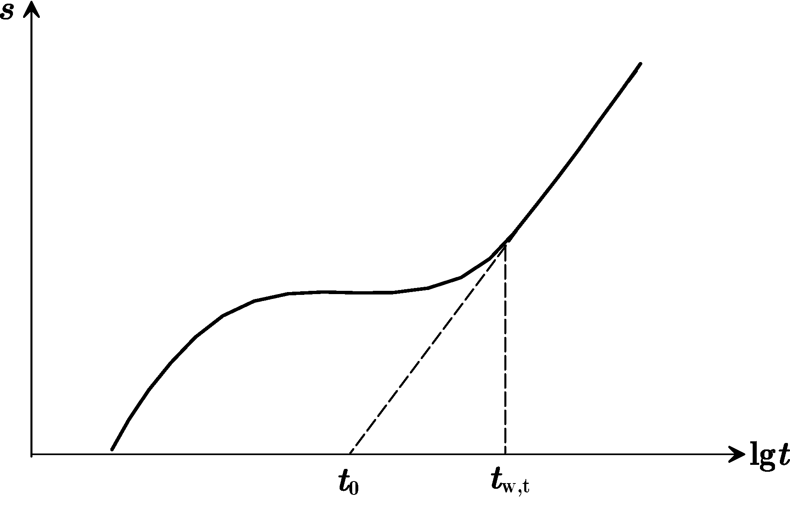

### 6.5.4 Neuman 直线图解法

Neuman 解在抽水初期与抽水后期的近似解都具有 Theis 解的形式，因此可以依照 Jacob 公式的形式，利用抽水初期与抽水后期的观测孔观测数据，用直线图解法求取水文地质参数。

**直线图解法求参**

1. 将实测数据 $(s_i,t_i)$ 点在单对数纸上；

2. 后期的曲线应为一直线，直线斜率 $i_L$，延长直线与 $t$ 轴相交，得到零降深时间 t$_{L}$，计算参数：

$$
T =\frac{2.3Q}{4\pi i_L},\quad \mu=\frac{2.25Tt_L}{r^2}
$$

3. 将实测曲线中间的水平直线段向右延长并与后期直线相交. 得到交点时间 $t_{\beta}$，计算相应的 $t_{y\beta}$：

$$
t_{y_\beta}=\frac{Tt_{\beta}}{r^2\mu}
$$

   若 $t_{y\beta}$ 在 4.0 $\sim$ 100.0 之间（其他值须从完整观测孔 $\frac{1}{\beta}$ 与 $t_{y\beta}$ 关系曲线图中读出，教材图 4.31），可直接计算 $\beta$：$\beta= 0.195 t_{y_\beta}^{-1.1053}$

4. 如果实测 $s-t$ 曲线早期部分也出现直线段，并且和后期直线段彼此平行，则可求出 $T$，否则仍需用配线法确定参数：$i_E$ 为早期直线段斜率，延长直线与 $t$ 轴相交，得到零降深时间坐标 $t_E$；计算参数：

$$
T =\frac{2.3Q}{4\pi i_E},\quad S=\frac{2.25Tt_E}{r^2}
$$

5. 计算其他参数：

$$
K_r=\frac{T}{H_0},\quad K_d=\beta\frac{H_0^2}{r^2},\quad\,K_z=K_rK_d,\quad \sigma =\frac{S}{\mu},\text{或}\quad\sigma =\frac{t_E}{T_L}
$$

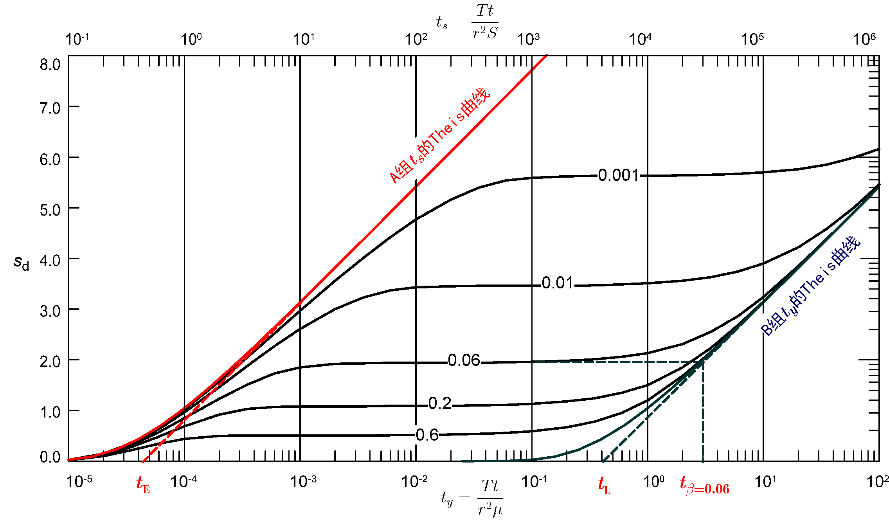

## 6.6 水位恢复试验的求参方法

恢复水位监测是抽水试验的一个重要组成部分. 用水位恢复试验的观测数据也可求出水文地质参数。

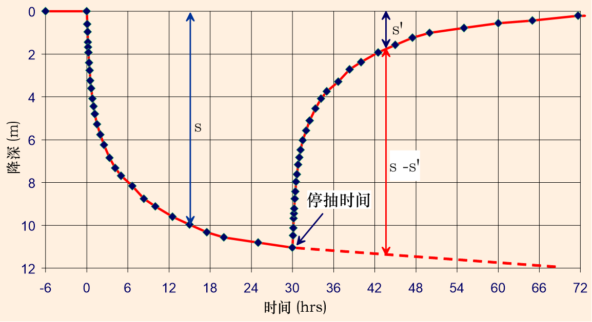

**剩余降深 $s'$**: 原始水位与停抽后某时刻水位之差为剩余降深.

### 6.6.1 Theis 模型的水位恢复试验法

不考虑水头惯性滞后性, 以流量 Q 持续抽水 $t_p$ 时间后停抽. 记 $t'=t-t_p$, $t(>t_p)$ 时刻剩余降深 $s'$ 为持续抽水的降深与 $t_p$ 时刻开始注水的降深叠加:

$$
s'=\frac{Q}{4{\pi}T}\left[W(u)-W(u')\right]
$$

式中, $u=\frac{r^2S}{4Tt}$, $u'=\frac{r^2S}{4Tt'}$.

$u,u'\le0.01$时, Jacob 公式成立：

$$
s'=\frac{2.3Q}{4{\pi}T}\lg\frac{2.25Tt}{r^2S}-\frac{2.3Q}{4{\pi}T}\lg\frac{2.25Tt'}{r^2S}=
\frac{2.3Q}{4{\pi}T}\lg\frac{t}{t'}
$$

**水位恢复试验法求参步骤**

- 在单对数坐标纸上用实测数据绘制 $s'\sim \lg \frac{t}{t'}$ 散点图并作出拟合直线;
- 求直线段的斜率 $i$: 可直接读取一个对数周期纵坐标的变化值为直线斜率 $i$;
- 计算导水系数: $T=\frac{0.183Q}{i}$;

**例：** 某承压含水层完整井抽水试验, 停抽后观测数据如图. 试求含水层水文地质参数。已知  $Q=1100m^3/d$。

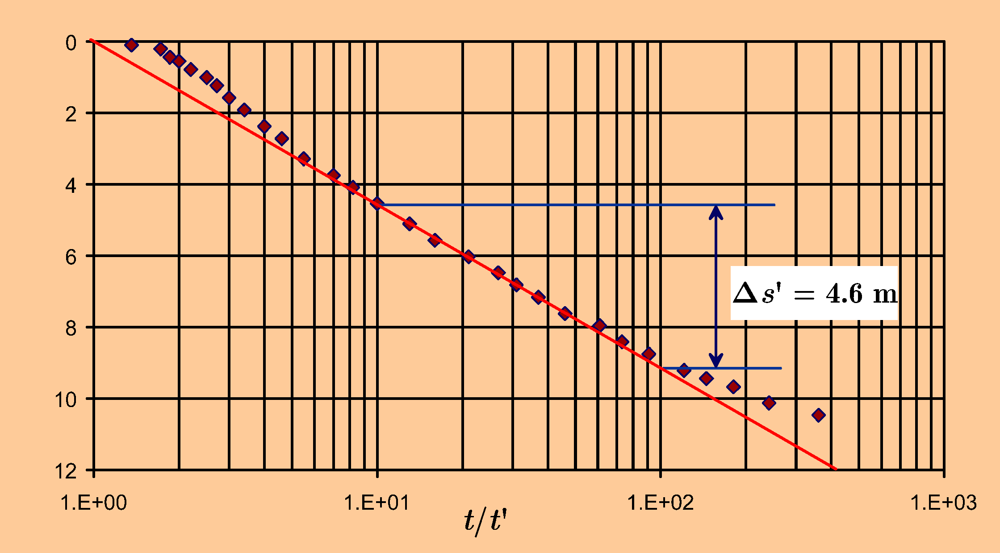

由 $\Delta s'=4.6m$ 知 $i=4.6$。求导水系数：

$$
T=0.183\frac{Q}{i}=0.183\times\frac{1100}{4.6}=43.76 m^2/d
$$

> - 抽水试验初期流量不稳定, 水位恢复试验法在这一点上较抽水试验要好.
> - 恢复试验开始时不满足 $u'<0.01$, 恢复时间 $t'$ 很长后抽水引起的效应会消失, 因此应避免用 $\frac{t}{t'}$ 小的数据及 $\frac{t}{t'}$ 很大的数据求参.
> - 恢复试验直线图解不能计算参数 $S$. 但如果已知停抽时刻的水位降深 $s_p$, 可由 $s_p=i\lg{\frac{2.25Tt_p}{r^2S}}$ 求 $S$.

### 6.6.2 Neuman模型的水位恢复试验法

Neumann 模型没有涉及非饱和带地下水的运动，仅仅把自由面视为可移动边界，所以可以根据该模型利用水位恢复资料确定导水系数。

设 $t_p$ 为抽水持续时间，$t'$ 为从停泵开始算起的水位恢复时间，$s'$ 为剩余降深。绘制 $s'\sim \lg\left(1+\frac{t_p}{t'}\right)$ 曲线，在 $1+\frac{t_p}{t'}$ 较小，即恢复时间较长的情况下，会出现直线段。

设直线段斜率为 $i$，可求出导水系数：

$$
T =\frac{2.3Q}{4\pi i}
$$

Neumann 解是在潜水面降深远小于含水层厚度的情况下导出的。如不满足该条件，在 Dupuit 假设条件下可以使用修正降深 $s'=s-\frac{s^2}{2H_0}$ 对降深修正。由于存在 "潜水面迟后反应"，因此只能对抽水后期的数据使用修正降深。

## 6.7 求参问题的程序设计

本章所讨论的各种求参方法，以介绍基本原理和求参步骤为主。随着计算机的普及与发展，现在已有专门的软件解决水文地质求参问题，如 AquiferTest 等。尽管如此，对于水文地质工作者来说，掌握基本原理掌仍是至关重要的，以手工完成配线法等求参工作仍时专业技能训练的重要部分。而借助于办公软件（如 MS Excel）或采用某种程序设计语言编程解决水文地质求参问题，对提高计算机应用能力大有益处。本课程的数据试验部分介绍了用 MS Excel 数据表实现配线法求参的内容。本节主要介绍最小二乘法与 Jacob、Theis 等公式等相结合的求参方法。

### 6.7.1 应用 Jacob 公式的最小二乘法求参

将 Jacob 公式改写 

$$
\begin{array}{l}
s=\frac{0.183Q}{T}\lg\frac{2.25T}{r^2S} +\frac{0.183Q}{T}\lg t\\
s=\frac{0.183Q}{T}\lg\frac{2.25T}{S}+\frac{0.183Q}{T}\lg\frac{t}{r^2} \\
s=\frac{0.183Q}{T}\lg\frac{2.25Tt}{S} -\frac{0.366Q}{T}\lg r
\end{array}
$$

写成统一形式 

$$
y=a+bx
$$

根据观测数据序列，可用最小二乘法求出系数 $a,b$, 进一步根据相应公式计算 $(T,S)$。

根据观测数据或变换后的数据 $\{(x_i,y_i),\,i=1,2,\cdots,n\}$ ，求拟合直线  。

记 $E(a, b)=\sum\limits_{i=1}^n(y_i-a-bx_i)^2$，令 $\frac{\partial E}{\partial a}=0, \frac{\partial E}{\partial b}=0$ , 可求出 $E(a, b)$ 最小值的（$a,b$）：

$$
\left\{
\begin{array}{ll}
\frac{\partial E}{\partial a}&=\sum\limits_{i=1}^n[2(y_i-a-bx_i)]=0\\
\frac{\partial E}{\partial b}&=\sum\limits_{i=1}^n[2(y_i-a-bx_i)x_i]=0
\end{array}
\right.
$$

得

$$
\left\{
\begin{array}{cccc}
&an&+&b\sum\limits_{i=1}^{n}x_i&=&\sum\limits_{i=1}^{n}y_i\\
&a\sum\limits_{i=1}^{n}x_i&+&b\sum\limits_{i=1}^{n}x_i^2 &=&\sum\limits_{i=1}^{n}x_iy_i
\end{array}
\right.
$$

解得

$$
\left\{
\begin{split}
b&=\frac{n\sum\limits_{i=1}^{n}x_iy_i-\sum\limits_{i=1}^{n}x_i\sum\limits_{i=1}^{n}y_i}{n\sum\limits_{i=1}^{n}x_i^2-(\sum\limits_{i=1}^{n}x_i)^2}\\
a&=\frac{1}{n}(\sum\limits_{i=1}^{n}y_i-b\sum\limits_{i=1}^{n}x_i)
\end{split}
\right.
$$

>  Jacob 公式结合最小二乘法求参，属于一步优化方法。

**例：** 某承压含水层抽水试验，含水层的顶、底板绝对隔水，抽水时侧向边界尚无影响。14 号孔为完整抽水井，抽水量为 $60m^3/h$。2 号观测孔距抽水孔 $43m$，15 号观测孔距抽水孔 $125m$，观测资料如表。试求导水系数和贮水系数。

<center>  某完整井非稳定流抽水试验观测资料 </center>

| 抽水累计时间t(min) | 2#降深s(m) | 15#降深s(m) | 抽水累计时间t(min) | 2#降深s(m) | 15#降深s(m) |
|:------------:|:--------:|:---------:|:------------:|:--------:|:---------:|
| 10           | 0.73     | 0.16      | 210          | 2.77     | 1.55      |
| 20           | 1.28     | 0.48      | 270          | 2.99     | 1.70      |
| 30           | 1.53     | 0.54      | 330          | 3.10     | 1.83      |
| 40           | 1.72     | 0.65      | 400          | 3.20     | 1.89      |
| 60           | 1.96     | 0.75      | 450          | 3.26     | 1.98      |
| 80           | 2.14     | 1.00      | 645          | 3.47     | 2.17      |
| 100          | 2.28     | 1.12      | 870          | 3.68     | 2.38      |
| 120          | 2.39     | 1.22      | 990          | 3.77     | 2.46      |
| 150          | 2.54     | 1.36      | 1185         | 3.85     | 2.54      |

参考值：

2#孔：$T=173 m^2/d$，$S=4.78 \times 10^{-4}$

15#孔：$T=193 m^2/d$，$S=3.14 \times 10^{-4}$

Jacob 公式：

$$
s = \frac{0.183Q}{T}\log_{10}\frac{2.25Tt}{r^2S} = a+b\lg t 
$$

**代码：**

```python
# -*- coding: utf-8 -*-
import numpy as np
import matplotlib.pyplot as plt
import matplotlib.font_manager as fm
import time

%matplotlib inline
# 绘图字体
myfont = fm.FontProperties(fname=r'.\simkai.ttf') # 设置字体

# 从文件读数据到数组 t, s 中, 文件和当前脚本在同一目录下不用写具体路径

startTime = time.time()

filename = 'ex2_ts.txt'
t_time = []
s_drawdown = []

with open(filename, 'r') as file_to_read:
    while True:
        # 整行读取数据
        lines = file_to_read.readline()
        if not lines:
            break
            pass
        # 将整行数据分割处理，如果分割符是空格，括号里就不用传入参数。
        t, s_1, s_2 = [float(i) for i in lines.split('\t')]
        # 添加新读取的数据
        t_time.append(t)
        s_drawdown.append(s_1)
        pass

# 将数据从list类型转换为array类型
t_time = np.array(t_time)
s_drawdown = np.array(s_drawdown)

# 抽水量，观测孔与抽水井距离
Q0 = t_time[0]
r0 = s_drawdown[0]

# 时间--降深数据
log_time = np.log10(t_time[1:])
drawdown = s_drawdown[1:]

# 验证一下数据对不对
# print("Q=",Q0,"m^3/min,", " r=", r0,"m")
# print("\n",t_time, "\n\n", drawdown, "\n")

# 取数组长度
n = len(log_time)

# 最小二乘系数

st = drawdown * log_time
b = (n*np.sum(st)-np.sum(drawdown)*np.sum(log_time))/(n*np.sum(log_time**2)-np.sum(log_time)**2)
a = (np.sum(drawdown)-b*np.sum(log_time))/n

# 计算T, S
T = 0.183 * Q0 / b
S = np.power(10, -a / b) * 2.25 * T / r0 / r0

# 显示最终结果
print("T = {:.2f} m^2/d, ".format(T * 60 * 24),"S = {:.2e}".format(S))

endTime = time.time()
print("运行时间为:%f s" %(endTime - startTime))

u = r0*r0*S/4/T/t_time

print(u)

# 生成绘图数据
x = np.linspace(1, np.max(log_time), 10)
y = a + b * x

fig, ax = plt.subplots()
ax.plot(np.log10(t_time[1:]), s_drawdown[1:], 'o', x, y, '-')
plt.grid(True)
plt.ylabel('降深 s',fontproperties=myfont,fontsize=16)
plt.show()
```

计算结果：

> T = 176.82 m^2/d,  S = 4.35e-04
> 运行时间为:0.003988 s

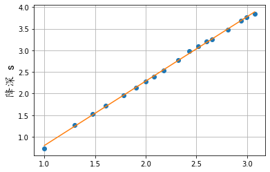

### 6.7.2 应用 Theis 公式的最小二乘法求参

由 Theis 公式

$$
s=\frac{Q}{4{\pi}T}W(u)
$$

设初始参数 $(T_0,S_0)$，降深 $s$ 在 $(T_0,S_0)$ 的泰勒级数展开

$$
s(T,S)=s(T_0,S_0)+\left.\frac{\partial{s}}{\partial{T}}\right|_{T=T_0}\Delta{T}+\left.\frac{\partial{s}}{\partial{S}}\right|_{S=S_0}\Delta{S}+O(\Delta{T}^2+\Delta{S}^2)
$$

式中，$\Delta{T}= T-T_0,\,\Delta{S}=S-S_0$.

忽略高阶无穷小

$$
s(T,S)\approx s(T_0,S_0)+\left.\frac{\partial{s}}{\partial{T}}\right|_{T=T_0}\Delta{T}+\left.\frac{\partial{s}}{\partial{S}}\right|_{S=S_0}\Delta{S}
$$

简写为 

$$
s(T,S)\approx C+A\Delta{T}+B\Delta{S}
\tag{4}
$$

式中 

$$
\left\{\begin{array}{ll}
A&=\left.\frac{\partial{s}}{\partial{T}}\right|_{T=T_0} =\frac{Q}{4{\pi}T_0^2}\left[-W(u_0)+e^{-u_0}\right] \\
B&=\left.\frac{\partial{s}}{\partial{S}}\right|_{S=S_0}=
-\frac{Q}{4{\pi}T_0}\frac{e^{-u_0}}{S_0}\\
C&=s(T_0,S_0)\\
u_0&=\frac{r^2S_0}{4T_0t}
\end{array}
\right.
$$

对于给定的初始值 $(T_0,S_0)$, 以及具有观测数据的时间点 $t_i(i=1,2,\cdots,n)$, 可计算出公式 (4) 的系数 $A_i, B_i, C_i (i=1,2,\cdots,n)$.

设 $t_i$ 时刻的观测降深为 $\hat{s}_i$ ，计算降深为 $s_i=C_i+A_i\Delta{T}+B_i\Delta{S}$，误差平方和为

$$
E(\Delta{T},\Delta{S})=\sum_{i=1}^n(C_i+A_i\Delta{T}+B_i\Delta{S}-\hat{s}_i )^2
$$

根据此式用最小二乘法可求出一步优化参数的步长 $(\Delta T,\Delta S)$），一步优化后的参数为 $(T_0+\Delta T,S_0+\Delta S)$。

**例：** 取自 李义昌，地下水动力学，徐州：中国矿业大学出版社，1995，193-196 

某承压含水层中的水井进行了非稳定流抽水试验，抽水量 $Q=542.2m^3/d$，对距抽水井 $117.85m$ 处的观测孔进行观测，数据如下表。试求含水层水文地质参数。

| No. | t(min) | s(m)  | No. | t(min) | s(m)  |
|:---:|:------:|:-----:| --- |:------:|:-----:|
| 1   | 8      | 0.002 | 13  | 900    | 1.000 |
| 2   | 12     | 0.006 | 14  | 1200   | 1.150 |
| 3   | 30     | 0.020 | 15  | 1500   | 1.220 |
| 4   | 60     | 0.050 | 16  | 1800   | 1.320 |
| 5   | 120    | 0.165 | 17  | 2100   | 1.390 |
| 6   | 180    | 0.270 | 18  | 2400   | 1.450 |
| 7   | 240    | 0.370 | 18  | 3000   | 1.510 |
| 8   | 300    | 0.455 | 20  | 3600   | 1.670 |
| 9   | 360    | 0.530 | 21  | 4200   | 1.710 |
| 10  | 480    | 0.655 | 22  | 4800   | 1.720 |
| 11  | 600    | 0.755 | 23  | 5820   | 1.730 |
| 12  | 720    | 0.880 |     |        |       |

**代码：**

```python
# -*- coding: utf-8 -*-
import numpy as np
import matplotlib.pyplot as plt
import matplotlib.font_manager as fm
import time

%matplotlib inline

# 绘图字体
myfont = fm.FontProperties(fname=r'simkai.ttf') # 设置字体

# 定义井函数计算方法，也可用 scipy.integrate.quad, 或 scipy.special.exp1 计算
# 其中，exp1(z) = integral(exp(-z*t)/t, t=1..inf).
# 以下是用多项式逼近的方法计算井函数

def TheisW(u):
    a = np.array([-0.57721566, 0.99999193, -0.24991055,
                  0.05519968, -0.00976004, 0.00107857])
    b = np.array([0.2677737343, 8.6347608925, 18.059016973, 8.5733287401])
    c = np.array([3.9584969228, 21.0996530827, 25.6329561486, 9.5733223454])
    if u <= 1:
        W = -np.log(u) + a[0] + u * (a[1] + u * \
                    (a[2] + u * (a[3] + u * (a[4] + u * a[5]))))
    else:
        W1 = b[0] + u * (b[1] + u * (b[2] + u * (b[3] + u)))
        W2 = c[0] + u * (c[1] + u * (c[2] + u * (c[3] + u)))
        W = (W1 / W2) * np.exp(-u) / u
    return W

startTime = time.time()

# 向量化井函数
vTheisW = np.vectorize(TheisW)

#  从文件读数据到数组 t, s 中, 文件和当前脚本在同一目录下不用写具体路径
filename = 'ex_time_drawdown.txt'  
t_time = []
drawdown = []
with open(filename, 'r') as file_to_read:
    while True:
        # 整行读取数据
        lines = file_to_read.readline()  
        if not lines:
            break
            pass
        # 将整行数据分割处理，如果分割符是空格，括号里就不用传入参数。
        tmp, time_tmp, drawdown_tmp = [float(i) for i in lines.split('\t')]
        # 添加新读取的数据
        t_time.append(time_tmp)  
        drawdown.append(drawdown_tmp)
        pass

# 将数据从list类型转换为array类型。
t_time = np.array(t_time)  
drawdown = np.array(drawdown)

# 验证一下数据对不对
# print(t_time, "\n\n", s_drawdown, "\n")

# 时间单位转化为 day
time_day = t_time / 1440.0

# 取数组长度
n = len(time_day)

# 抽水量，观测孔与抽水距离
Q0 = 542.20
r0 = 117.85

# 初始参数怎么取？随机取两点，用 Jacob 两点公式计算。
np.random.seed()
i1 = np.random.randint(int(n / 2))
i2 = np.random.randint(int(n / 2), n - 1)
t1 = time_day[i1]
t2 = time_day[i2]
s1 = drawdown[i1]
s2 = drawdown[i2]
kk = (s1 - s2) / np.log10(t1 / t2)
T0 = 0.183 * Q0 / kk
S0 = 2.25 * T0 * t1 / r0 / r0 / np.power(10, s1 / kk)

# 计算最小二乘中的常数项
A = np.zeros(n)
B = np.zeros(n)
C = np.zeros(n)
u0 = np.zeros(n)

# 循环计数器
i = 0

while True:
    # 向量化计算比较方便
    u0 = r0 * r0 * S0 / 4.0 / T0 / time_day
    A = (np.exp(-u0) - vTheisW(u0)) * Q0 / 4.0 / np.pi / T0 / T0
    B = -Q0 * np.exp(-u0) / 4.0 / np.pi / T0 / S0
    C = Q0 * vTheisW(u0) / 4.0 / np.pi / T0

    # 最小二乘法得出的参数搜索步长
    a11 = np.sum(A * A)
    a12 = np.sum(A * B)
    a22 = np.sum(B * B)
    b1 = np.sum(A * (drawdown - C))
    b2 = np.sum(B * (drawdown - C))

    DT = (b1 * a22 - b2 * a12) / (a11 * a22 - a12 * a12)
    DS = (b2 * a11 - b1 * a12) / (a11 * a22 - a12 * a12)

    while True:
        if T0 + DT < 0:    # 步长太大导致参数为负数，不合理！
            DT = DT / 2.0  # 减小步长
        else:
            break

    while True:
        if S0 + DS < 0:    # 步长太大导致参数为负数，不合理！
            DS = DS / 2.0  # 减小步长
        else:
            break

    i = i + 1  # 循环计数器

    if i > 100:  # 循环次数多，程序可能有错误
        print(i, "error: \t", T0 + DT, "\t", S0 + DS)    # 显示计算结果
        break

    if (abs(DT) > 1.0E-6) or (abs(DS) > 1.0e-8):  # 判断计算误差
        T0 = T0 + DT
        S0 = S0 + DS
    else:
        break

# 显示最终结果
print("n = {:n}, ".format(n),"T = {:.2f} m^2/d, ".format(T0),"S = {:.2e}".format(S0))

endTime = time.time()
print("运行时间为: %f s" %(endTime - startTime))

# 生成绘图数据
u0 = r0 * r0 * S0 / 4.0 / T0 / time_day
C = Q0 * vTheisW(u0) / 4.0 / np.pi / T0

fig, ax = plt.subplots()
ax.plot(t_time, drawdown, 'o', t_time, C, '*')
plt.grid(True)
plt.loglog()
plt.ylabel('双对数坐标',fontproperties=myfont,fontsize=16)
plt.show()
```

计算结果：

> n = 23,  T = 85.59 m^2/d,  S = 1.43e-03
> 运行时间为: 0.015625 s

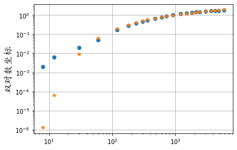

- 初值对最终结果有影响。含水层参数初值 $(T_0, S_0)$ 一般是凭经验给出的，也可在观测数据中选取质量较好的点 (如 2-3 个), 先用 Jacob 公式计算初始参数；
- 最小二乘法只是一步优化，有可能得出参数为负值的不合理结果，可用二分法对步长 $(\Delta{T},\Delta{S})$ 进行修正;
- 一次优化结果作为下一优化的初值，重复计算可得到最优参数。
