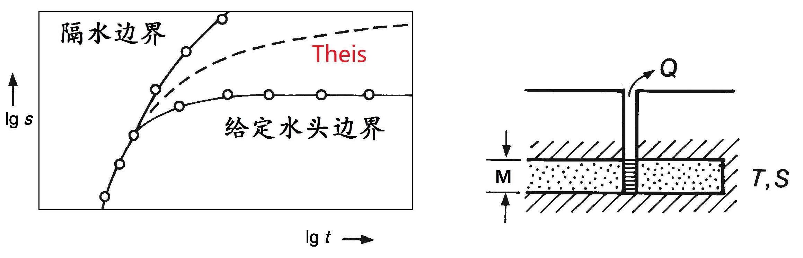
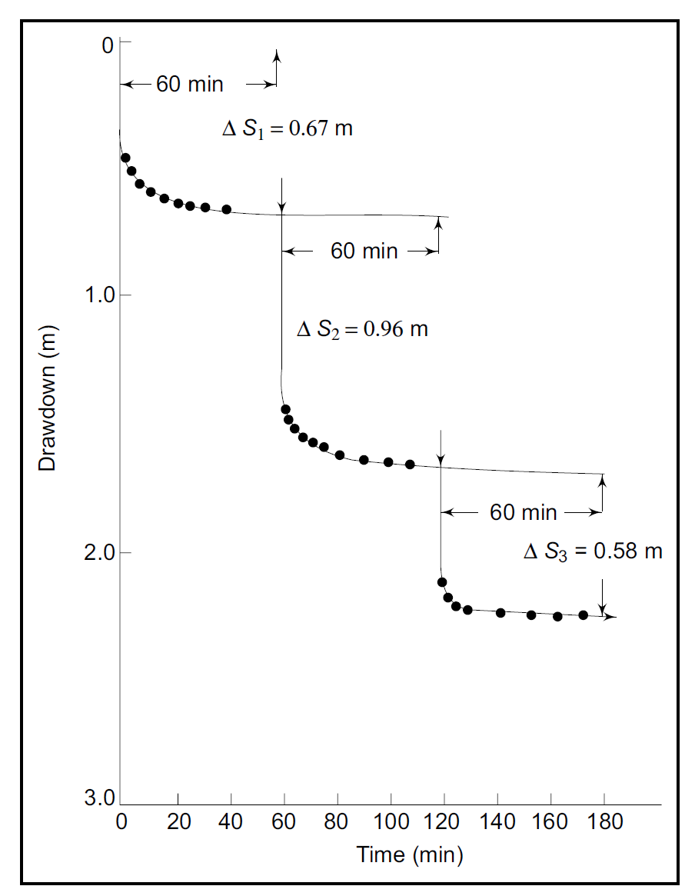
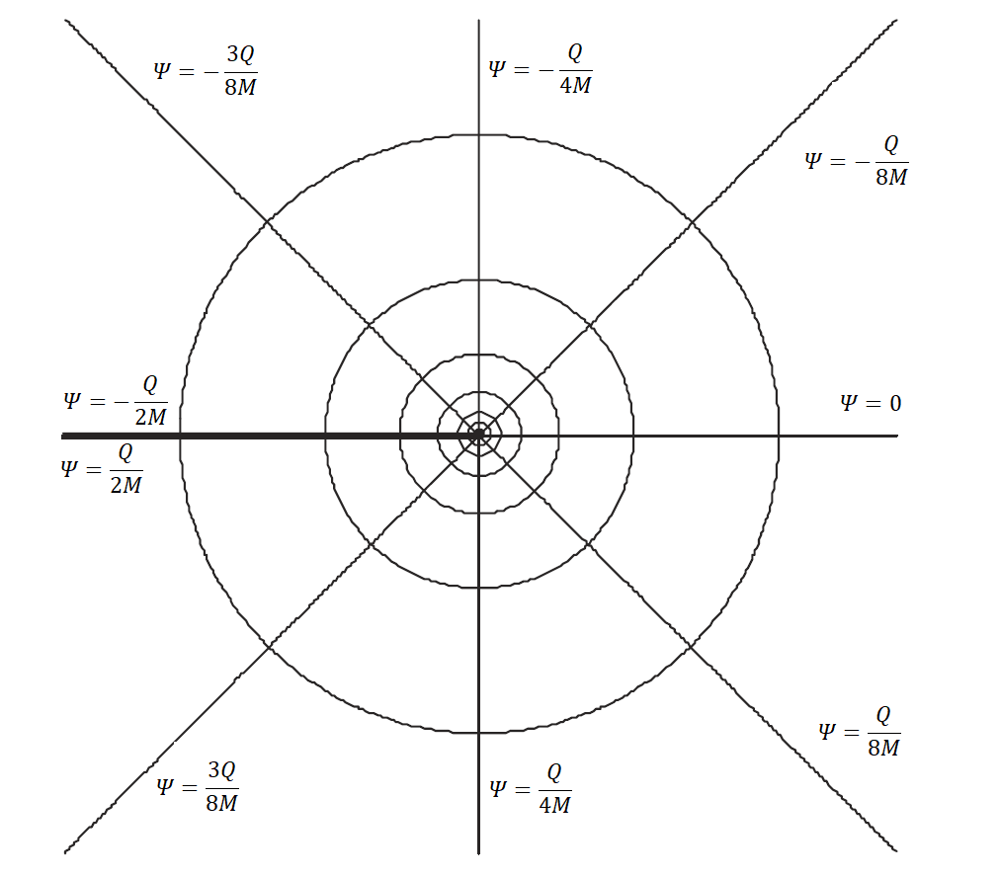
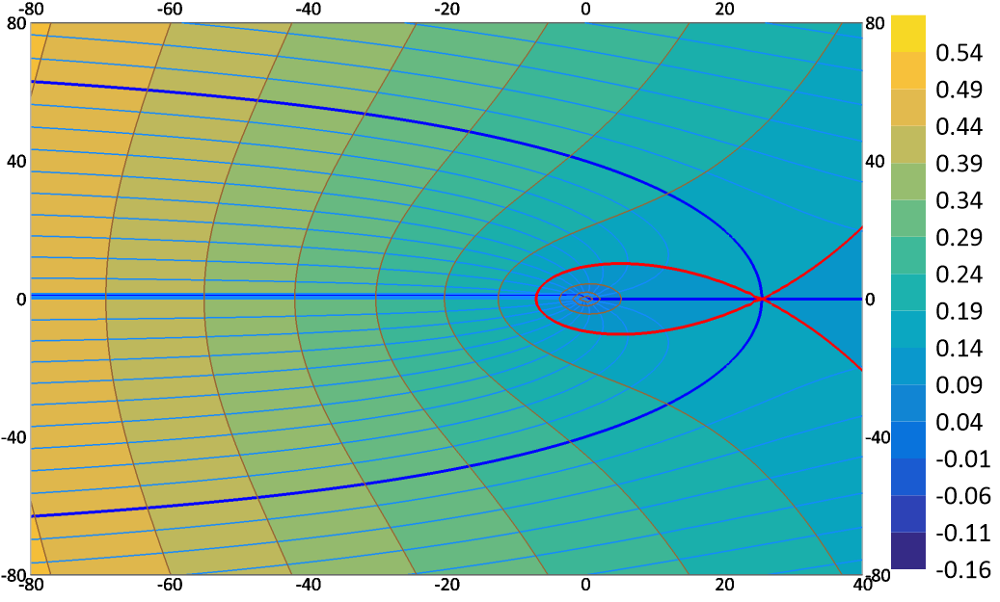
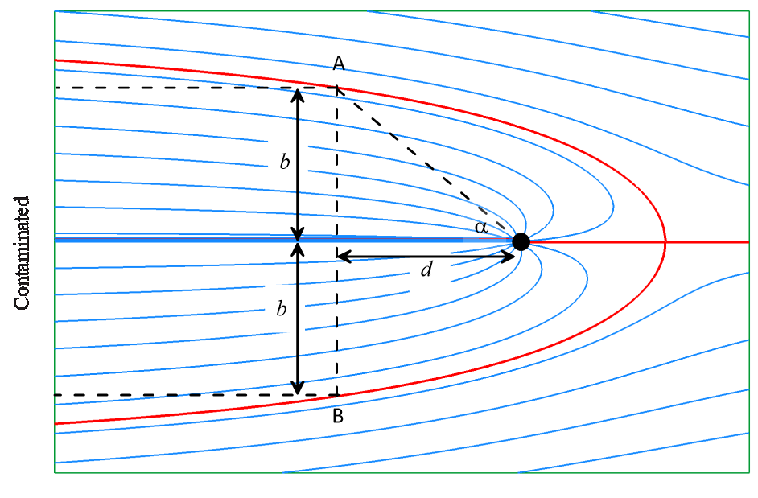

# 7 复杂水文地质条件下的解析法

<yanggy1010@126.com>

[TOC]

## 7.1 地下水向干扰井群的运动

### 7.1.1 叠加原理（Superposition Principle）

在数学物理中经常出现这样的现象：几种不同原因的综合所产生的效果，等于这些不同原因单独产生效果的累加。 对于线性系统来讲，两个或两个以上的激励引起的响应是每个激励单独引起的响应之和。 叠加原理适用于任何线性系统，包括代数方程、线性微分方程等。

例： 在无限的承压含水层中有两眼同时工作的抽水井 $W_1(x_1,y_1),W_2(x_2,y_2)$，抽水量 $Q_1,Q_2$，井半径  $r_{w1},r_{w2}$.

**数学模型为**

$$
\begin{cases}
\frac{\partial^2s}{\partial x^2}+\frac{\partial^2s}{\partial y^2}
=\frac{S}{T}\frac{\partial s}{\partial t} & t>0,0\le r<\infty\\
s(x,y,0)=0 & 0\le r<\infty\\
s(x,y,t)=0 & t>0,r\to\infty\\
\lim\limits_{r_1\to0}\big(r_1\frac{\partial s}{\partial r_1}\big)=-\frac{Q_1}{2\pi T} & t>0\\
\lim\limits_{r_2\to0}\big(r_2\frac{\partial s}{\partial r_2}\big)=-\frac{Q_2}{2\pi T} & t>0
\end{cases}
$$

式中，$r=\sqrt{x^2+y^2}$， $r_i=\sqrt{（x-x_i)^2+(y-y_i)^2}$，$i=1,2$。

单井工作的数学模型为

$$
\begin{cases}
\frac{\partial^2s_i}{\partial x^2}+\frac{\partial^2 s_i}{\partial y^2}=\frac{S}{T}\frac{\partial s_i}{\partial t} & t>0,0\le r<\infty\\
s(x,y,0)=0 & 0\le r<\infty\\
s(x,y,t)=0 & t>0,r\to\infty\\
\lim\limits_{r_i\to0}\big(r_i\frac{\partial s_i}{\partial r_i}\big)=-\frac{Q_i}{2\pi T} & t>0
\end{cases}
$$

根据叠加原理，两眼井同时工作在某观测井处降深，可以认为是单眼井独立工作所产生的降深之和，即 $s=s_1+s_2$ 。

**验证**： $s$ 满足方程、初始条件与边界条件。

**定义**：设 $\boldsymbol{L}$ 为线性微分算子，$\boldsymbol{L}\left[c_1u_1+c_2u_2\right]=c_1\boldsymbol{L}\left[u_1\right]+c_2\boldsymbol{L}\left[u_2\right]$ ，则 $\boldsymbol{L}u=f$ 称为 **线性微分方程**；

特别地，当 $\boldsymbol{L}u=0$ 时称为 **齐次线性微分方程**。

线性方程中关于未知函数及其导数都是一次的，齐次方程中不包含其他的已知函数（自由项）；边界条件也有类似的分类。**线性定解问题**指微分方程是线性，定解条件也是线性。无源汇的承压水运动方程是线性偏微分方程。

**叠加原理：** 设 $u_i$ 满足线性方程(或线性定解条件)

$$
\boldsymbol{L}u_i=f_i\quad(i=1,2,\cdots,n)
$$

则它们的线性组合 $u=\sum_{i=1}^nc_iu_i$ 必满足方程（或定解条件）

$$
\boldsymbol{L}u=\sum_{i=1}^nc_if_i
$$

> 提示：应用叠加原理可以将一个定解问题拆分成一个非齐次定解问题与几个齐次线性定解问题。

叠加原理应用较多的是空间叠加，也可以对时间叠加。以无补给的无限承压含水层单井变流量抽水为例，数学模型为：

$$
\begin{cases}
\frac{\partial^2{s}}{\partial{r^2}}+\frac{1}{r}\frac{\partial{s}}{\partial{r}}=
\frac{S}{T}\frac{\partial{s}}{\partial{t}}&t\ge t_0, 0<r<\infty\\
s(r,0)=0&0<r<\infty\\
s(\infty,t)=0 &t>t_0\\
\lim\limits_{r\to0}\big(r\frac{\partial{s}}{\partial{r}}\big)=
\left\{
\begin{array}{ll}
-\frac{Q_1}{2{\pi}T} & t_1>t \ge t_0\\
-\frac{Q_2}{2{\pi}T} & t\ge t_1
\end{array}
\right. &
\end{cases}
$$

该定解问题可以拆分为两个定解问题：

$$
\begin{cases}
\frac{\partial^2{s_1}}{\partial{r^2}}+\frac{1}{r}\frac{\partial{s_1}}{\partial{r}}=
\frac{S}{T}\frac{\partial{s_1}}{\partial{t}}&t\ge t_0, 0<r<\infty\\
s_1(r,0)=0&0<r<\infty\\
s_1(\infty,t)=0 &t\ge t_0\\
\lim\limits_{r\to0}\big(r\frac{\partial{s_1}}{\partial{r}}\big)=
-\frac{Q_1}{2{\pi}T} & t\ge t_0
\end{cases}
$$

$$
\begin{cases}
\frac{\partial^2{s_2}}{\partial{r^2}}+\frac{1}{r}\frac{\partial{s_2}}{\partial{r}}=
\frac{S}{T}\frac{\partial{s_2}}{\partial{t}}&t\ge t_1, 0<r<\infty\\
s_2(r,0)=0&0<r<\infty\\
s_2(\infty,t)=0 &t\ge t_1\\
\lim\limits_{r\to0}\big(r\frac{\partial{s_2}}{\partial{r}}\big)=
-\frac{Q_2-Q_1}{2{\pi}T} & t\ge t_1
\end{cases}
$$

应用叠加原理，有 $s=s_1+s_2$ 

**叠加原理应用条件**

- 各个边界条件的作用彼此是独立的;
- 抽水井的作用也是独立的;
- 潜水含水层的微分方程是非线性的，必须线性化后，才能用叠加原理。

### 7.1.2 干扰井群的非稳定流运动

无论供水或排水，均利用井群抽水。当井间距小于抽水产生的影响半径时，彼此间的降深和流量将会发生干扰。

- 干扰作用：若保持流量不变，有干扰的情况下降深比没有不干扰的降深大；若保持降深不变，有干扰的情况下井的流量比没有干扰的小。
- 影响因素：含水层的性质（$K$，$M$ 的大小）补给和排泄条件等；井的数量、间距和布井方式等。

以降深 $s$ 表示的 Theis、Hantush-Jacob、Hantushu、Boulton、Neumann 模型都可以使用叠加原理。如果模型解有近似表达形式，则叠加结果可以进一步简化。以承压水无限含水层的 Theis 模型与潜水无限含水层的 Neumann 为例说明。

**（1）Theis 模型**

**任意布置的干扰井群**

假设有 $n$ 口干扰井同时工作，其抽水量分别为 $Q_1,Q_2, \cdots,Q_n$，井半径分别为 $r_{w_1},r_{w_2}, \cdots,r_{w_n}$。观测孔距抽水井距离f分别为 $r_1,\,r_2,\cdots,\,r_n$。由叠加原理，观测孔降深为

$$
s = \sum\limits_{i=1}^n\frac{Q_i}{4\pi T}W(u_i)
$$

式中，$u_i=\frac{r_i^2S}{4Tt}$。当 $u_i<0.01$ 时，有

$$
s = \sum\limits_{i=1}^n\frac{Q_j}{4\pi T}\ln\frac{2.25Tt}{r_{i}^2S}
$$

分别将观测位置设为各个抽水井井壁，有

$$
\begin{cases} s_{w_1} = \frac{Q_1}{4\pi T} \ln\frac{2.25Tt}{r_{w_1}^2S}
+ \sum\limits_{j=2}^n \frac{Q_j}{4\pi T}\ln\frac{2.25Tt}{r_{1j}^2S} \\
s_{w_2} = 
 \frac{Q_2}{4\pi T} \ln\frac{2.25Tt}{r_{w_2}^2S}
+\sum\limits_{\substack{j=1 \\ j \ne2}}^n \frac{Q_j}{4\pi T}\ln\frac{2.25Tt}{r_{2j}^2S} \\ \cdots\\
s_{w_n} = 
 \frac{Q_n}{4\pi T} \ln\frac{2.25Tt}{r_{w_n}^2S}
+\sum\limits_{\substack{j=1}}^{n-1} \frac{Q_j}{4\pi T}\ln\frac{2.25Tt}{r_{nj}^2S} 
\end{cases}
$$

式中，$r_{ij}$ 为第 $i$ 眼抽水井与第 $j$ 眼抽水井的距离。

联立求解方程组，可求出给定各抽水井抽水量时各抽水井的降深；也可由给定各井的降深反求各抽水井的水量。

当各井的抽水量和井半径均相等时，每眼抽水井的降深相等，且为：

$$
s_w = \frac{Q}{4\pi T}\sum\limits_{j = 1}^n \ln
\frac{2.25Tt}{r_{ij}^2S} 
$$

式中，$r_{ij}$ 为第 $i$ 眼抽水井与第 $j$ 眼抽水井的距离，$r_{ii}=r_{w_i}$。

记 $R=\sqrt{2.25Tt/S}$，公式可简写为

$$
s_w=\frac{Q}{2\pi T}\sum\limits_{j=1}^n\ln\frac{R}{r_{ij}}
$$

**相距为 $L$ 的两口井**

$$
\begin{cases}
s_{w_1} = \frac{Q_1}{4\pi T} \ln \frac{2.25Tt}{r_{w_1}^2S} +
\frac{Q_2}{4\pi T}\ln\frac{2.25Tt}{L^2S}\\
s_{w_2} = \frac{Q_1}{4\pi T} \ln \frac{2.25Tt}{L^2S} +
\frac{Q_2}{4\pi T}\ln\frac{2.25Tt}{r_{w_2}^2S}
\end{cases}
$$

井半径、 流量和影响半径均相等时，抽水井的降深与流量为

$$
s_{w} = \frac{Q}{2\pi T} \ln\frac{R^2}{r_w L},\quad\,Q = \frac{2\pi T s_w }{\ln \frac{R^2}{r_w L}}
$$

**边长为 $L$ 四方形布置的水井：** 分别写出降深表达式。当井半径、 流量和影响半径均相等时，抽水井的降深与流量为

$$
s_{w} = \frac{Q}{2\pi T} \ln\frac{R^4}{\sqrt{2}r_wL^3},\quad\,Q = \frac{2\pi T s_w }{\ln\frac{R^4}{\sqrt{2}r_wL^3}}
$$

**按半径为 $r$ 的圆周均匀布置 $n$ 口井：** 由几何关系

$$
r_w \cdot r_{12} \cdot r_{13} \cdots r_{1n}=nr_w \cdot r^{n-1}
$$

井半径、 流量和影响半径均相等时，抽水井的降深与流量为

$$
s_{w} = \frac{Q}{2\pi T} \ln\frac{R^n}{nr_wr^{n-1}},\quad\,Q = \frac{2\pi T s_w }{\ln\frac{R^n}{nr_wr^{n-1}}}
$$

**（2）Neumann 模型**

对于 Neumann 模型，长时间抽水后

$$
s(r,t)=\frac{Q}{4\pi T}\int\limits_{u_y}^{\infty}\frac{e^{-y}}{y}dy=\frac{Q}{4\pi T}W(u_y)
$$

式中，$u_y=\frac{r^2\mu}{4Tt}$，$T=Kh_m$，$h_m=\frac{H_0+h}{2}$。

近似公式为

$$
s(r,t)=\frac{Q}{4\pi T}\ln\frac{2.25Tt}{r^2\mu}
$$

与 Theis 模型具有同样的结果。

### 7.1.3 干扰井群的稳定流运动

事实上，稳定流若采用 Dupuit 圆岛模型，由于参数 $R$ 的存在，严格意义上是不能应用叠加原理的。假设干扰井群抽水达到似稳定状态，影响半径 $R$ 对于井间距而言很大的情况下，可用叠加原理进行近似计算，并且与 Theis 模型、Neumann 模型的结果基本形似。

**任意布置的干扰井群**

任意位置的观测孔降深

承压水：

$$
s=\frac{Q}{2\pi T}\sum\limits_{i=1}^n\ln\frac{R}{r_{i}}
$$

潜水：

取 $s=H_0-h,\,2h_m=H_0+h$，有

$$
H_0^2-h^2=\frac{Q}{\pi K}\sum\limits_{i=1}^n\ln\frac{R}{r_{i}}
$$

**相距为 $L$ 的两口井**

井半径、流量和影响半径均相等时，抽水井的降深与流量为

- 承压水

$$
s_{w} = \frac{Q}{2\pi T} \ln\frac{R^2}{r_w L},\quad\,Q = \frac{2\pi T s_w }{\ln \frac{R^2}{r_w L}}
$$

- 潜水

$$
H_0^2-h_{w}^2 = \frac{Q}{\pi K} \ln \left(\frac{R^2}{r_{w}L}\right),\quad\,Q = \frac{\pi K \left( H_0^2-h_w^2 \right) }{\ln\left(\frac{R^2}{r_w L} \right)}
$$

**边长为 $L$ 四方形布置的水井:**

井半径、 流量和影响半径均相等时，抽水井的降深与流量为

- 承压水

$$
s_{w} = \frac{Q}{2\pi T} \ln\frac{R^4}{\sqrt{2}r_wL^3},\quad\,Q = \frac{2\pi T s_w }{\ln\frac{R^4}{\sqrt{2}r_wL^3}}
$$

- 潜水

$$
H_0^2-h_w^2 = \frac{Q}{\pi K} \ln\frac{R^4}{\sqrt{2}r_wL^3},\quad\,Q = \frac{\pi K (H_0^2-h_w^2)}{\ln\frac{R^4}{\sqrt{2}r_wL^3}}
$$

**按半径为 $r$ 的圆周均匀布置 $n$ 口井:**

井半径、 流量和影响半径均相等时，抽水井的降深与流量为

- 承压水

$$
s_{w} = \frac{Q}{2\pi T} \ln\frac{R^n}{nr_wr^{n-1}},\quad\,Q = \frac{2\pi T s_w }{\ln\frac{R^n}{nr_wr^{n-1}}}
$$

- 潜水

$$
H_0^2-h_w^2 = \frac{Q}{\pi K} \ln\frac{R^n}{nr_wr^{n-1}},\quad\,Q = \frac{\pi K(H_0^2-h_w^2)}{\ln\frac{R^n}{nr_wr^{n-1}}}
$$

有补给的含水层，抽水过程中能达到稳态，如有越流补给或者补给边界对称的等间距井排等。

**有越流补给的为稳定流**

近似计算公式

$$
s = \frac{Q}{2\pi T}K_0\left(\frac{r}{B} \right)
$$

多个抽水井抽水产生的降深

$$
s= \sum\limits_{i = 1}^n \frac{Q_i}{2\pi T}K_0\left(\frac{r_{i}}{B} \right)= \sum\limits_{i = 1}^n
\frac{Q_i}{2\pi T}\ln\left(\frac{1.123B}{r_i}\right)
$$

**补给边界对称分布的无限井排**

设井距 $\sigma$，等距分布，井排与两侧边界距离相等，边界水头 $H_0$，井半径、流量和影响半径均相等时，抽水井的降深与流量

- 承压水

$$
s=\frac{Q}{2\pi T}\bigg[\ln\frac{\sigma}{\pi r_w}+\ln\Big(\sinh\frac{\pi R}{\sigma}\Big)\bigg],\quad\,
Q=\frac{2\pi Ts_w}{\ln\frac{\sigma}{\pi r_w}+\ln\Big(\sinh\frac{\pi R}{\sigma}\Big)}
$$

- 潜水

$$
H_0^2-h_w^2=\frac{Q}{\pi K}\bigg[\ln\frac{\sigma}{\pi r_w}+\ln\Big(\sinh\frac{\pi R}{\sigma}\Big)\bigg],\quad\,
Q=\frac{\pi K(H_0^2-h_w^2)}{\ln\frac{\sigma}{\pi r_w}+\ln\Big(\sinh\frac{\pi R}{\sigma}\Big)}
$$

## 7.2 地下水向边界附近井的运动

### 7.2.1 镜象法原理

研究两眼干扰井的流网，发现以下现象：

- 两井抽水量相同时，在两眼井连线的垂直平分线处会形成分水线;
- 一井抽水、一井注水且抽 (注) 水量相同时，在两眼井连线的垂直平分线上水头不变.

镜像实质上就是叠加原理的特殊应用，方便对特定边界的处理。

以无限承压含水层为例，两眼同时工作的抽水井 $W_1(x_1,y_1),W_2(x_2,y_2)$，抽水量 $Q_1,Q_2$，井半径  $r_{w1},r_{w2}$.

**数学模型为**

$$
\begin{cases}
\frac{\partial^2s}{\partial x^2}+\frac{\partial^2s}{\partial y^2}
=\frac{S}{T}\frac{\partial s}{\partial t} & t>0,0\le r<\infty\\
s(x,y,0)=0 & 0\le r<\infty\\
s(x,y,t)=0 & t>0,r\to\infty\\
\lim\limits_{r_1\to0}\big(r_1\frac{\partial s}{\partial r_1}\big)=-\frac{Q}{2\pi T} & t>0\\
\lim\limits_{r_2\to0}\big(r_2\frac{\partial s}{\partial r_2}\big)=-\frac{Q}{2\pi T} & t>0
\end{cases}
$$

式中，$r=\sqrt{x^2+y^2},\,r_i=\sqrt{（x-x_i)^2+(y-y_i)^2}$，$i=1,2$。

应用叠加原理，分解为两个独立工作的抽水井的定解问题。记观测孔距抽水井距离分别为 $r_1$、$r_2$，观测孔的降深为两眼井单独抽水产生的降深之和。

根据 Theis 解，有

$$
s_1=\frac{Q}{4\pi T}W(u_1),\,s_2=\frac{Q}{4\pi T}W(u_2)
$$

式中，$u_1=\frac{r_1^2S}{4Tt},\,u_2=\frac{r_2^2S}{4Tt}$，则，即 $s=s_1+s_2$。

计算两眼井连线的垂直平分线上的点  $(x,y)$ 的水平方向降深的梯度，有

$$
\frac{\partial s}{\partial x} =\frac{\partial s_1}{\partial x}+\frac{\partial s_2}{\partial x}
=-\frac{Q}{4\pi T}\frac{(x-x_1)}{r_1^2}e^{-u_1}-\frac{Q}{4\pi T}\frac{(x-x_2)}{r_2^2}e^{-u_2}
$$

因为$x=(x_1+x_2)/2$，$r_1=r_2$，$u_1=u_2$，代入上式得

$$
\frac{\partial s}{\partial x}=0
$$

因此，在两眼井连线的垂直平分线处会形成分水线。同理可以验证，当 $Q_1=Q$ (抽水), $Q_2=-Q$ (注水) 时，在两眼井连线的垂直平分线处有 $s=0$。我们用叠加原理证明了流网的正确性。

在一定条件下，可用无限含水层中的两口井来模拟隔水或定水头边界附近的井. 两口井一实一虚，互为镜像. 将这种方法形象称为**镜像法**. 镜像法是叠加原理的一种应用方式。通过镜像法的规律，避免了使用抽象的叠加原理，便于实际应用。

边界对抽水井降落漏斗有明显影响, 井位于边界附近或长时间抽水都要考虑边界的影响. 将 $lg s\sim \lg t$ 与标准曲线对比后，可知受边界影响非稳定流抽水的 $s\sim t$ 曲线变化情况。

镜像法研究的**边界类型**

- 直线补给边界
  边界水位保持不变, 在镜像位置设一同时工作的虚注水井，通过两个无限含水层中的井流模型叠加形成水位不变的直线边界;
- 直线隔水边界
  流量等于 0,  在镜像位置设一同时工作虚抽水井，通过两个无限含水层中的井流模型叠加形成分水线边界（隔水边界）.

**虚拟井的特征**

- 位置对称：虚井和实井位置关于边界是对称的；
- 流量相等：虚井流量和实井相等；
- 虚井性质取决于边界性质：定水头补给边界，虚井性质和实井相反；隔水边界，虚井和实井性质相同；
- 工作时间：实井、虚井同时工作.

本章不讨论稳定流问题! 因为

- 基于 Dupuit 模型的稳定流为有限含水层，圆岛半径 $R$ 为参数，这种情况在现实中极为少见;

- 有补给边界的含水层，长时间抽水后会形成稳定流，为非稳定流的特殊情况. 若无补给，则形成不了稳定流。

### 7.2.2 直线边界附近的非稳定井流

#### 7.2.2.1 直线补给边界的非稳定井流

**承压水**

设抽水量为 $Q$, 井至边界垂直距离为 $a$, $P(x,y)$ 处降深为 $s$; 虚井为注水井. 任意一点降深为

$$
s = \frac{Q}{4\pi T}\left[W (u_1) - W (u_2) \right]
$$

式中，$u_i = \frac{r_i^2S}{4Tt}$. 若 $u_i\le 0.01$，Jacob 公式可用

$$
\begin{split} s & = \frac{Q}{4\pi T}\left[ \ln\frac{2.25Tt}{r_1^2S} - \ln\frac{2.25Tt}{r_2^2S} \right] \\
& = \frac{Q}{2\pi T}\ln\frac{r_2}{r_1}\end{split}
$$

**潜水**

虚井为注水井. 如果降深不大可忽略三维流的影响，对 $\Delta h^2=H_0^2-h^2$ 叠加

$$
H_0^2-h^2 = \frac{Q}{2\pi K}\left[W (u_1) - W (u_2) \right]
$$

式中，$u_i = \frac{r_i^2\mu}{4Tt},T=Kh_m$, $h_m$ 为潜水流平均厚度, $\mu$ 为给水度. 若 $u_i\le 0.01$，Jacob 公式可用

$$
\begin{split} H_0^2-h^2 & =\frac{Q}{2\pi K}\left[ \ln\frac{2.25Tt}{r_1^2\mu} - \ln\frac{2.25Tt}{r_2^2\mu} \right] \\
& = \frac{Q}{\pi K}\ln\frac{r_2}{r_1}\end{split}
$$

> 存在补给边界时，抽水一定时间以后能达到稳定状态.

#### 7.2.2.2  直线隔水边界的非稳定井流

**承压水井**

设抽水井的流量为 $Q$ ，井中心至边界的垂直距离为 $a$，$P(x,y)$ 点降深为 $s$.

虚井为抽水井，任一点降深为

$$
s = \frac{Q}{4\pi T}\left[ W (u_1) + W (u_2) \right]
$$

式中，$u_i = \frac{r_i^2S}{4Tt}$. 若 $u_i\le 0.01$，Jacob 公式可用

$$
\begin{split} s & =\frac{Q}{4\pi T}\left[ \ln\frac{2.25Tt}{r_1^2S}+\ln\frac{2.25Tt}{r_2^2S} \right]\\
& =\frac{Q}{2\pi T}\ln\frac{2.25Tt}{r_1r_2 S}
\end{split}
$$

**潜水井**

虚井为抽水井.如果降深不大可忽略三维流的影响，对 $\Delta h^2=H_0^2-h^2$ 叠加

$$
H_0^2-h^2 = \frac{Q}{2\pi K}\left[W (u_1) + W (u_2) \right]
$$

式中: $u_i = \frac{r_i^2\mu}{4Tt},T=Kh_m$, $h_m$ 为潜水流平均厚度, $\mu$ 为给水度. 若 $u_i\le 0.01$，Jacob公式可用

$$
\begin{split} H_0^2-h^2 & =\frac{Q}{2\pi K}\left[ \ln\frac{2.25Tt}{r_1^2\mu}+\ln\frac{2.25Tt}{r_2^2\mu} \right]
\end{split}
$$

#### 7.2.2.3 直线边界的求参问题

**（1）配线法**：通过构造特殊的井函数，用配线法求参数.

设抽水井距边界为 $a$，观测孔距实井 $r_1$，距虚井 $r_2$. 记 $u_i = \frac{r_i^2S}{4Tt}$，有

$$
\frac{u_2}{u_1} = \frac{r_2^2}{r_1^2} = (\frac{r_2}{r_1})^2
$$

记 $\lambda=(\frac{r_2}{r_1})^2$，则$u_2 =\lambda u_1$，设

$$
\Phi(u_1,\lambda)=W (u_1)+W(\lambda u_1) ,\qquad \Phi ' (u_1,\lambda )=W (u_1)-W(\lambda u_1)
$$

只要知道 $u_1$ 和 $\lambda$ 即可求出 $\Phi(u_1,\lambda)$ 和 $\Phi ' (u_1,\lambda )$.

$$
\begin{array}{ll}
s =\frac{Q}{4\pi T}\Phi( u_1,\lambda) & \text{: 隔水边界} \\
s = \frac{Q}{4\pi T}\Phi'( u_1,\lambda) & \text{: 补给边界}  \\
t = \frac{r^2S}{4T}\cdot\dfrac{1}{u_1} &
\end{array}
$$

对以上三式两边取对数

$$
\begin{array}{l}
\lg s = \lg\frac{Q}{4\pi T} + \lg\Phi(u_1,\lambda) \\
\lg s = \lg\frac{Q}{4\pi T} + \lg\Phi'(u_1,\lambda) \\
\lg t = \lg\frac{r^2S}{4T} + \lg\frac{1}{u_1}
\end{array}
$$

$\Phi(u_1,\lambda)-\frac{1}{u_1}$、$\Phi'(u_1,\lambda)-\frac{1}{u_1}$ 曲线与 $s\sim t$ 曲线形状相似.

**求参步骤**

1. 在双对数纸上作标准曲线 $\Phi(u_1,\lambda)-\frac{1}{u_1}$，$\Phi'(u_1,\lambda)-\frac{1}{u_1}$;
2. 在另一张模数相同的透明双对数纸上作曲线 $s\sim t$ 或 $s\sim \frac{t}{r^2}$；
3. 配线并读取匹配点坐标：$\left[ \Phi(u_1,\lambda)\right]$或$\left[ \Phi'(u_1,\lambda)\right]$，    $[\frac{1}{u_1}]$，$[s]$，$[t]$；
4. 代入公式求参：
   $T=\frac{Q}{4\pi [s]} \left[ \Phi(u_1,\lambda)\right]$, $S=\frac{4T}{r^2}\frac{[t]}{ [\frac{1}{u_1}]}$

**（2）直线图解法**

**隔水边界**

在 $u_i\leq0.01$ 时，Jacob 近似公式可用. 边界未起作用前：

$$
s = \frac{0.183Q}{T}\lg\frac{2.25Tt}{r_1^2S}
$$

边界起作用后：

$$
s = \frac{0.366Q}{T}\lg\frac{2.25Tt}{r_1r_2S}
$$

假设早期直线在横轴上的截距为 $t_1$，斜率 $i_1$；后期直线在横轴上的截距为 $t_2$，斜率 $i_2$；两直线交点的坐标为 $(t_i,s_i)$. 

用抽水早期直线求参数：

$$
T=0.183\frac{Q}{i_1},\quad S=\frac{2.25Tt_1}{r_1^2}
$$

用抽水后期直线求参数：

$$
T=0.366\frac{Q}{i_2},\quad S=\frac{2.25Tt_2}{r_1r_2}
$$

**近似确定隔水边界位置**：求观测孔与虚井的距离，再推断隔水边界位置.

两直线交点的坐标为 $(t_i,s_i)$.  在$(t_i,s_i)$点，有

$$
\frac{0.183Q}{T}\ln\frac{2.25Tt_i}{r_1^2S} =\frac{0.366Q}{T}\ln\frac{2.25Tt_i}{r_1r_2S}
$$

整理得

$$
\frac{2.25Tt_i}{r_2^2S}=1
$$

由上式可求出 $r_2$。又第一直线段上有 $\frac{2.25t_1T}{r_1^2S}=1$，

$$
r_2=\sqrt{\frac{t_i}{t_1}}r_1
$$

**近似确定隔水边界位置计算步骤**

- 当已知直线边界的方向时，只要一个观测孔即可确定 $a$ 值.
  1. 求 $r_2$;
  2. 通过主井作直线边界的垂线;
  3. 以观测孔为中心，以 $r_2$ 为半径做弧线; 两线交点即为虚井位置，$a$ 为实井与虚井距离的一半.
- 未知直线边界方向时，需要两个观测确定 $a$ 值 .
  1. 求 $r_{21},r_{22}$;
  2. 以观测孔 1 为中心，$r_{21}$ 为半径做弧；以观测孔 2 为中心，$r_{22}$ 为半径做弧；两弧交点之一为虚井的位置.
  3. 主井-虚井连线的中垂线为直线隔水边界，$a$ 为实井与虚井距离的一半.

**补给边界**

抽水一定时间后达到稳定状态，在单对数坐标纸上出现水平线段. 可用边界未起作用的早期直线段求参数：

$$
T = \frac{0.183Q}{i},\quad S=\frac{2.25Tt_1}{r_1^2}
$$

> 思考: 利用抽水试验资料能否确定补给边界位置？需要什么条件？

抽水试验曲线偏离泰斯标准曲线一般有三种：

- 曲线后半部向上偏离标准曲线：可能是抽水附近有一隔水边界存在.当然也有其它情况！
- 曲线后半部向下偏离标准曲线，甚至与时间坐标平行：说明抽水试验附近有导水边界.
  当然也有其它情况（如越流等）！
- 曲线前半部偏离标准曲线，后半部重合：实际抽水时弹性释放不是瞬时完成的，
  与泰斯假定条件不符，因此开始降深偏大.

> 根据抽水试验 $s\sim t$ 曲线特点，分析抽水试验资料时应结合具体水文地质条件来分析隐伏断层性质、位置、发现隔水层中的天窗等，从而选择正确的计算方法.

### 7.2.3 扇形含水层中的非稳定井流

两条汇聚边界组成扇形含水层，在特定条件下可使用镜像法. 

**虚拟井的特征**

- 位置对称
- 流量相等
- 虚井性质取决于边界性质
- 工作时间相同
- 井与边界同时映射:
  对于一条边界不仅要映出井的像，也要映出另一条边界的像，且边界性质不变
- 扇形夹角要求:
  为使映射后为整个平面，扇形夹角 $\theta$ 能整除 360°
- 映射后实井和虚井位于同一圆周上
- 夹角 $\theta$ 与边界性质的组合条件：
  边界性质相同时 $\theta$ 能整除 180°; 边界性质不同时，$\theta$ 能整除 90°
- $\theta$ =120° 的特况：
  只有当两条边界都是隔水的，且抽水井位于 $\theta$ 角的平分线上时才能用镜像法

> 实际含水层只要夹角相近就可用镜像法进行近似计算.

#### 7.2.3.1 象限含水层 (90°)

**(1) 两条隔水边界**

**承压水**

3 眼虚井都是抽水井. 记 $r_1,r_2,r_3,r_4$ 分别为点 $P(x,y)$ 至实井、虚井的距离. 则 $P$ 点降深

$$
s=\frac{Q}{4\pi T}\left[ W(u_1)+W(u_2)+W(u_3)+W(u_4)\right]
$$

式中，$u_i=\frac{r_i^2S}{4Tt}(i=1,2,3,4)$. 当 $u_{i}<0.01$ 时，Jacob公式可用

$$
s=\frac{Q}{4\pi T}\ln\frac{(2.25Tt)^4}{r_1^2r_2^2r_3^2r_4^2S^4}=\frac{Q}{\pi T}\ln\frac{2.25Tt}{\sqrt{r_1r_2r_3r_4}S}
$$

**求参**

当 $u_{i}<0.01$ 时，有

$$
s =0.733\frac{Q}{T}\lg\frac{2.25Tt}{\sqrt{r_1r_2r_3r_4}S}
$$

$s\sim\lg t$ 直线斜率为

$$
i=0.733\frac{Q}{\pi T}=4\times 0.183\frac{Q}{T}
$$

> 抽水时间足够长，两隔水边界充分影响以后，$s\sim\lg t$ 直线的斜率为无限含水层的 4 倍.

**潜水**

如果降深不大可忽略三维流的影响，对 $\Delta h^2=H_0^2-h^2$ 叠加.

3 眼虚井都是抽水井. 记 $r_1,r_2,r_3,r_4$ 分别为点 $P(x,y)$ 至实井、虚井的距离. 则 $P$ 点降深

$$
H_0^2-h^2=\frac{Q}{2\pi K}\left[ W(u_1)+W(u_2)+W(u_3)+W(u_4)\right]
$$

式中，$u_i=\frac{r_i^2\mu}{4Tt}(i=1,2,3,4)$, $T=Kh_m$, $h_m$ 为潜水流平均厚度, $\mu$ 为给水度. 当 $u_{i}<0.01$ 时，Jacob 公式可用

$$
H_0^2-h^2=\frac{Q}{2\pi K}\ln\frac{(2.25Tt)^4}{r_1^2r_2^2r_3^2r_4^2\mu^4}=\frac{2Q}{\pi K}\ln\frac{2.25Tt}{\sqrt{r_1r_2r_3r_4}\mu}
$$

**(2) 两条补给边界**

**承压水**

$W_1,W_4$ 为抽水井，$W_2,W_3$ 为注水井. 记 $r_1,r_2,r_3,r_4$ 分别为点 $P(x,y)$ 至实井、虚井的距离.则 $P$ 点降深为

$$
s=\frac{Q}{4\pi T}\left[ W(u_1)-W(u_2)-W(u_3)+W(u_4)\right]
$$

式中：$u_i=\frac{r_i^2S}{4Tt}(i=1,2,3,4)$. 当 $u_i<0.01$ 时，由Jacob公式可用

$$
s=\frac{Q}{4\pi T}\ln\frac{r_2^2r_3^2}{r_1^2r_4^2}=\frac{Q}{2\pi T}\ln\frac{r_2r_3}{r_1r_4}
$$

> 存在补给边界时，抽水一定时间以后能达到稳定状态.

**潜水**

如果降深不大可忽略三维流的影响，对 $\Delta h^2=H_0^2-h^2$ 叠加.

$W_1,W_4$ 为抽水井，$W_2,W_3$ 为注水井. 记 $r_1,r_2,r_3,r_4$ 分别为点 $P(x,y)$ 至实井、虚井的距离.则 $P$ 点降深为

$$
H_0^2-h^2=\frac{Q}{2\pi K}\left[ W(u_1)-W(u_2)-W(u_3)+W(u_4)\right]
$$

式中，$u_i=\frac{r_i^2\mu}{4Tt}(i=1,2,3,4)$, $T=Kh_m$, $h_m$ 为潜水流平均厚度, $\mu$ 为给水度.  当 $u_{i}<0.01$ 时，Jacob 公式可用

$$
H_0^2-h^2=\frac{Q}{2\pi K}\ln\frac{r_2^2r_3^2}{r_1^2r_4^2}=\frac{Q}{\pi K}\ln\frac{r_2r_3}{r_1r_4}
$$

**(3) 一条补给边界，一条隔水边界**

**承压水**

$W_1,W_3$ 为抽水井，$W_2,W_4$ 为注水井. 记 $r_1,r_2,r_3,r_4$ 分别为点 $P(x,y)$ 至实井、虚井的距离. 则 $P$ 点降深为

$$
s=\frac{Q}{4\pi T}\left[ W(u_1)-W(u_2)+W(u_3)-W(u_4)\right]
$$

式中：$u_i=\frac{r_i^2S}{4Tt}(i=1,2,3,4)$. 当$u_i<0.01$时，由 Jacob 公式可用

$$
s=\frac{Q}{4\pi T}\ln\frac{r_2^2r_4^2}{r_1^2r_3^2}=\frac{Q}{2\pi T}\ln\frac{r_2r_4}{r_1r_3}
$$

**潜水**

如果降深不大可忽略三维流的影响，对 $\Delta h^2=H_0^2-h^2$ 叠加.

$$
H_0^2-h^2 = \frac{Q}{2\pi K}\left[ W(u_1)-W(u_2)+W(u_3)-W(u_4)\right]
$$

式中，$u_i = \frac{r_i^2\mu}{4Tt}$, $T=Kh_m$, $h_m$ 为潜水流平均厚度, $\mu$ 为给水度. 若 $u_i\le 0.01$，Jacob 公式可用

$$
H_0^2-h^2=\frac{Q}{2\pi K}\ln\frac{r_2^2r_4^2}{r_1^2r_3^2}=\frac{Q}{\pi K}\ln\frac{r_2r_4}{r_1r_3}
$$

#### 7.2.3.2 其他角度的扇形含水层

**讨论 $\theta$=60° 的含水层, 井位于分角线上的情形。**

**(1) 两边界都是补给边界**

**承压水**

$W_1,W_3,W_5$ 为抽水井, $W_2,W_4,W_6$ 为注水井.

$$
\begin{split}
s=\frac{Q}{4\pi T}\left[\right. W(u_1)-W(u_2)+W(u_3) \\
-W(u_4)+W(u_5)-W(u_6)\left.\right]\end{split}
$$

式中, $u_i=\frac{r_i^2S}{4Tt}(i=1,2,3,4)$，当 $u_i<0.01$ 时，由 Jacob 公式可用

$$
s = \frac{Q}{2\pi T}\ln\frac{r_2r_4r_6}{r_1r_3r_5}
$$

**潜水**

如果降深不大可忽略三维流的影响，对 $\Delta h^2=H_0^2-h^2$ 叠加. $W_1,W_3,W_5$ 为抽水井, $W_2,W_4,W_6$ 为注水井.

$$
\begin{split}
H_0^2-h^2=\frac{Q}{4\pi K}\left[\right. W(u_1)-W(u_2)+W(u_3) \\
-W(u_4)+W(u_5)-W(u_6)\left.\right]\end{split}
$$

式中，$u_i = \frac{r_i^2\mu}{4Tt}$, $T=Kh_m$, $h_m$ 为潜水流平均厚度, $\mu$ 为给水度. 若 $u_i\le 0.01$，Jacob公式可用

$$
H_0^2-h^2 =\frac{Q}{\pi K}\ln\frac{r_2r_4r_6}{r_1r_3r_5}
$$

**(2) 两边界都是隔水边界**

**承压水**

$W_1,W_2,W_3,W_4,W_5,W_6$ 都为抽水井

$$
\begin{split}
s=\frac{Q}{4\pi T}\left[\right. W(u_1)+ W(u_2)+W(u_3) \\
+W(u_4)+W(u_5)+W(u_6)\left.\right]\end{split}
$$

式中：$u_i=\frac{r_i^2S}{4Tt}(i=1,2,3,4)$，当 $u_i<0.01$ 时，由 Jacob 公式可用

$$
\begin{split}s & = \frac{Q}{4\pi T}\ln \frac{(2.25Tt)^6}{(r_1r_2r_3r_4r_5r_6)^2S^6}\\
&=\frac{6Q}{4\pi T}\ln \frac{2.25Tt}{\sqrt[3]{r_1r_2r_3r_4r_5r_6}S} \end{split}
$$

**潜水**

如果降深不大可忽略三维流的影响，对 $\Delta h^2=H_0^2-h^2$ 叠加. $W_1,W_2,W_3,W_4,W_5,W_6$ 都为抽水井

$$
\begin{split}\\
H_0^2-h^2=\frac{Q}{2\pi K}\left[\right. W(u_1)+ W(u_2)+W(u_3) \\
+W(u_4)+W(u_5)+W(u_6)\left.\right]\end{split}
$$

式中，$u_i = \frac{r_i^2\mu}{4Tt}$, $T=Kh_m$, $h_m$ 为潜水流平均厚度 $\mu$ 为给水度. 若 $u_i\le 0.01$，Jacob 公式可用

$$
H_0^2-h^2 =\frac{6Q}{2\pi K}\ln \frac{2.25Tt}{\sqrt[3]{r_1r_2r_3r_4r_5r_6}\mu}
$$

> 课堂练习
> 
> 写出 $\theta$=45° 含水层的非稳定流公式.

### 7.2.4 条形含水层中的井流

两条平行边界中间的含水层，应用镜像法时要同时映出另一边界的像，需要重复映射无穷多次，最后将条形含水层中的一口井映射为无限含水层中的一个无穷井排. 为实用目的，一般只要映射 3-5 次就够了，应用叠加原理，用非稳定流公式进行近似计算.

**(1) 两条平行补给边界**

取实井、虚井连线与做边界交点为原点.含水层任一点 $(x, y)$ 的降深

$$
s=\frac{Q}{4\pi T}\ln \left[ \frac{\cosh\frac{\pi y}{l}-\cos \frac{\pi (x+a)}{l}}{\cosh\frac{\pi y}{l}-\cos \frac{\pi (x-a)}{l}} \right]
$$

式中

$$
\begin{split}\sinh x & =\frac{\mathrm{e}^x-\mathrm{e}^{-x}}{2}\\
\cosh x & = \frac{\mathrm{e}^x+\mathrm{e}^{-x}}{2}\end{split}
$$

$l$ 为条形含水层宽度；$a$ 为实井至左边界(纵轴)的距离.

**井壁降深**：$y=0,x+a=2a,x-a=r_w$.

**承压井**

$$
s_w=\frac{Q}{2\pi KM}\ln \left(\frac{2l}{\pi r_w}\sin\frac{\pi a}{l}\right)
$$

**潜水井**

$$
H_0^2-h_w^2=\frac{Q}{\pi K}\ln \left(\frac{2l}{\pi r_w}\sin\frac{\pi a}{l}\right)
$$

推导中利用了如下公式

$$
1-\cos(2x)=2\sin^2(x),\quad 1-\cos(x)\approx \frac{x^2}{2}(x\to0)
$$

**(2) 一为隔水边界，一为补给边界**

取实井、虚井连线与做边界交点为原点.含水层任一点 $(x, y)$ 的降深

$$
s=\frac{Q}{4\pi T}\ln\frac{[\cosh\frac{\pi y}{2l}+\cos\frac{\pi(x+a)}{2l}][\cosh\frac{\pi y}{2l}+\cos\frac{\pi(x-a)}{2l}]}
{[\cosh\frac{\pi y}{2l}-\cos\frac{\pi(x+a)}{2l}][\cosh\frac{\pi y}{2l}-\cos\frac{\pi(x-a)}{2l}]}
$$

**井壁降深** ：$y=0,x+a=2a,x-a=r_w$.

$$
s_w=\frac{Q}{2\pi T}\ln\left[\frac{4l}{\pi r_w}\cot\frac{\pi a}{2l}\right]
$$

**(3) 两条平行隔水边界**

两边都是隔水边界时无法达到稳定状态，抽水足够长时任一点降深近似为

$$
s=\frac{Q}{4\pi T}
\left\{
\frac{4\pi}{l}\sqrt{\frac{Tt}{S}}f(\lambda)
+\ln\left(\frac{e^{\frac{2\pi y}{l}}}
{4\left[\cosh\frac{\pi y}{l}-\cos\frac{\pi(x+a)}{l}\right]\left[\cosh\frac{\pi y}{l}-\cos \frac{\pi (x-a)}{l} \right]}\right) \right\}
$$

式中, $f(\lambda )=\mathrm{ierfc}(\lambda )=\frac{{{e}^{-{{\lambda }^{2}}}}}{\sqrt{\pi }}-\lambda \mathrm{erfc}(\lambda )$, $\mathrm{erfc}(\lambda )$ 为余误差函数, $\lambda =\sqrt{\frac{y^2S}{4Tt}}$.

**井壁降深**：$y=0,x+a=2a,x-a=r_w$.

$$
s=\frac{Q}{4\pi T}\left\{4\sqrt{\frac{Tt}{\pi l^2S}}-2\ln \left[ \frac{2\pi {{r}_{w}}}{l}\sin \frac{\pi a}{l} \right] \right\}
$$

## 7.3 井损与有效半径的确定方法

### 7.3.1 基本概念

**井损产生原因**

- 水流穿过过滤器时所产生的水头损失;
- 穿过过滤器后由水平转为垂向的水头损失；向上运动过程中，因流量和流速不断增加所引起的水头损失;
- 水流在井管内向上运动至水泵口的沿程水头损失;

**井损与抽水量的关系**

- $Q$ 较小时

$$
\Delta h = C Q^2\;(\text{Jacob})
$$

- $Q$ 较大时, 井附近和井中可能出现紊流：

$$
\Delta h = C Q^n\;(\text{Rorabaugh})
$$

  式中，$C$ 为井损系数。

> **承压井 Dupuit 公式为无井损的理想形式:**

$$
s_w=\frac{\ln\frac{R}{r_w}}{2\pi T}Q = BQ ,\quad B = \frac{\ln\frac{R}{r_w}}{2\pi T}
$$

### 7.3.2 承压稳定流的井损与有效井半径

记 $s_w$ 为井壁水位降深，$s_{t,w}$ 为井水位降深

**Jacob:**

$$
s_{t,w}=s_w+CQ^2=BQ+CQ^2
$$

**Rorabaugh:**

$$
s_{t,w}=s_w+CQ^n=BQ+CQ^n
$$

式中，$s_w$---井壁水位降深，$s_{t,w}$---井水位降深

> 井损系数 C 随井筒直径增大而减小，随流向水泵吸水管口距离的增大而增加。

**确定井损值和有效半径**

**多次降深法：** 要求有三次以上的降深与观测资料。

Jacob 公式：

$$
\frac{s_{t,w}}{Q} = B + CQ
$$

以 $\frac{s_{t,w}}{Q}$ 为纵坐标，$Q$ 为横坐标绘散点图并拟合直线，斜率即为 $C$，$B$ 为纵轴上的截距;

- 井损：$\Delta h = CQ^2$；
- 有效半径：用抽水试验求得的 $T$ 与 $R$ 按下式计算

$$
r_w = R \mathrm{e}^{-2\pi T B}
$$

**适用于大流量的 Rorabaugh 公式**

$$
\frac{s_{t,w}}{Q} - B = CQ^{n - 1}
$$

取对数

$$
\lg\left(\frac{s_{t,w}}{Q}-B\right)=\left(n-1\right)\lg Q+\lg C
$$

**试算法**

- 假设一个 $B$ 值，在双对数纸上以 $(Q,\frac{s_{t,w}}{Q}-B)$ 绘图;
- 改变 $B$ 值直到各点散落在一条直线上为止；
- $n-1$ 为直线的斜率，$C$ 为直线在纵轴上的截距；
- 最后求出井损与有效井半径。

### 7.3.3 阶梯流量抽水确定井损的 Jacob 方法

假设以阶梯流量做抽水试验. 抽水起始时间为 $t_0=0$, 抽水开始前 $Q_0$, 抽水井降深为 $s_0=0$. 设 $t_n$ 为第 $n$ 阶段结束时间, 抽水量为 $Q_n$, 抽水井降深 $s_n$, 延续时间 $\Delta t_n=t_n-t_{n-1}$. 按 Jacob 公式与叠加原理 

$$
s_n=\sum\limits_{i=1}^n B_n\Delta{Q_n}+CQ_n^2
$$

式中，$\Delta{Q_n}=Q_n-Q_{n-1}$; $B_n$ 为 $n$ 阶段的抽水系数; $C$ 为井损常数.

$n$ 时段抽水引起的降深增加量 

$$
\begin{align*}
\Delta{s_n}&=s_n-s_{n-1}\\
& =B_n\Delta{Q_n}+C(Q_n^2-Q_{n-1}^2)
\end{align*}
$$

其中 

$$
\begin{align*}
Q_n^2-Q_{n-1}^2&=(Q_n-Q_{n-1})(Q_n+Q_{n-1})\\
& =\Delta{Q_n}(Q_n+Q_{n-1})
\end{align*}
$$

代入并整理得

$$
\frac{\Delta{s_n}}{\Delta{Q_n}}=B_n+C(Q_n+Q_{n-1})
$$

取两相连时间段 $(t_{n},t_{n+1})$,  有 

$$
\frac{\Delta{s_{n+1}}}{\Delta{Q_{n+1}}}-
\frac{\Delta{s_n}}{\Delta{Q_n}}= (B_{n+1}-B_n)+C(Q_{n+1}-Q_{n-1})
$$

**抽水系数分析**

当各时段抽水延续时间达不到稳定流抽水要求时, 借助 Theis 或 Jacob 公式可求出系数 $B_n$. 以 Jacob 公式为例:

$$
B_n=\frac{1}{4\pi{T}}\ln\frac{2.25a(t-t_n)}{r_w^2}
$$

式中, $a=\frac{T}{S}$ 为压力传导系数, $\Delta{t_n}=t_n-t_{n-1}$ 为 $n$ 时段延续时间. 若设计的抽水试验能使 $B_n$ 相差不大，则可认为 $B_n=B$ 为常数.

因为 

$$
Q_{n+1}-Q_{n-1}=\Delta{Q_{n+1}}+\Delta{Q_n}
$$

有

$$
\frac{\Delta{s_{n+1}}}{\Delta{Q_{n+1}}}-
\frac{\Delta{s_n}}{\Delta{Q_n}}=C(\Delta{Q_{n+1}}+\Delta{Q_n})
$$

可得 

$$
C=\frac{\Delta{s_{n+1}}/\Delta{Q_{n+1}}-
\Delta{s_n}/\Delta{Q_n}}
{\Delta{Q_{n+1}}+\Delta{Q_n}}
$$

上式可计算井损系数 (Jacob, 1946，1953). 

井损系数判别抽水井状况的标准 (Walton, 1962)

| C (sec$^2$/m$^5$) | 井况      |
|:-----------------:|:-------:|
| $<$ 1900          | 设计与开发合理 |
| 1900 -- 3800      | 恶化      |
| $>$ 3800          | 堵塞严重    |

由 

$$
\sum\limits_{i=1}^n\Delta{Q_n}=Q_n
$$

可得

$$
\frac{s_n}{Q_n}=B+CQ_n
$$

 使用最小二乘法或直线图解法可求出 $C$ 与 $B$. 进一步，根据上式求出水力传导系数

$$
a=\frac{r_w^2}{2.25(\Delta{t})_0}\exp(4\pi{TB})
$$

**例**：采用 Jacob 方法，确定以 0.002 m${}^3$ /sec 流量抽水的井损

| No. | $\Delta s$(m) | $\Delta Q$(m${}^3$/sec) |
|:---:|:-------------:|:-----------------------:|
| 1   | 0.67          | 0.01                    |
| 2   | 0.96          | 0.01                    |
| 3   | 0.58          | 0.005                   |

计算得

$$
\begin{align*}
C_1=1450 sec^2/m^5\\
C_2=1334 sec^2/m^5
\end{align*}
$$

取平均值 

$$
\overline{C}=1292 sec^2/m^5
$$

## 7.4  均匀流中的井

如果水力坡度、渗透速度在整个 $x-y$ 平面上为常数，地下水流称为**均匀流**。对于均匀流，水头面是平面。

规模大的含水层，水头面不是平面。但如果感兴趣的只是含水层的一小部分，这时的水头分布可以看做平面。
均匀流中井流问题可以视为均匀流的水头与抽水井产生的降深的叠加。这种方法可用于设计抽水井捕获地下水的污染羽。

一均质各向同性厚度为 $M$ 的承压含水层，地下水沿 $x$ 方向均匀流动，渗透速度为 $v_{0}$；有一口抽水井，抽水量为 $Q$。取井位置为坐标原点建立坐标系，记 $H_0$ 为均匀流的水头，则 $v_{0}=-K\frac{\partial H}{\partial x}$.

**均匀流的水头方程、流函数**

假设均匀流 $(0,0)$ 处的水头为 $h_0$, 则均流水头方程：

$$
H_0(x,y)=-\frac{v_{0}}{K}x+h_0
$$

设 $\Psi$ 为均匀流的流函数，满足

$$
\frac{\partial \Psi}{\partial x}=-v_y,\;\frac{\partial \Psi}{\partial y}=v_x
$$

得

$$
\Psi=v_{0}y+f(x)
$$

特别地，取 $f(x)=0$ 得 $\Psi=v_0y$。

**轴对称井流的水头方程、流函数**

设完整井以定流量进行稳定流抽水，记 $h$ 、$s$ 为距抽水井距离 $r$ 处的水头与降深，$h_w$、$s_w$ 为抽水井的水头与降深。

取柱坐标系，以抽水井为坐标原点，由 Thiem 公式

$$
h-h_w=s_w-s=\frac{Q}{2\pi KM} \ln \frac{r}{r_w}
$$

又

$$
r\frac{\partial h}{\partial r}=\frac{Q}{2{\pi}KM},\,\frac{\partial h}{\partial \theta}=0
$$

设 $\Psi$ 为轴对称井流的流函数，满足

$$
\frac{\partial \Psi}{\partial x}=-v_y,\;\frac{\partial \Psi}{\partial y}=v_x
$$

有

$$
\frac{\partial \Psi}{\partial \theta}=-\frac{Q}{2\pi M}
$$

$$
\frac{\partial \Psi}{\partial r}=0
$$

积分并取常数为 0，得

$$
\Psi=-\frac{Q}{2\pi M}\theta
$$

或

$$
\Psi=-\frac{Q}{2\pi M}\arctan\frac{y}{x}
$$

**均匀流中的井**

由叠加原理，有抽水井的均匀流水头

$$
H=H_0-s=-\frac{v_{0}}{K}x+\frac{Q}{2\pi KM} \ln r + C
$$

式中，$C=h_0-s_w-\frac{Q}{2\pi KM}\lg r_w$ 为常数. 进一步计算得

**流函数**

$$
\Psi=v_0y-\frac{Q}{2\pi M}\arctan\frac{y}{x}
$$

**驻点：** 水流停滞点 ($v=0$)。

**驻点坐标：**

$$
{x_s} =\frac{Q}{2\pi Mv_0} ,\,{y_s} = 0
$$

**分水线方程（过驻点的流线，也即 $\Psi=0$ 的流线）：**

$$
\begin{split} y & =\frac{Q }{2\pi Mv_0 }\arctan\frac{y}{x}\\
&=x_s\arctan\frac{y}{x}\end{split}
$$

**渐近线方程**：

$$
y = \pm\frac{Q}{2Mv_0}
$$

**捕获区宽度**：

$$
B=\frac{Q}{Mv_0}
$$

> - 分水线以内的地下水流向井，分水线以外的地下水流向下游；
> - 均匀流中的井流可用于设计抽水井捕获地下水的污染羽。

**应用**

例 1：某承压含水层厚度 $25$ m，渗透系数 $500m/d$，地下水原始水力坡度 $0.0025$，$v_0=1.25m/d$，抽水量 $5000m^3/d$，试确定捕获区形状。

**解：**

- 计算捕获区的最大宽度

$$
\begin{split}
y_{max}&=\pm \frac{Q}{2Mv_0}\\
&=\pm\frac{5000m^3/d}{2\times25m\times1.25m/d}\\
&=80m\\
B&=160m
\end{split}
$$

- 求驻点

$$
\begin{split}
x_s &=\frac{Q}{2\pi Mv_0}\\
&=\frac{5000m^3/d}{2\times \pi\times 25m\times1.25m/d}\\
&=25.46m
\end{split}
$$

- 求分水线方程

$$
x=\frac{y}{\tan\left(\frac{y}{x_0}\right)}=\frac{y}{\tan\left(\frac{y}{25.46}\right)}
$$

- 用Excel计算曲线
  
  | No. | y     | x     | No. | y     | x       |
  |:---:|:-----:|:-----:|:---:|:-----:|:-------:|
  | 1   | 1.00  | 25.45 | 10  | 46.00 | -11.06  |
  | 2   | 6.00  | 24.99 | 11  | 51.00 | -23.53  |
  | 3   | 11.00 | 23.86 | 12  | 56.00 | -40.72  |
  | 4   | 16.00 | 22.02 | 13  | 61.00 | -66.05  |
  | 5   | 21.00 | 19.41 | 14  | 66.00 | -107.82 |
  | 6   | 26.00 | 15.93 | 15  | 71.00 | -192.77 |
  | 7   | 31.00 | 11.43 | 16  | 76.00 | -481.60 |
  | 8   | 36.00 | 5.69  | 17  | 78.00 | -998.44 |
  | 9   | 41.00 | -1.62 |     |       |         |

- 绘出图形

例 2：某承压含水层厚度 $25$ m，渗透系数 $500m/d$，地下水原始水力坡度 $0.0025$，$v_0=1.25m/d$，经调查垂直地下水流向的污染断面宽  $2b$, 在下游距断面 $d$ 处设计一抽水井，抽取被污染的地下水，地面处理达标排放 (如图）。试计算设计抽水量。

**解：**

A 点流函数值

$$
\Psi_A=v_0\,b-\frac{Q}{2\pi M}(\pi-\alpha)=v_0\,b-\frac{Q}{2\pi M}(\pi-\arctan\frac{b}{d})
$$

B 点流函数值

$$
\Psi_B=-v_0\,b
+\frac{Q}{2\pi M}(\pi-\arctan\frac{b}{d})
$$

根据流函数性质点，两点流函数值之差等于两点之间的流量。 由于流函数沿负 $x$ 轴有一个跳跃，因此不能简单地计算 A 点和 B 点的流函数只差。

以负 $x$ 轴为切割线

$$
-\frac{Q}{M}=\big(-\frac{Q}{2M}-\Psi_A\big)+\big(\Psi_b-\frac{Q}{2M}\big)
$$

符号表示流向与径向相反。将 $\Psi_A$、 $\Psi_B$ 式代入上式得

$$
\frac{Q}{\pi M}(\pi-\arctan\frac{b}{d})=2v_0\,b
$$

解出 $Q$：

$$
Q=\frac{2Mv_0\,a}{1-1/\pi\arctan(b/d)}
$$

若 $b=56m$，$d=40m$，计算得 $Q=5018.41m^/d$。

## 7.5 承压完整井的定降深模型

井内水位或降深保持不变, 随着放水时间的延续, 降深漏斗会不断扩展, 井流量逐渐减小.

**数学模型**

$$
\begin{cases}
\frac{\partial^2s}{\partial r^2}+\frac{1}{r}\frac{\partial s}{\partial r}=\frac{S}{T}\frac{\partial s}{\partial t} & t>0,0<r<\infty\\
s(r,0)=0 & 0<r<\infty\\
s(\infty,t)=0 & t>0 \\
s(0,t)= s_w & t>0
\end{cases}
$$

**模型的解**

$$
s=s_wA(\lambda,\overline{r})
$$

其中 

$$
A(\lambda,\overline{r})
=1-\frac{2}{\pi}\int_{0}^{\infty}
\frac{J_0(u)Y_0(\overline{r}u)-Y_0(u)J_0(\overline{r}u)}{J_0^2
(u)+Y_0^2(u)}\cdot \frac{e^{-\lambda u^2}}{u}\mathrm{d}u
$$

式中，$\lambda=\frac{Tt}{r_w^2S}$ 为无量纲时间; $\overline r = \frac{r}{r_w}$ 为无量纲距离; $J_0(x)$、$Y_0(x)$ 为零阶第一、二类贝塞尔函数.

$A(\lambda,\overline r)$ 为承压含水层无越流定降深井的**降深函数**.

$\lambda>500$ 时, $A(\lambda,\bar{r})\approx\frac{W\left(\frac{\bar{r}^2}{4\lambda}\right)}{{\ln}\,2.25\lambda}$

**降深变化规律**

- $A(\lambda,\overline r)$ 是一个小于 1 的函数,
- 各点降深在同一时刻随远离自流 (放水) 井而逐渐减小;
- 在同一断面上随着时间增加而增大.

**井的流量**

$$
Q=2{\pi}Ts_wG(\lambda)
$$

其中 

$$
G(\lambda)=
\frac{4\lambda}{\pi}
\int_{0}^{\infty}
xe^{-\lambda x^2}
\left\{\frac{\pi}{2}+\mathrm{tg}^{-1}\left[ \frac{Y_0(x)}{J_0(x)} \right]\right\}
\mathrm{d}x
$$

式中，$\lambda=\frac{Tt}{r_w^2S}$ 为无量纲时间; $\overline r=\frac{r}{r_w}$ 为无量纲距离; $J_0(x)$、$Y_0(x)$ 为零阶第一、二类贝塞尔函数.

$G(\lambda)$ 为承压含水层无越流定降深井的**流量函数**.

**流量函数近似公式**

当 $\lambda= \frac{Tt}{r_w^2S}>500$ 时

$$
G(\lambda)\approx\frac{2}{W\left(\frac{1}{4\lambda}\right)}\approx\frac{2}{{\ln}\,2.25\lambda}
$$

**求参**

利用自流井做放水试验确定水文地质参数是一种既简单又经济的办法.求参方法的原理和定流量抽水试验相似.

**配线法**

$$
Q= {\pi}Ts_wG(\lambda),\quad t=\frac{r_w^2S}{T}\lambda
$$

两边取对数

$$
\lg Q=\lg G(\lambda)+\lg(2{\pi}Ts_w),\quad \lg t=\lg\lambda+\lg\frac{r_w^2S}{T}
$$

在双对数纸上 $Q\sim t$ 与 $G(\lambda)\sim \lambda$ 形状相同, 匹配点坐标 $[G (\lambda)]$、$[\lambda]$、$[Q]$、$[t]$, 按下式计算 $T$ 和 $S$.

$$
T=\frac{\left[Q\right]}{2{\pi}s_w\left[G(\lambda)\right]},\quad S=\frac{Tt}{r_w^2\lambda}
$$

**直线图解法**

$\lambda=\frac{Tt}{r_w^2S}>500$ 时 

$$
\begin{split}
Q &=\frac{4{\pi}Ts_w}{{\ln}\frac{2.25Tt}{r_w^2S}}\\
\frac{1}{Q} &=\frac{2.3}{4{\pi}Ts_w}\lg\frac{2.25T}{r_w^2S}+
\frac{2.3}{4{\pi}Ts_w}\lg t
\end{split}
$$

- 直线斜率求 $T$

$$
i=\frac{2.3}{4{\pi}Ts_w}\implies T=\frac{2.3}{4{\pi}s_wi}=\frac{0.183}{s_w i}
$$

- 直线与 $t$ 轴交点处横坐标求 $S$

$$
\frac{2.25Tt_0}{r_w^2S}=1\implies S=2.25T\frac{t_0}{r_w^2}
$$

## 7.6 地下水向不完整井的运动

### 7.6.1 地下水向不完整井运动的特点

**不完整井分类**

- 井底进水
- 井壁进水
- 井壁和井底进水

**不完整抽水井附近的井流特征**

- 不完整井为三维流，完整井近似二维流
  - $r/M<1.5-2.0$ 时，离井越近流线弯曲越明显，为三维流;
  - $r/M>1.5-2.0$ 时，流线趋于层状，为平面径向流.
- 不完整井的流量小于完整井的流量
  - 设 $l$ 为过滤器长度，$M$ 为含水层厚度，则 $l/M$
    越大流量越大；$l/M=1$ 时为完整井，流量最大.
- 必须考虑过滤器位置和顶、底板对水流状态的影响
  - 含水层很厚时，可忽略隔水底板对水流的影响(按半无限含水层处理)；
  - 其它则考虑顶底板影响(按有限含水层处理).

> 不完整井研究重点：井附近的三维流区.

### 7.6.2 地下水向不完整井的稳定运动

#### 7.6.2.1 半无限厚含水层中的不完整井

如果井底刚好揭穿含水层的顶板，则构成井底进水的不完整井.

- 含水层厚度很大时，可以忽略底板对井流的影响；
- 如果井底为半球形，则流线为径向直线，等水头面为半个同心球面，在球坐标系中为一维流.

**汇点与源点**

均质含水层中，如果渗流以一定强度从各个方向汇聚一点并被该点吸收，则该点称为汇点；反之，若渗流由一点沿径向流出，则称该点为源点.

> 空间汇点可以理解为直径无限小的球形过滤器，渗流沿径向流入并被吸收掉.

**空间汇点**  

设离汇点距离为 $\rho$ 处降深为 $s$，流向汇点的流量为 $Q'$，球形过水断面的流量

$$
Q'=- K\frac{\mathrm{d}s}{\mathrm{d}\rho} \cdot 4\pi\rho^2
$$

分离变量, 从 $\rho$ 至 $R$ 积分

$$
s=\frac{Q'}{4\pi K}\left( \frac{1}{\rho} - \frac{1}{R} \right)
$$

如果 $R\gg\rho$，则 

$$
s=\frac{Q'}{4\pi K\rho}
$$

此为球面进水空间汇点作用下任意一点降深; $Q'=4\pi K \rho s$.

**井底进水的承压不完整井**

将半球形不完整井看成半球形空间汇点. 设井半径为 $r_w$，流量 $Q$，降深 $s_w$，则 

$$
\begin{split}
Q_w &=\frac{Q'}{2}=2\pi Kr_w s_w\\
s_w &=\frac{Q}{2\pi K r_w}
\end{split}
$$

**井壁进水的承压不完整井**

圆柱状过滤器可看成用无数个汇点组成的汇线. 设过滤器长度 $l$，流量 $Q$ 沿汇线均匀分布. 取微元
$\Delta\eta_i$，流向微元的流量

$$
\Delta Q_i=\frac{Q}{z_2-z_1}\Delta\eta_i
$$

微元 $\Delta\eta_i$ 作用下 $\rho_1$ 处的点 A 降深

$$
\Delta s_i=\frac{\Delta Q_i}{4\pi K\rho_1}=\frac{Q}{4\pi K\rho_1(z_2 -z_1)}\Delta\eta_i
$$

考虑隔水顶板对汇点的影响，用镜像法在顶板上方对称位置映出同等强度的虚汇点. 含水层任意一点 A 降深等于实汇点和虚汇点产生降深之和

$$
\begin{split}
\Delta s_i &=\frac{Q}{4\pi K\rho_1(z_2-z_1)}\Delta\eta_i \\
&+\frac{Q}{4\pi K\rho_2(z_2-z_1)}\Delta\eta_i \\
&=\frac{Q}{4\pi K(z_2-z_1)}\left(\frac{1}{\rho_1}+\frac{1}{\rho_2}\right)\Delta\eta_i
\end{split}
$$

用柱坐标表示

$$
\Delta s_i=\frac{Q}{4\pi K(z_2-z_1)}\left(\frac{1}{\sqrt{(z-\eta)^2+r^2}}+\frac{1}{\sqrt{(z+\eta)^2+r^2}} \right)\Delta\eta_i
$$

汇线对 A 点产生的总降深

$$
s=\frac{Q}{4\pi K(z_2-z_1)}\int_{z_1}^{z_2}\left(\frac{1}{\sqrt{(z-\eta)^2+r^2}}+
\frac{1}{\sqrt{(z+\eta)^2+r^2}}\right)\mathrm{d}\eta
$$

过滤器与隔水顶板相接时 ($z_1=0,z_2=l$) 时

$$
s=\frac{Q}{4\pi Kl}\left(\mathrm{arsinh}\frac{l-z}{r}+\mathrm{arsinh}\frac{l+z}{r} \right)
$$

式中 

$$
\mathrm{arsinh}x=\ln\left(x+\sqrt{x^2+1}\right)
$$

井壁进水非完整井等降深面是一关于 $z$ 轴对称的半旋转椭球面.

若选择形状为半旋转椭球面的等降深面为假想过滤器，并使其水头与井壁的动水位相等. 将假想过滤器与实际过滤器套在一起，交点 ($r_w,z_0$)，则有

$$
s_w=\frac{Q}{4\pi Kl}\left(\mathrm{arsinh}\frac{l-z_0}{r_w}+\mathrm{arsinh}\frac{l+z_0}{r_w}\right)
$$

式中，$s_w$ 为真实井壁降深；$r_w$ 为过滤器半径；$z_0$ 为待定坐标.

**巴布什金公式** (1955)

试验得出，$z_0=0.75l$ 时计算流量与真实流量相等

$$
Q=\frac{2\pi Kl s_w}{\ln\frac{1.32l}{r_w}}
$$

巴布什金公式适用条件：$l/r_w>5$. $l<0.3M$ 的有限厚含水层中，$R\le (5\sim 8)M$
时，巴布什金公式误差有 10%.

**吉林斯基**公式 (1950)  

根据假想过滤器与真实过滤器表面积相等的条件，将半椭球面换算成圆柱面，得

$$
Q=\frac{2\pi Kl s_w}{\ln\frac{1.6l}{r_w}}
$$

**井壁进水的潜水不完整井**

巴布什金在砂槽中研究过潜水向不完整井的运动，发现流线弯曲具有对称性：过滤器上下两端流线弯曲程度较大，过滤器中线 N-N 处流线几乎水平，流面也几乎是水平面. N-N 流面可看做不透水面，将潜水不完整井分成上下两段，上段为潜水完整井，下段看成半无限厚含水层承压水不完整井.

- 上段潜水完整井

$$
Q_1=\frac{\pi K(s_w + l)s_w}{\ln\frac{R}{r_w}}
$$

- 下段半无限厚承压水不完整井
    记 $m_0$ 为由 N-N 中线到隔水底板的距离，$l/2<0.3m_0$ 时可认为含水层厚度无限, 巴布什金公式适用

$$
Q_2=\frac{\pi Kl s_w}{\ln\frac{0.66l}{r_w}}
$$

当 $1/2<0.3 m_0$ 时，潜水不完整井流量为

$$
Q=Q_1+Q_2=\pi Ks_w\left[ \frac{l+s_w}{\ln\frac{R}{r_w}}+\frac{\pi Kl s_w}{\ln\frac{0.66l}{r_w}}\right]
$$

#### 7.6.2.2 有限厚度含水层中的不完整井

含水层厚度有限时，需要同时考虑含水层顶板、底板对水流的影响. 

分三种情形：

- 过滤器与顶板接触
- 过滤器与顶板接触
- 过滤器与隔水顶部不接触

**过滤器与顶板接触**

麦斯盖特 (Muskat) 承压水不完整井公式

$$
Q=\frac{2\pi KMs_w}{\frac{1}{2a}\left[2\ln\frac{4M}{r_w}-2.3A\right]-\ln\frac{4M}{R}}
$$

式中，$\alpha=l/M$ 称为不完整程度；

$$
A=f(\alpha)=\lg\frac{\Gamma(0.875\alpha)\Gamma(0.125\alpha)}{\Gamma(1-0.875\alpha)\Gamma(1-0.125\alpha)}
$$

$\Gamma$ 为伽马函数； $R$ 为影响半径.

$\alpha=1$ 时 $A=0$，Muskat 公式为完整井公式；$\alpha$ 很小时不能使用 Muskat 公式. $l/r_w>5$ 时，Muskat 公式可以给出比较满意结果，误差不超过 10%.

**过滤器与隔水顶部不接触**

- 承压水井
   以过滤器饱水部分中线将过滤器分为上下两部分，形成两个过滤器与隔水顶、底板接触的不完整井

$$
Q=2\pi Ks_w( B+D)
$$

   式中

$$
B=\frac{m_1}{\frac{1}{2\alpha_1}\left[2\ln\frac{4m_1}{r_w}-2.3A_1\right]-\ln\frac{4m_1}{R}}
$$

$$
D=\frac{m_2}{\frac{1}{2\alpha_2}\left[2\ln\frac{4m_2}{r_w}-2.3A_2\right]-\ln\frac{4m_2}{R}}
$$

   $A_1=f\left(\frac{0.5l}{m_1}\right),\;A_2=f\left(\frac{0.5l}{m_2}\right)$，$m_1,m_2$    分别为过滤器中部至隔水顶、底板距离.

- 潜水井
  
  - 过滤器埋藏较浅 ($l/2<0.3m_0$), 适用巴布什金公式

$$
Q=\pi Ks_w\left[ \frac{(l+s_w)}{\ln\frac{R}{r_w}}+\frac{2\pi Kl s_w}{\ln\frac{0.66l}{r_w}}\right]
$$

- 过滤器埋藏较深 ($l/2>0.3m_0$, 适用 Muskat 公式

$$
Q=\frac{\pi K (l+s_w) s_w}{\ln\frac{R}{r_w}}+ \frac{2\pi Km_0 s_w } {\frac{1}{2a}\left(2\ln\frac{4m_0}{r_w}-2.3A\right)-\ln\frac{4m_0}{R}}
$$

   式中，$m_0$ 为过滤器中部至隔水底板的距离.

### 7.6.3 地下水向承压不完整井的非稳定运动

#### 7.6.3.1 数学模型与解

有越流承压含水层中的不完整井 (坐标如图). 忽略弱透水层的弹性释水，将越流补给量看作是含水层内部随坐标变化的垂向补给量，弱透水层视为隔水层.

**微分方程**

$$
\frac{\partial^2s}{\partial r^2}+\frac{1}{r}\frac{\partial s}{\partial r}+\frac{\partial^2s}{\partial z^2}-\frac{s}{B^2}=\frac{S_s}{K}\frac{\partial s}{\partial t}
$$

**定解条件**

$$
\begin{array}{l}
s(r,z,0)=0 \\
\left. \frac{\partial s}{\partial z}\right|_{z=0}=0\\
\left. \frac{\partial s}{\partial z}\right|_{z=M}=0\\
s(r,\infty ,t)=0\\
\lim\limits_{r\to 0}\left( lr\frac{\partial s}{\partial r} \right)=
\left\{ \begin{array}{ll}
0 & 0<z<d  \\
-\frac{Q}{2\pi K} & d<z<l+d  \\
0 & l+d<z<M 
\end{array} \right. 
\end{array}
$$

式中，$B$---越流因素；$l$---过滤器长度；$d$---含水层顶板至过滤器顶部的距离.

**解的形式**

$$
s(r,z,t)=\frac{Q}{4\pi T}W(u,\frac{r}{B})+\frac{Q}{4\pi T}\xi\left(u,\frac{l}{M},\frac{d}{M},\frac{r}{M},\frac{r}{B},\frac{z}{M}\right)
$$

表达式第 1 项为完整井降深，第 2 项为不完整井的附加降深；$\xi$ 称为不完整井的阻力系数.

$$
u=\frac{r^2S}{4Tt},W\left(u,\frac{r}{B}\right)=\int_u^\infty\frac{1}{y}e^{-y-\frac{r^2}{4B^2y}}dy
$$

$$
\begin{split}
\xi& \left(u,\frac{l}{M},\frac{d}{M},\frac{r}{M},\frac{r}{B},\frac{z}{M}\right)\\
=& \frac{2M}{\pi l} \sum_{n=1}^\infty\frac{1}{n}\left\{\sin\left[\frac{n\pi(l+d)}{M}\right] -\sin\left[\frac{n\pi d}{M}\right]\right\}
\cos\left(\frac{n\pi z}{M}\right)W_n(u,\lambda)\end{split}
$$

$$
W_n(u,\lambda)=\int_u^\infty\frac{1}{y} e^{-y-\frac{\lambda^2}{4y}}dy,\lambda^2=\left(\frac{n\pi r}{M} \right)^2+\left(\frac{r}{B} \right)^2
$$

附加降深是 $z$ 的函数与井流量 $Q$、导水系数 $T$、含水层厚度 $M$、过滤器长度 $l$、过滤器位置 $d$、不完整程度 $\frac{l}{M}$、计算断面到抽水井相对距离 $\frac{r}{M}$ 有关.

**平均降深**

$$
\bar{s}=\frac{1}{l}\int_0^l s\mathrm{d}z
$$

$$
\bar{s}(r,t)=\frac{Q}{4\pi T}\left[ W(u,\frac{r}{B})+\xi_0\left(u,\frac{l}{M},\frac{d}{M},\frac{r}{M},\frac{r}{B}\right)\right]
$$

式中

$$
\begin{split}
\xi_0& \left(u,\frac{l}{M},\frac{d}{M},\frac{r}{M},\frac{r}{B}\right)\\
&=\frac{2M^2}{(\pi l)^2}\sum_{n=1}^\infty\frac{1}{n^2}\left\{\sin\left[\frac{n\pi(l+d)}{M}\right] -\sin\left[\frac{n\pi d}{M}\right]\right\}
\sin\left(\frac{n\pi l}{M}\right)W_n(u,\lambda)\end{split}
$$

**过滤器与顶板相接 $(d=0)$ 的解（Hantush）**

1. 越流含水层中的非稳定流

$$
s(r,t)=\frac{Q}{4\pi T}\left[ W(u,\frac{r}{B})+
    \xi_a\left(u,\frac{l}{M},\frac{r}{M},\frac{r}{B}\right)\right]
$$

  式中

$$
\xi_a\left(u,\frac{l}{M},\frac{r}{M},\frac{r}{B}\right)
=\frac{2M^2}{\pi^2l^2}\sum_{n=1}^\infty\frac{1}{n^2}
\sin^2\left(\frac{n\pi l}{M}\right)W_n(u,\lambda)
$$

2. 承压含水层中的非稳定流 $(B\to\infty)$

$$
s(r,t)=\frac{Q}{4\pi T}\left[ W(u)+
\xi_b\left(u,\frac{l}{M},\frac{r}{M}\right)\right]
$$

  式中

$$
\xi_b\left(u,\frac{l}{M},\frac{r}{M}\right)=
\frac{2M^2}{\pi^2l^2}\sum_{n=1}^\infty\frac{1}
{n^2}\sin^2\left(\frac{n\pi l}{M}\right)W_n
\left(u,\frac{n\pi r}{M}\right)
$$

3. 越流含水层中的稳定流
    当抽水时间很长时有

$$
W\left(u,\frac{r}{B}\right)\approx2K_0\left(
\frac{r}{B} \right),\quad W_n (u,\lambda)\approx2K_0(\lambda)
$$

$$
s(r,t)=\frac{Q}{2\pi T}\left[ K_0\left(
\frac{r}{B}\right)+\xi_c\left(\frac{l}{M},
\frac{r}{M},\frac{r}{B}\right)\right]
$$

  式中

$$
\xi_c\left(\frac{l}{M},\frac{r}{M},\frac{r}{B}\right)=
\frac{2M^2}{\pi^2l^2}\sum_{n=1}^\infty
\frac{1}{n^2}\sin^2\left(\frac{n\pi l}{M}\right)K_0
\left(\lambda\right)
$$

> 从实用角度看，当 $r\ge1.5M$ 时可忽略阻力系数，简化为完整井公式.
> 
> 对于各向异性含水层按 $r\ge1.5M\sqrt{K_z/K_r}$ 确定.

#### 7.6.3.2 根据抽水试验资料确定水文地质参数

观测孔在 $r<1.5M$ 范围以内须按不完整井公式计算.

以无越流补给的不完整井为例

$$
s=\frac{Q}{4\pi T}W\left( u,\frac{r}{M},\frac{l}{M} \right)
$$

在双对数纸上 $W\left( u,\frac{r}{M},\frac{l}{M} \right)$ 曲线与 $s—t$ 或 $s-\frac{t}{r^2}$ 形状是相似的.

假设已给定不完整系数 $(\frac{l}{M})$，对不同的 $\frac{r}{M}$ 做出标准曲线，将实测曲线与相应的 $\frac{r}{M}$ 标准曲线拟合，任选一匹配点，并记下该点坐标，按下式计算参数：

$$
T=\frac{Q}{4\pi[s]}\left[ W\left( u,\frac{r}{M},\frac{l}{M} \right) \right]
$$

$$
S=\frac{4T[t]}{r^2\left[\frac{1}{u} \right]}
$$

## 7.7 水动力弥散理论

**溶质运移机理**

溶质在水中的运动的两种现象

- 对流：溶质随水流运移的运动.
- 水动力弥散：流体在多孔介质中运动时，由于速度不均一或浓度不均一所需形成的溶质运移现象.

**水动力弥散**

- 机械弥散—速度不均一
- 分子扩散—浓度不均一

**水动力弥散方向性**

- 沿水流方向的弥散称为[纵向弥散;
- 垂直水流方向的弥散称为[横向弥散.

机械弥散和分子扩散是同时出现的，流速较大时机械弥散为主；流速很小时分子扩散为主.

**分子扩散 Fick 定律**

$$
\mathbf{I} ''=-\mathbf{D}''\cdot\nabla\,c
$$

式中，$\mathbf{I} ''$ — 分子扩散产生的单位时间通过单位面积的溶质质量；$\mathbf{D} ''$ — 分子扩散系数，$c$ — 溶质浓度；$\nabla$ — 梯度算子：

$$
\nabla=\frac{\partial}{\partial x}\;\mathbf{i}+\frac{\partial}{\partial y}\;\mathbf{j}+\frac{\partial}{\partial z}\;\mathbf{k}
$$

**机械弥散 Fick 定律**

$$
\mathbf{I} '=-\mathbf{D}'\cdot\nabla\,c
$$

式中，$\mathbf{I}'$ — 机械弥散产生的单位时间通过单位面积的溶质质量；$\mathbf{D} '$ — 机械弥散系数，$c$ — 溶质浓度；

水动力弥散是分子弥散和机械扩散共同作用的.

- 动力弥散系数

$$
\mathbf{D}=\mathbf{D}'+\mathbf{D}''
$$

- 水动力弥散 Fick 定律

$$
\mathbf{I}=\mathbf{I} '+\mathbf{I} ''=-\mathbf{D}\cdot\nabla\,c
$$

   式中：$\mathbf{I}$ — 单位时间内通过面积的溶质质量.

**水动力弥散系数特点**

- 2 阶对称张量
- 一主方向与速度矢量一致
- 大小取决于流速

如果取 $x$ 方向与流速方向一致，$y$ 轴和 $z$ 轴与流速方向垂直，有

$$
\left[\begin{array}{l} I_x\\I_y\\I_z\end{array}\right]=-\left[
\begin{array}{ccc}D_{xx} & 0 &\\ 0 & D_{yy} & 0\\0& 0& D_{zz}
\end{array}\right]\left[\begin{array}{c}\frac{\partial c}{\partial x}\\
\frac{\partial c}{\partial y}\\\frac{\partial c}{\partial z}\end{array}\right]
$$

水动力弥散系数张量

$$
\mathbf{D}=\left[
\begin{array}{ccc}D_{xx} & 0 &\\ 0 & D_{yy} & 0\\0& 0& D_{zz}
\end{array}\right]=\left[\begin{array}{ccc}D_{L} & 0 &\\ 0 & D_{T} & 0\\0& 0& D_{T}\end{array}\right]
$$

式中，$D_L$ — 纵向弥散系数；$D_T$ — 横向弥散系数.

**对流—弥散方程及其定解条件**

以渗流区内任一点为中心，取一无限小的六面体单元，各边长为 $\Delta x$、$\Delta y$、$\Delta z$，选择 $x$ 轴与 $P$ 点处的平均流速方向一致.

水动力弥散引起的物质运移：$\Delta t$ 时间内 $x,y,z$ 方向流入、流出单元体的溶质质量差

$$
\frac{\partial I_x}{\partial x}n\Delta x\Delta y\Delta z\Delta t,\,\frac{\partial I_y}{\partial x}n\Delta y\Delta y\Delta z\Delta t,\,\frac{\partial I_z}{\partial x}n\Delta z\Delta y\Delta z\Delta t
$$

$\Delta t$ 时间内弥散引起单元体溶质质量的变化

$$
-\left(\frac{\partial I_x}{\partial x}+\frac{\partial
I_y}{\partial y}+\frac{\partial I_z}{\partial z}\right)n\Delta
x\Delta y\Delta z\Delta t
$$

对流引起的物质运移：$\Delta t$ 时间内对流引起单元体溶质质量的变化

$$
-\left[ n\left(\frac{\partial I_x}{\partial x}+\frac{\partial
I_y}{\partial y}+\frac{\partial I_z}{\partial z}\right) +
\frac{\partial(v_x c)}{\partial x}+\frac{\partial(v_y c)}{\partial y}
+\frac{\partial(v_z c)}{\partial z}\right]\Delta x\Delta y\Delta
z\Delta t
$$

设单元体内溶质浓度随时间的变化率为 $\frac{\mathrm{d}c}{\mathrm{d}t}$，$\Delta t$ 时间内单元体溶质质量变化量

$$
\frac{\partial c}{\partial t}n\Delta x\Delta y\Delta z\Delta t
$$

如果不考虑化学反应、吸附、抽水等因素，有

$$
\begin{split}-\left[ n\left(\frac{\partial I_x}{\partial x}+\frac{\partial
I_y}{\partial y}+\frac{\partial I_z}{\partial z}\right) +
\frac{\partial(v_x c)}{\partial x}+\frac{\partial(v_y c)}{\partial y}
+\frac{\partial(v_z c)}{\partial z}\right]&\Delta x\Delta y\Delta z\Delta t\\
=& n\frac{\partial c}{\partial t}\Delta x\Delta y\Delta z\Delta t
\end{split}
$$

若坐标轴与流速方向一致，应用 Fick 定律并消去 $\Delta x\Delta y\Delta z\Delta t$

$$
\frac{\partial}{\partial x}\left(D_{xx}\frac{\partial c}{\partial
x}\right)+\frac{\partial}{\partial y}\left(D_{yy}\frac{\partial
c}{\partial y}\right)+\frac{\partial}{\partial
z}\left(D_{zz}\frac{\partial c}{\partial z}\right)-\frac{\partial(u_x
c)}{\partial x}-\frac{\partial(u_y c)}{\partial y}-\frac{\partial(u_z
c)}{\partial z}=\frac{\partial c}{\partial t}
$$

式中，$u$ — 水流的实际平均流速.

假设因其它原因（化学反应、吸附、抽水等），单位时间单位体积含水层内溶质质量变化为 $f$，则

$$
\frac{\partial}{\partial x}\left(D_{xx}\frac{\partial c}{\partial
x}\right)+\frac{\partial}{\partial y}\left(D_{yy}\frac{\partial
c}{\partial y}\right)+\frac{\partial}{\partial
z}\left(D_{zz}\frac{\partial c}{\partial z}\right)-\frac{\partial(u_x
c)}{\partial x}-\frac{\partial(u_y c)}{\partial y}-\frac{\partial(u_z
c)}{\partial z} +f=\frac{\partial c}{\partial t}
$$

**初始条件**：初始时刻的浓度分布.

$$
c(x,y,z,0)= c_0(x,y,z)
$$

**边界条件**：

- 第一类边界：已知边界处的浓度

$$
\left. c(x,y,z,t)\right|_{\Gamma_1}=\varphi_1(x,y,z,t)
$$

- 第二类边界：已知单位时间通过单位边界面积的溶质质量

$$
\left.\left(uc-D_L\frac{\partial c}{\partial s}\right)\right|_{\Gamma_2}=\varphi_2(t)
$$

> 隔水边界 $\left.\frac{\partial c}{\partial s}\right|_{\Gamma_2}=0$

**构建水动力弥散模型需要的信息**

1. 微分方程；
2. 研究的空间区域和时间区间；
3. 研究区水头场的分布；
4. 有关参数；
5. 定解条件.

**一维弥散问题的解**

流速与 $x$ 方向一致的半无限一维均匀流问题

投放示踪剂前，含水层中示踪剂浓度为 0，然后在河渠一侧连续注入浓度为 $C_0$ 的示踪剂.
在均匀流情况下，$u_x=u$ 为常数

**数学模型**

$$
\begin{cases}\frac{\partial}{\partial x}\left(D_{L}\frac{\partial
c}{\partial x}\right)-u\frac{\partial c}{\partial x}=\frac{\partial
c}{\partial t} & t > 0, 0\le x <\infty\\ c (x,0)=0 &0\le x <
\infty\\ c(0,t)=c_0 &t > 0\\ c(\infty,t)=0 &t > 0\end{cases}
$$

**定解问题的解**

$$
c(x,t)=\frac{C_0}{2}\left\{\mathrm{erfc}\left(\frac{x-
ut}{2\sqrt{D_Lt}}\right)+\exp\left(\frac{ux}{D_L}\right) \mathrm{erfc}
\left(\frac{x+ut}{2\sqrt{D_Lt}}\right)\right\}
$$

当 $\frac{x}{D_L}$ 足够大时近似为

$$
c(x,t)=\frac{c_0}{2}\mathrm{erfc}\left[\frac{x-ut}{2\sqrt{D_Lt}}
\right]
$$

$\frac{x}{D_L}\ge 500$ 时误差小于 3%.
